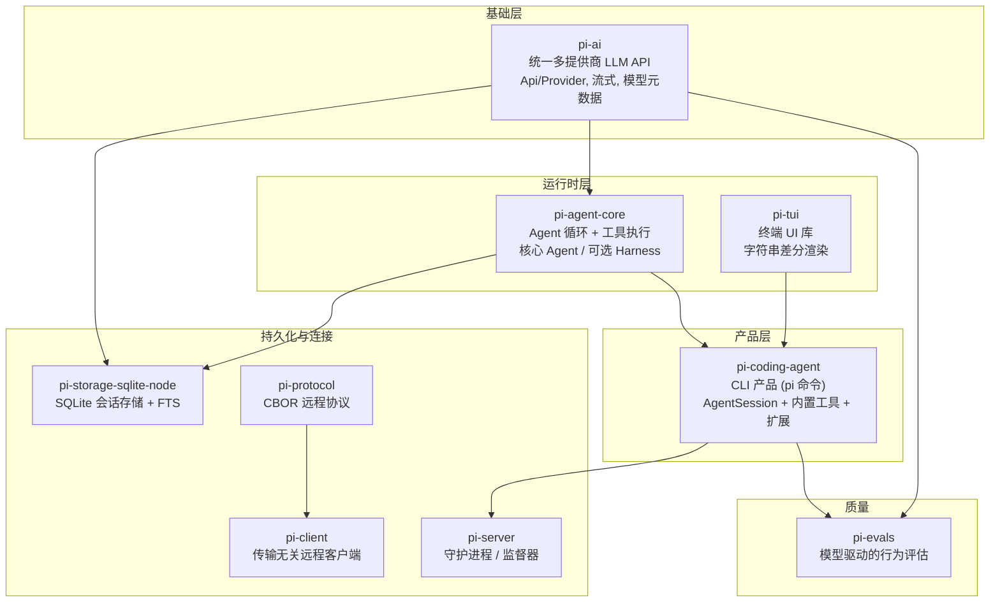
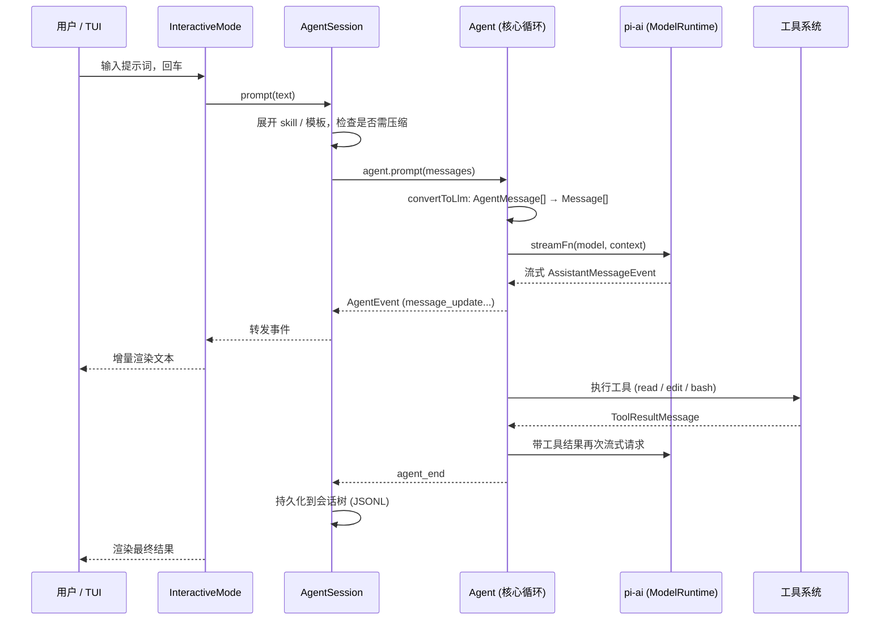

# Pi Agent 源码解析

**一个最小化 AI 编程 Agent 的架构、模式与内部机制**

---

> 本书是一份教育性的源码研究笔记。它分析的对象 [Pi Agent](https://pi.dev)（`@earendil-works/pi-coding-agent` 及其同族包）是一个 MIT 许可的开源项目，因此书中所有代码片段均直接取自真实源码，文件路径与函数名皆可逐一核对。本书与 Pi Agent 的维护者无关，未获其背书或赞助。

---

## 这本书想回答什么问题

市面上大多数生产级 AI 编程 Agent 都是庞然大物。以 Claude Code 为例，它是一个包含近两千个 TypeScript 文件的单体应用：内置七种权限模式、四十多个工具、分叉自研的终端渲染器、四层上下文压缩、二十七种生命周期钩子。它的复杂性是一艘潜艇式的复杂性——每一个 `if` 分支背后都站着一个曾经在生产环境里造成过事故的故障模式。

Pi Agent 选择了相反的方向。它的 `CONTRIBUTING.md` 开篇第一句话就是：

> **pi's core is minimal.** If your feature does not belong in the core, it should be an extension.

这不是营销话术，而是贯穿整个代码库的组织原则。Pi Agent 没有内置的逐工具权限审批系统——它把隔离交给容器；它没有 MCP，也没有 Claude Code 式的生命周期钩子——它把扩展性交给一个 TypeScript 扩展系统；它的核心 Agent 循环不是上千行的"潜艇"，而是一个干净的两层嵌套状态机。整个产品被拆成九个职责单一、可独立复用的 npm 包，从最底层的统一 LLM API（`pi-ai`），到 Agent 运行时（`pi-agent-core`），到终端 UI 库（`pi-tui`），再到组装一切的 CLI（`pi-coding-agent`）。

这本书要回答的核心问题是：

> **一个刻意保持最小化的 Agent，如何在不牺牲生产级能力的前提下，把复杂性挡在核心之外？**

我们会沿着依赖栈自底向上拆解这个系统。每一章都聚焦一个抽象，讲清楚它*是什么*、*为什么这样设计*，以及*如果换一种设计会失去什么*。

---

## 与 Claude Code 的对照

本书的写作参考了《Claude Code 源码解析》一书的结构与叙事方法，但二者分析的对象在设计哲学上几乎是对立面，因此章节结构也做了相应调整。下表是两条路线的粗略对照，可以作为阅读本书时的心智锚点：

| 维度 | Claude Code（综合体路线） | Pi Agent（最小化路线） |
|------|--------------------------|------------------------|
| 代码组织 | 近两千文件的单体 | 九个职责单一的包 |
| Agent 循环 | `query.ts`，约 1,730 行的单一 `while(true)` | `agent-loop.ts`，干净的两层嵌套循环 |
| 权限 | 七种内置权限模式 + 逐工具审批 | 无内置审批；项目信任 + 容器化隔离 |
| 扩展性 | 生命周期钩子（27 事件）+ MCP | TypeScript 扩展系统 + skills + 模板 |
| 终端 UI | 分叉的 Ink/React 渲染器 | 完全自研的字符串差分渲染器 |
| 会话存储 | 消息数组 + 压缩 | 可追加、可分支的**会话树** |
| 多提供商 | 四种基础设施路径，同一 SDK | `Api`（协议）/`Provider`（端点）二层抽象，约 38 个提供商 |

需要强调：最小化不等于简陋。Pi Agent 把"综合性"从核心挪到了**边缘**——挪进扩展、挪进容器、挪进可选的守护进程。核心因此保持小而干净，而系统整体的能力边界并未收缩。理解这种"复杂性守恒"是如何做到的，是本书的主线。

---

## 九个包，一张依赖图

Pi Agent 是一个 monorepo。理解这九个包各自的职责与依赖方向，是理解整个系统的前提。全书的章节基本沿着这张图自底向上展开：

| 包 | npm 名 | 一句话职责 | 对应章节 |
|----|--------|-----------|---------|
| `packages/ai` | `@earendil-works/pi-ai` | 把约 38 个 LLM 提供商统一到一套流式 API 之后 | 第 2 章 |
| `packages/agent` | `@earendil-works/pi-agent-core` | Agent 循环、工具执行、状态、可选的持久化 Harness | 第 3–7 章 |
| `packages/tui` | `@earendil-works/pi-tui` | 完全自研的终端 UI 库，差分渲染 | 第 12–13 章 |
| `packages/coding-agent` | `@earendil-works/pi-coding-agent` | `pi` 命令本体，组装一切的 CLI 产品 | 第 8–11、14 章 |
| `packages/protocol` | `@earendil-works/pi-protocol` | 传输无关的 CBOR 远程会话协议 | 第 15 章 |
| `packages/client` | `@earendil-works/pi-client` | 运行时无关的远程会话客户端 | 第 15 章 |
| `packages/server` | `@earendil-works/pi-server` | 监督多个无头 Agent 子进程的守护进程 | 第 15 章 |
| `packages/storage/sqlite-node` | `@earendil-works/pi-storage-sqlite-node` | 会话树的 SQLite 存储后端 + 全文搜索 | 第 5 章 |
| `packages/evals` | `@earendil-works/pi-evals` | 模型驱动的行为评估框架 | 第 16 章 |

---

## 黄金路径：从一次按键到一次输出

和参考书一样，我们先建立一条贯穿全书的"黄金路径"。当你在终端里敲下 `pi` 并输入"修复 auth.ts 里的空指针 bug"，请求会这样流过整个系统：

这条路径上的每一段都对应后续某一章的放大：

- `pi` 命令如何启动、如何决定进入哪种模式 → **第 8 章**
- `AgentSession` 如何编排一轮对话、如何展开 skill 与模板 → **第 9、10 章**
- `Agent` 核心循环如何流式调用模型、执行工具、决定停止 → **第 3、4 章**
- `pi-ai` 如何把请求送到正确的提供商并解析流式响应 → **第 2 章**
- `InteractiveMode` 如何把事件流渲染成终端画面 → **第 11、12 章**
- 这一轮对话如何被持久化进会话树 → **第 5 章**

一旦你把这条路径内化，后续每一章都只是对其中某一段的深入放大。

---

## 目录

### 第一部分：基础
*在 Agent 能够思考之前，必须先有一个能跟模型对话的层。*

| # | 章节 | 你将学到什么 |
|---|------|-------------|
| 1 | [架构总览：最小化 Agent 的设计哲学](./book/ch01-architecture.md) | 九个包的依赖栈、核心/Harness 二分、项目信任、与单体路线的对照 |
| 2 | [与模型对话：pi-ai 统一 LLM 层](./book/ch02-ai-layer.md) | `Api`/`Provider` 二层抽象、统一消息格式、`EventStream`、SSE 解析、惰性加载、模型元数据生成、双层重试、成本核算 |

### 第二部分：Agent 核心
*系统的心跳：流式输出、执行工具、观察结果、重复。*

| # | 章节 | 你将学到什么 |
|---|------|-------------|
| 3 | [Agent Loop：两层嵌套循环](./book/ch03-agent-loop.md) | `runLoop` 状态机、`StreamFn` 边界、`AgentEvent` 事件流、续接/停止决策、截断保护 |
| 4 | [工具系统：从定义到执行](./book/ch04-tools.md) | `AgentTool` 接口、prepare/execute/finalize 三阶段、sequential vs parallel、文件互斥队列、七个内置工具 |
| 5 | [状态、消息与会话树](./book/ch05-state-and-session-tree.md) | 可变 `AgentState`、`AgentMessage` 与声明合并、`convertToLlm`、可追加可分支的会话树、JSONL/SQLite 存储后端 |

### 第三部分：持久化编排
*让 Agent 拥有跨轮次、跨会话的记忆与结构。*

| # | 章节 | 你将学到什么 |
|---|------|-------------|
| 6 | [AgentHarness：可持久化的编排器](./book/ch06-harness.md) | 核心/Harness 分层、phase 状态机、turn 快照、hook 系统、写缓冲、`ExecutionEnv` 依赖反转 |
| 7 | [上下文压缩与分支摘要](./book/ch07-compaction.md) | `shouldCompact`、切点选择、摘要生成、分支摘要、token 估算 |

### 第四部分：编码 Agent 产品
*`pi` 命令如何把上述一切组装成一个可用的产品。*

| # | 章节 | 你将学到什么 |
|---|------|-------------|
| 8 | [启动流水线：从 cli.ts 到模式分发](./book/ch08-bootstrap.md) | 入口 shim、`main()` 引导序列、`resolveAppMode`、参数解析、三种运行模式 |
| 9 | [AgentSession：中央编排器](./book/ch09-agent-session.md) | `createAgentSession` 的装配点、事件系统、`prompt()` 生命周期、steering/follow-up 队列 |
| 10 | [系统提示词与资源装配](./book/ch10-system-prompt.md) | `buildSystemPrompt`、skills、prompt 模板、项目上下文文件、斜杠命令 |
| 11 | [三种运行模式](./book/ch11-modes.md) | 交互式 TUI REPL、print/headless 模式、RPC 模式如何消费同一条事件流 |

### 第五部分：终端界面
*用户看到的一切都经过这一层——而这一层是从零写的。*

| # | 章节 | 你将学到什么 |
|---|------|-------------|
| 12 | [pi-tui：自研渲染器](./book/ch12-tui-rendering.md) | 组件即 `render(width) => string[]`、逐行差分、主屏/备屏双渲染器、帧调度、同步输出 |
| 13 | [输入、按键与编辑器](./book/ch13-input-and-editor.md) | Kitty 键盘协议协商、`StdinBuffer` 序列重组、按键解析、快捷键、`Editor` 组件 |

### 第六部分：扩展与连接
*最小化核心如何向外延伸，而不被复杂性淹没。*

| # | 章节 | 你将学到什么 |
|---|------|-------------|
| 14 | [扩展系统：最小化核心的延伸](./book/ch14-extensions.md) | `ExtensionAPI`、注册工具/命令/快捷键/flag、skills/模板/主题、为什么没有 MCP 与钩子 |
| 15 | [远程控制：守护进程、RPC 与协议](./book/ch15-remote.md) | `pi-server` 监督器、无头 RPC 子进程、Radius 中继、`pi-protocol`/`pi-client` 的 CBOR 通道 |

### 第七部分：质量与结语
*如何验证一个 Agent 真的变好了，以及我们从中学到了什么。*

| # | 章节 | 你将学到什么 |
|---|------|-------------|
| 16 | [行为评估：pi-evals](./book/ch16-evals.md) | 模型驱动的端到端评估、harness 对照表、pass-rate lift、token/延迟/成本配对差 |
| 17 | [结语：最小化的赌注](./book/ch17-epilogue.md) | 六个架构赌注、可迁移的经验、最小化与综合性的权衡 |

---

## 贯穿全书的十个模式

如果你只读这些：

1. **分层即防火墙** —— 把系统拆成 `ai → agent → coding-agent` 的依赖栈，每一层只依赖下一层的抽象，复杂性被层与层之间的接口挡住。
2. **`Api` 与 `Provider` 分离** —— 用约 10 种"线缆协议"适配器统一约 38 个提供商；协议是少的，端点是多的。
3. **流即契约** —— `EventStream` 异步可迭代原语贯穿全栈；失败不抛出，而是编码进流的终止事件。
4. **两层嵌套循环** —— 内层处理工具调用与 steering，外层处理 follow-up；续接与停止的每个决策都显式可见。
5. **工具是自描述对象** —— 并发模式、参数 schema、UI 渲染都内聚在工具定义里，循环本身对工具一无所知。
6. **会话是一棵树** —— 转录不是扁平数组，而是可追加、可分支、可压缩的不可变条目树，`leaf` 标记当前位置。
7. **核心与 Harness 二分** —— 同一个包里既有纯净的最小循环，也有可选的持久化编排器；产品可以二选一。
8. **项目信任取代逐工具审批** —— 不在每个工具调用前弹窗，而是问一次"你信任这个项目里的资源吗"，把隔离交给容器。
9. **渲染即字符串差分** —— 组件输出 `string[]`，渲染器只做逐行相等扫描 + 同步输出，没有虚拟 DOM。
10. **扩展是类型化的** —— 扩展性不靠运行时钩子字符串，而靠一个约 40 种事件、强类型的 `ExtensionAPI`。

---

## 代码引用约定

- 书中所有文件路径均**相对于 `pi-agent-src/` 目录**（即 Pi Agent 仓库的根）。例如 `packages/agent/src/agent-loop.ts` 指 `pi-agent-src/packages/agent/src/agent-loop.ts`。
- 代码片段为便于讲解可能省略了部分类型标注或分支，但函数名、类型名、字段名与文件位置均与源码一致，可直接检索核对。
- 分析基于的版本为 monorepo 各包 `v0.83.0`。

## 适用人群

- **构建 Agentic 系统的工程师** —— 想看看"最小化"路线如何落地，借鉴可迁移的模式。
- **评估架构的技术负责人** —— 在"综合体"与"最小化核心 + 扩展"两条路线之间做权衡。
- **对生产级 AI 工具底层运作感兴趣的任何人** —— 尤其是想理解一个开源 Agent 如何组织其代码与边界。

## 免责声明

本书为独立的技术分析，纯属教育目的。Pi Agent 是其各自维护者的产品，本书与其无关，未获背书或赞助。书中观点为作者基于源码的解读，如有错漏，以源码为准。
