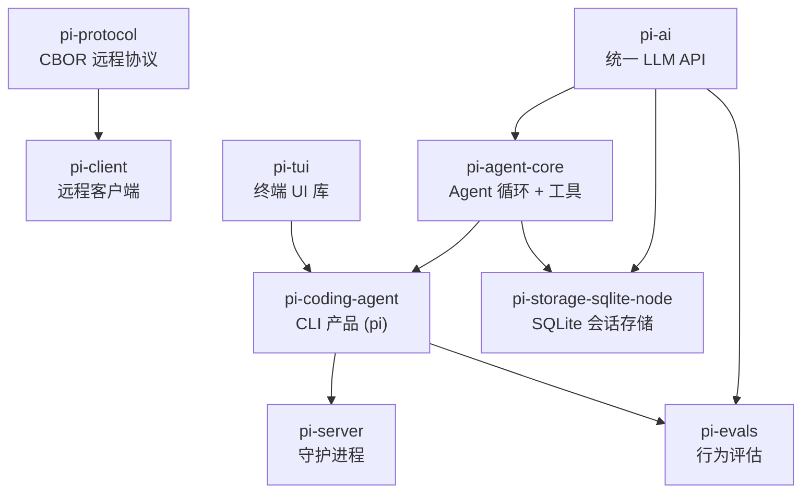
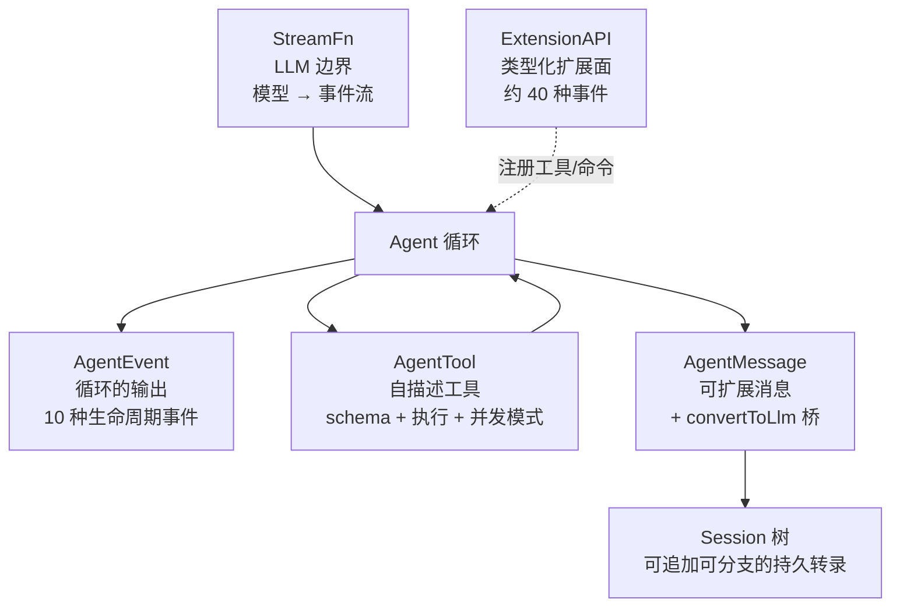
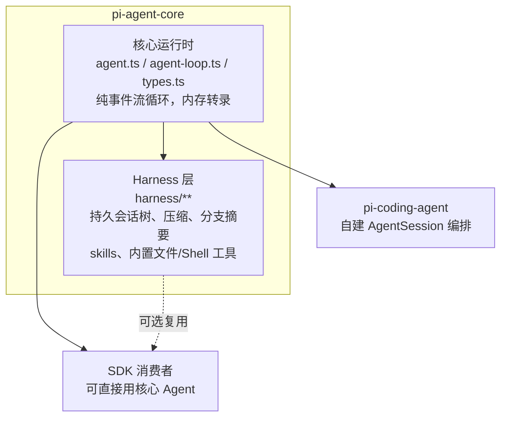
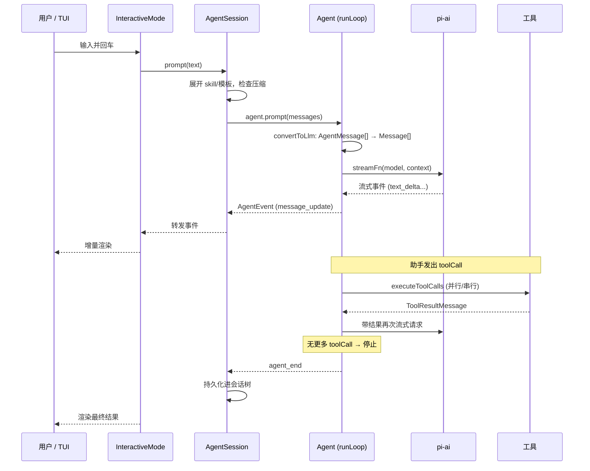
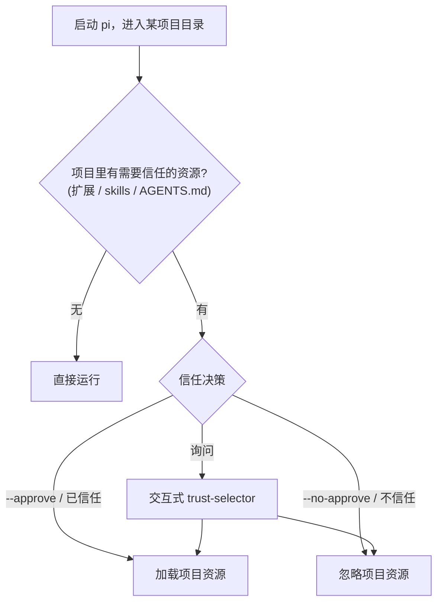
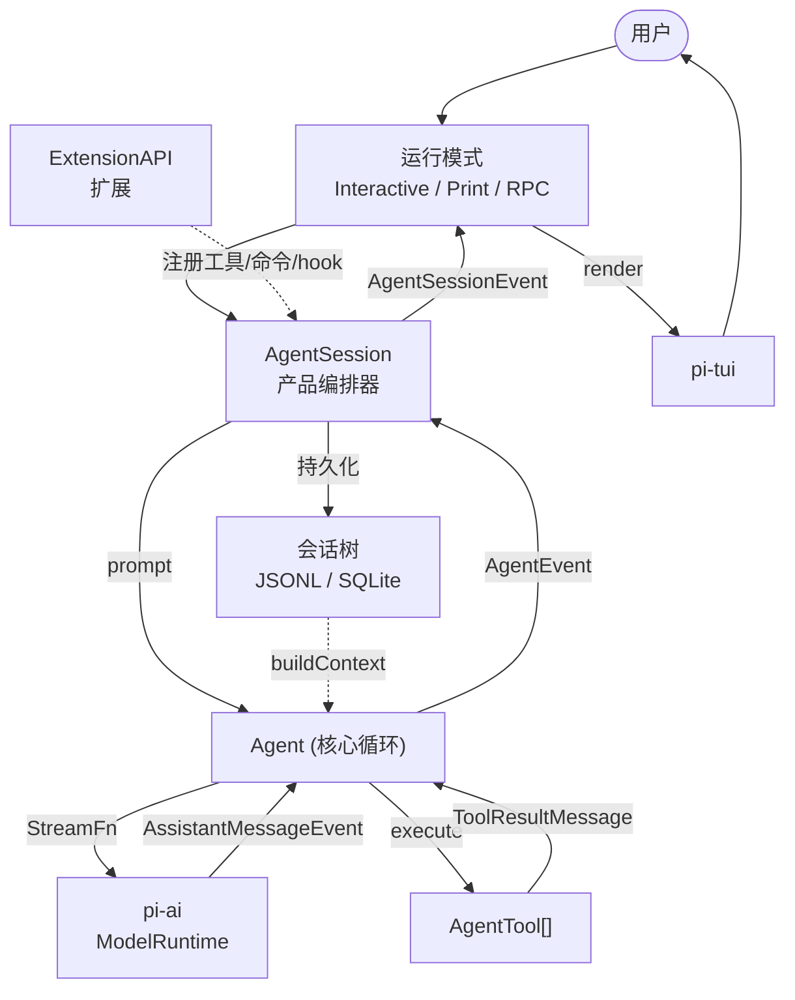

# 第 1 章：架构总览——最小化 Agent 的设计哲学

## 你正在面对的是什么

传统 CLI 是一个函数：接收参数，执行任务，退出。`grep` 不会自作主张地再去跑 `sed`。契约简单而确定——一条命令，一个动作。

Agent 化的 CLI 打破了这份契约。它接收自然语言提示词，自主决定调用哪些工具，以任意顺序执行它们，评估结果，然后不断循环，直到任务完成或用户终止。"程序"不再是一组固定指令，而是一个围绕语言模型的循环——模型在运行时动态生成自己的指令序列。工具调用是副作用，模型的推理是控制流。

面对这个本质上的复杂性，业界有两种典型回答。

一种是**综合体路线**：把所有可能需要的能力都内置进来。权限系统、几十个工具、上下文压缩、生命周期钩子、自研渲染器……全部装进一个庞大的单体。Claude Code 是这条路线的代表——近两千个文件，每一个 `if` 分支背后都站着一个真实发生过的故障。这种复杂性是"潜艇式"的：你不能删掉任何一个舱室，因为海水曾经从那里渗进来过。

Pi Agent 给出了另一种回答。它的 `CONTRIBUTING.md` 开篇即宣言：

> **pi's core is minimal.** If your feature does not belong in the core, it should be an extension.
>
> Pi's core exists to be minimal and to be extensible so that it can be influenced and manipulated by extensions.

这不是文档里的客套话，而是贯穿整个代码库的组织原则。本章的任务，就是让你看清这条原则如何塑造了系统的每一个层次——从包的划分，到循环的形状，到安全模型，到扩展机制。

---

## 复杂性守恒定律

在深入细节之前，先建立一个贯穿全书的核心观察。

一个生产级 Agent 必须处理的复杂性是**守恒**的：多提供商适配、流式解析、工具执行、并发安全、上下文膨胀、持久化、错误恢复、终端渲染、可扩展性——这些难题不会因为你不写它们就消失。综合体路线把它们全部吸进核心；最小化路线则试图把它们**推到边缘**——推到扩展里、推到容器里、推到可选的守护进程里、推到调用方的责任里。

Pi Agent 的几次关键"外推"：

| 复杂性 | 综合体路线的做法 | Pi Agent 外推到何处 |
|--------|------------------|---------------------|
| 权限与安全 | 内置七种权限模式 + 逐工具审批弹窗 | **容器/沙箱** + 一次性的"项目信任"决策 |
| 工具生态 | 内置 40+ 工具 | 7 个内置工具 + **扩展注册自定义工具** |
| 生命周期拦截 | 27 种运行时钩子事件 | 强类型 `ExtensionAPI`（约 40 种事件）|
| 外部工具协议 | 内置 MCP（8 种传输）| **不提供**；由扩展自行集成 |
| 远程控制 | 内置 bridge / 云端执行 | 独立的可选包 `pi-server` / `pi-protocol` |
| 会话存储后端 | 内置 | 抽象接口 + 可插拔后端（JSONL / SQLite）|

每一次外推都让核心变小一点，同时把"是否承担这份复杂性"的选择权交给使用者。理解这一点，你就能解释 Pi Agent 几乎所有看似"缺失"的功能——它们不是没做，而是被刻意放在了核心之外。

---

## 九个包：依赖栈即架构

Pi Agent 不是一个文件树，而是一个 monorepo。它的架构首先体现在**包的划分**上。理解这九个包各自的职责与依赖方向，等于理解了系统的一半。



这张图有几个值得注意的特征。

**依赖是严格单向的。** `pi-ai` 不依赖任何兄弟包；`pi-agent-core` 只依赖 `pi-ai`；`pi-coding-agent` 依赖 `pi-agent-core`、`pi-ai`、`pi-tui`。没有任何循环依赖。这意味着每一层都可以被单独拿出来复用——你完全可以用 `pi-ai` 写一个跟 Agent 无关的 LLM 应用，或者用 `pi-tui` 写一个跟 LLM 无关的终端工具。

**`pi-tui` 与 LLM 完全无关。** 终端 UI 库不依赖 `pi-ai`，也不依赖 `pi-agent-core`。它是一个独立的、通用的差分渲染库。把 UI 从 Agent 逻辑中彻底剥离，是 Pi Agent 与那些"UI 和逻辑缠在一起"的 Agent 的关键区别之一。第 12 章会看到，这个库甚至不是基于 React/Ink 的——它完全自研。

**远程能力是独立的旁支。** `pi-protocol` 和 `pi-client` 构成一条独立的远程会话通道，`pi-server` 则是一个监督无头 Agent 子进程的守护进程。它们都依赖产品层，但产品层不依赖它们——你安装 `pi` 命令本身并不需要任何远程组件。第 15 章会看到，这里其实藏着**两套**互不相同的远程控制设计。

**存储是可插拔的。** `pi-storage-sqlite-node` 实现了 `pi-agent-core` 定义的存储接口，但核心并不依赖它。默认的会话存储是简单的 JSONL 文件（在产品层实现），SQLite 是一个可选的、带全文搜索的后端。

这种划分本身就是"最小化"的第一层体现：**核心之所以小，是因为它把大量职责切出去成了独立的包。**

---

## 六个核心抽象

如果说综合体路线由六个内置子系统定义，那么 Pi Agent 由六个**接口抽象**定义。其他一切——九个包、几十个文件——都是为了实现或消费这六个抽象。



**1. `StreamFn`——LLM 边界**（`packages/agent/src/types.ts`）。这是核心循环与模型世界之间唯一的接缝：

```typescript
export type StreamFn = (
	model: Model<Api>,
	context: Context,
	options?: SimpleStreamOptions,
) => AssistantMessageEventStream | Promise<AssistantMessageEventStream>;
```

它的契约里有一条至关重要的约定：**永不抛出**。请求失败、模型错误、网络中断，统统不能以异常形式出现，而必须编码进流末尾那个 `stopReason: "error" | "aborted"` 的 `AssistantMessage`。这一条约定让循环的错误处理逻辑变得极其简单——它永远不需要 `try/catch` 模型调用，只需要检查流的结果。`pi-ai` 的 `Models.streamSimple` 满足这个形状；第 2 章会看到整个 `pi-ai` 包如何围绕"把失败编码进流"这一原则组织。

**2. `AgentEvent`——循环的输出**（`packages/agent/src/types.ts`）。循环不返回一个大对象，而是发出一串生命周期事件：

```
agent_start | agent_end
turn_start  | turn_end
message_start | message_update | message_end
tool_execution_start | tool_execution_update | tool_execution_end
```

一个"turn"（轮次）= 一次助手响应 + 它的工具调用与结果。任何消费者——TUI REPL、headless print 模式、RPC 模式——都通过订阅这条事件流来工作。第 11 章会看到，三种运行模式的本质区别仅仅是"如何渲染同一条事件流"。

**3. `AgentTool`——自描述工具**（`packages/agent/src/types.ts`）：

```typescript
export interface AgentTool<TParameters extends TSchema = TSchema, TDetails = any>
	extends Tool<TParameters> {
	label: string;
	prepareArguments?: (args: unknown) => Static<TParameters>;
	execute: (
		toolCallId: string,
		params: Static<TParameters>,
		signal?: AbortSignal,
		onUpdate?: AgentToolUpdateCallback<TDetails>,
	) => Promise<AgentToolResult<TDetails>>;
	executionMode?: ToolExecutionMode; // "sequential" | "parallel"
}
```

工具不只是函数。它自带参数 schema（TypeBox）、执行逻辑、并发声明（`executionMode`）、进度上报回调（`onUpdate`）。循环对工具的内部一无所知——它只知道"按 schema 校验、调用 execute、收集结果"。新增第 N+1 个工具不需要改动循环的任何一行代码。第 4 章详述。

**4. `AgentMessage` 与 `convertToLlm`——消息桥**（`packages/agent/src/types.ts`、`agent-loop.ts`）。循环内部使用一个可扩展的消息联合类型：

```typescript
export interface CustomAgentMessages {} // 通过声明合并扩展
export type AgentMessage = Message | CustomAgentMessages[keyof CustomAgentMessages];
```

`Message`（来自 `pi-ai`）覆盖 `user | assistant | toolResult`。但产品可以往转录里塞入自定义消息类型——压缩摘要、分支摘要、bash 执行记录——它们对 UI 有意义，却不应发给模型。`convertToLlm` 就是那座桥：它在每次调用模型前，把内部的 `AgentMessage[]` 过滤、转换成提供商能理解的 `Message[]`。这个"内部表示 ≠ 线上表示"的分离，是 Pi Agent 容纳自定义消息类型而不污染协议的关键。

**5. Session 树——持久转录**（`packages/agent/src/harness/session/session.ts`）。转录不是一个扁平数组，而是一棵**可追加、可分支的不可变条目树**。每个条目有 `id`、`parentId`、`timestamp`；一个 `leaf` 标记指向"当前位置"。`moveTo(entryId)` 可以重新指向 leaf，从而实现分支与回溯；压缩不是删除历史，而是插入一个 `compaction` 条目。这个设计让"fork 一个会话""回到三步之前换个思路"成为一等公民。第 5 章详述。

**6. `ExtensionAPI`——类型化扩展面**（`packages/coding-agent/src/core/extensions/types.ts`）。这是最小化哲学最直接的产物。Pi Agent 没有运行时钩子字符串，也没有 MCP；它把扩展性集中到一个强类型接口上：

```typescript
export type ExtensionFactory = (pi: ExtensionAPI) => void | Promise<void>;
```

扩展拿到一个 `pi` 对象，可以 `on(event, handler)` 订阅约 40 种事件、`registerTool(...)` 注册工具、`registerCommand(...)` 注册斜杠命令、`registerShortcut(...)` 注册快捷键、`registerFlag(...)` 注册 CLI flag。因为一切都是 TypeScript 类型，扩展能在编译期得到完整的类型检查与自动补全。第 14 章详述。

---

## 核心与 Harness：一个包里的两层

`pi-agent-core` 这个包内部，还藏着理解 Pi Agent 设计哲学的关键一刀。它实际上包含**两个层次**：



**核心运行时**（`src/agent.ts`、`src/agent-loop.ts`、`src/types.ts`）是一个有状态的 `Agent` 类，包裹着一个纯净的、发事件的循环。它只维护内存中的转录，不碰文件系统，不做持久化。这是"最小化核心"的字面体现——它小到可以在任何环境（包括浏览器）里运行。

**Harness 层**（`src/harness/**`）建立在核心之上，增加了持久化的会话树存储、上下文压缩、分支摘要、skills、prompt 模板，以及内置的文件/Shell 工具。它是"如果你想要一个开箱即用的、可持久化的 Agent"的可选层。

关键洞察在于：**产品层 `pi-coding-agent` 并没有使用 Harness 层的 `AgentHarness` 类。** 它在 `packages/coding-agent/src/core/sdk.ts` 里直接实例化核心 `Agent`：

```typescript
import { Agent, type AgentMessage, setDefaultStreamFn } from "@earendil-works/pi-agent-core";
// ...
agent = new Agent({
	initialState: { systemPrompt: "", model, thinkingLevel, tools: [] },
	convertToLlm: convertToLlmWithBlockImages,
	streamFn: async (model, context, options) => modelRuntime.streamSimple(model, context, { ... }),
	// ...
});
```

然后产品层在核心 `Agent` 之上构建了**自己的**编排器 `AgentSession`（3,333 行）和**自己的** JSONL 会话管理 `SessionManager`。

为什么要这样？因为产品层需要的编排逻辑（扩展系统、项目信任、三种运行模式、斜杠命令、模型切换 UI）与通用 Harness 的关注点并不重合。`pi-agent-core` 把"纯净最小循环"和"一种通用的持久化方案"都提供给你，但**不强迫**你用后者——产品层证明了你可以只在最小核心之上，搭建一个完全定制的、面向具体产品的编排层。

这是"最小化"的第二层体现：**即使在一个包内部，核心也保持纯净，把"如何编排"的自由留给上层。** 第 6 章会深入 Harness 层，第 9 章会深入产品层自建的 `AgentSession`。

---

## 黄金路径：从按键到输出

现在追踪一个请求的完整流转。你输入"为登录函数添加错误处理"，按下回车。



关于这条路径，有三点值得注意，它们各自对应后续章节。

**循环是事件流，不是回调链。** `Agent.prompt()` 内部驱动 `runLoop`，后者通过一个 `emit` 回调发出 `AgentEvent`。`Agent` 类把这些事件归约（reduce）进自己的可变状态，再分发给订阅者。消费者按自己的节奏处理事件——TUI 渲染、print 模式写 stdout、RPC 模式序列化成 JSON。第 3 章会看到，循环本身是一个干净的两层嵌套状态机，没有综合体路线里那种上千行的错误恢复迷宫。

**模型调用永不抛出。** 因为 `StreamFn` 的契约，循环里检查 `message.stopReason === "error" | "aborted"` 就足以处理所有模型层失败。错误恢复的复杂性被外推给了 `pi-ai`（双层重试）和扩展（可以 hook `before_provider_request`）。

**工具执行与模型边界正交。** 循环不知道工具是读文件还是跑 shell，也不知道它是并行还是串行——这些信息内聚在 `AgentTool` 自己的 `executionMode` 字段里。第 4 章会看到，并发策略就是读这个字段然后选择 `Promise.all` 还是 `for` 循环，仅此而已。

---

## 安全模型：项目信任，而非逐工具审批

这是 Pi Agent 与综合体路线最刺眼的分歧，也是最小化哲学最彻底的体现。

综合体路线内置一套精密的权限系统：多种权限模式、每个工具调用前的审批弹窗、LLM 分类器评估转录。Pi Agent 的 `README.md` 直接放弃了这一切：

> Pi does not include a built-in permission system for restricting filesystem, process, network, or credential access. By default, it runs with the permissions of the user and process that launched it.
>
> If you need stronger boundaries, containerize or sandbox Pi.

它把**隔离**这件事外推给了操作系统和容器（README 给出了三种容器化模式：Gondolin 微虚拟机、普通 Docker、OpenShell 沙箱）。

但这不意味着 Pi Agent 对安全毫无处理。它把安全关注点收窄成了**一个**问题：*你是否信任当前项目目录里的资源？* 因为项目目录里可能有 `AGENTS.md`、自定义扩展、skills——这些都会影响 Agent 的行为，可能来自不可信的第三方仓库。



这个决策由 `packages/coding-agent/src/core/trust-manager.ts` 的 `ProjectTrustStore` 持久化（按 cwd 记录），由 `project-trust.ts` 的 `resolveProjectTrusted(...)` 解析，CLI 上对应 `--approve/-a` 与 `--no-approve/-na` 两个 flag，交互式下对应 `/trust` 命令和一个 `trust-selector` 组件。扩展甚至可以 hook `project_trust` 事件来参与决策。

工具层面的"安全"则通过**允许/拒绝清单**表达，而非审批弹窗：`--tools`、`--exclude-tools`、`--no-tools`、`--no-builtin-tools`，以及"只读工具组"（`grep`/`find`/`ls` 默认关闭）。

这是一种截然不同的安全姿态：不在每个动作前设卡，而是**在边界处一次性决策，然后把动作的执行环境本身变得安全**。它把"逐个判断工具调用是否安全"这份复杂性，外推给了容器和用户的信任决策。第 14 章讨论扩展时会回到这个模型。

---

## 多提供商：协议是少的，端点是多的

Pi Agent 支持约 38 个 LLM 提供商（OpenAI、Anthropic、Google、Bedrock、Vertex、OpenRouter、Groq、xAI、DeepSeek……）。如果为每个提供商写一套适配，将是巨大的维护负担。`pi-ai` 的解法是引入**两个层次**：

- **`Api`（线缆协议）**：如何与*一族*服务器对话。约 10 种：`openai-completions`、`openai-responses`、`anthropic-messages`、`google-generative-ai`、`bedrock-converse-stream`、`mistral-conversations` 等。
- **`Provider`（配置好的端点）**：一个具体的运行时端点（id、baseUrl、认证、模型目录、绑定到哪些 `Api`）。约 38 个。

关键在于：**许多提供商复用同一个 `Api`。** OpenRouter、Groq、Together、xAI 都说 `openai-completions`/`openai-responses`。于是约 10 个协议适配器就统一了约 38 个厂商——协议是少的，端点是多的。新增一个"说 OpenAI 方言"的提供商，几乎只需要写一个工厂函数和一个模型目录文件。第 2 章详述。

---

## 各组件如何连接

把六个抽象和九个包合起来，系统的依赖与数据流是这样的：



`AgentSession` 是产品层的枢纽：它持有核心 `Agent`，把用户输入变成 `prompt()` 调用，把 `Agent` 发出的 `AgentEvent` 翻译成更高层的 `AgentSessionEvent` 分发给运行模式，同时负责持久化、压缩、模型切换、扩展绑定。核心循环与工具系统之间的环形依赖——模型生成工具调用、工具产生结果、结果回灌、模型再决策——依然是系统的心跳，只是它现在被包裹在干净的 `StreamFn`/`AgentEvent` 接口之内。

与后续章节的关系：第 2 章放大 `pi-ai`（`StreamFn` 的实现）。第 3–5 章放大核心循环、工具与状态。第 6–7 章放大可选的 Harness 与压缩。第 8–11 章放大产品层如何组装这一切。第 12–13 章放大 `pi-tui`。第 14–15 章放大扩展与远程。第 16 章看如何用 evals 验证这一切真的有效。

---

## 实践应用

如果你正在构建一个 Agent 系统，Pi Agent 的架构提供了五条可迁移的模式。

**用依赖栈做防火墙。** 把系统拆成严格单向依赖的层（模型层 → 运行时层 → 产品层），每层只依赖下一层的抽象接口。它解决的问题是：复杂性在单体里自由蔓延。当 `pi-tui` 连 `pi-ai` 都不依赖时，你就知道 UI 的复杂性绝不可能泄漏进 Agent 逻辑。层的边界就是复杂性的防火墙。

**把"是否承担复杂性"变成选择。** 权限、远程、存储后端、扩展——这些都不是核心强制内置的，而是可选的包或外推的责任。它解决的问题是：核心被所有边缘需求绑架。当核心保持最小，只想跑一个内存 Agent 的 SDK 用户就不必拖着一整套持久化和远程基础设施。

**核心与编排分离，且不强迫绑定。** 同一个运行时包既提供纯净最小循环，也提供可选的持久化 Harness，但产品可以两者都不用、自建编排。它解决的问题是：框架把自己的编排假设强加给所有使用者。把"机制"（循环）和"策略"（如何编排、如何持久化）分开，策略才能因产品而异。

**失败编码进流，而非抛出。** `StreamFn` 约定永不抛出，失败是流末尾的一个终止事件。它解决的问题是：异步流式管道里 `try/catch` 四处散落、消费者不知道何时该断开。当失败是数据而非控制流，错误处理就退化成了一次字段检查。

**安全决策放在边界，而非每个动作前。** 不在每个工具调用前弹窗，而是在进入项目时做一次信任决策，再把执行环境本身（容器）变安全。它解决的问题是：审批疲劳与权限系统的维护负担。当然，这条模式的前提是你确实能控制执行环境——如果你的 Agent 直接跑在用户主机上且无法容器化，逐动作审批可能仍是必要的。最小化安全模型有其适用边界，理解这个边界比模仿它更重要。

---

## 总结

Pi Agent 的架构是一个关于"克制"的论证。它把系统拆成九个单向依赖的包，把核心收窄到一个纯净的两层循环，把权限交给容器，把扩展交给类型化 API，把存储交给可插拔后端。它没有比综合体路线"少做"事情——它只是把每一份额外的复杂性都放到了核心之外，让使用者按需承担。

这种设计不是没有代价。把隔离交给容器，意味着裸跑在主机上的 `pi` 确实拥有用户的全部权限；不提供 MCP，意味着想接外部工具生态的人要自己写扩展。本书后续不会回避这些权衡。但理解了"复杂性守恒"这条主线，你就能看懂 Pi Agent 每一个看似缺失的功能背后，那份刻意的取舍。

下一章，我们从依赖栈的最底层开始：`pi-ai` 如何用约 10 个协议适配器，把约 38 个 LLM 提供商藏到一套统一的流式 API 之后。
