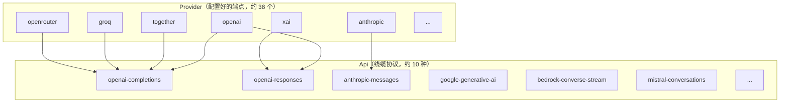

# 第 2 章：与模型对话——pi-ai 统一 LLM 层

## 一个被低估的难题

表面上，"调用一个大模型"很简单：发一个 HTTP 请求，读一段流式响应。但当你需要同时支持 OpenAI、Anthropic、Google、AWS Bedrock、Google Vertex、OpenRouter、Groq、xAI、DeepSeek……约 38 个提供商时，简单的事就变得棘手。每个提供商都有自己的：

- 请求格式（消息怎么表示、工具怎么声明、thinking 怎么开关）
- 流式协议（SSE 事件名、增量结构、终止信号）
- 认证方式（API key、OAuth、AWS 凭证、ADC 文件、环境变量）
- 用量与计费口径（缓存读/写、reasoning token、分层定价）
- 错误语义（哪些该重试、哪些是永久失败）

如果为每个提供商写一套端到端适配，你会得到 38 份彼此微妙不同的代码，每新增一个厂商都是一次复制粘贴的灾难。`pi-ai`（`packages/ai`）的存在就是为了消灭这种重复。它的 `package.json` 自我描述是：

> Unified LLM API with automatic model discovery and provider configuration.

本章拆解它如何做到这一点。核心是一个二分：**协议是少的，端点是多的。**

---

## 核心二分：`Api` 与 `Provider`

`pi-ai` 把"跟模型对话"拆成两个正交的概念。这是理解整个包的组织原则。



**`Api`（线缆协议）** 回答"如何与*一族*服务器对话"。它实现于 `packages/ai/src/api/*.ts`，约 10 种：`openai-completions`、`openai-responses`、`openai-codex-responses`、`azure-openai-responses`、`anthropic-messages`、`bedrock-converse-stream`、`google-generative-ai`、`google-vertex`、`mistral-conversations`、`pi-messages`。

**`Provider`（配置好的端点）** 回答"具体连到哪个服务"。它实现于 `packages/ai/src/providers/*.ts`，约 38 个。一个 Provider 携带 `id`、`baseUrl`、认证配置、一份模型目录，以及到一个或多个 `Api` 的绑定。

关键的复用在于：**许多 Provider 说同一种方言。** OpenRouter、Groq、Together 都说 `openai-completions`/`openai-responses`。于是约 10 个协议适配器就统一了约 38 个厂商。新增一个"说 OpenAI 方言"的提供商，你几乎不用碰任何协议代码——只需要写一个工厂函数和一个模型目录。

### 统一的请求输入：`Context`

无论哪个提供商，循环喂给 `pi-ai` 的都是同一个 `Context`（`packages/ai/src/types.ts`）：

```typescript
export interface Context {
	systemPrompt?: string;
	messages: Message[];
	tools?: Tool[];
}
```

`Message` 是一个联合类型（`UserMessage | AssistantMessage | ToolResultMessage`），其内容块（content block）被规范化为 `TextContent`、`ThinkingContent`、`ImageContent`、`ToolCall` 几种。每个提供商的 `Api` 适配器负责把这个统一表示翻译成自己的线上格式——第 2 章后半部分会看到翻译的细节。

### 统一的输出：`AssistantMessage` 与 `Usage`

每个提供商的响应都被折叠成同一个 `AssistantMessage`，它携带规范化的用量与成本（`packages/ai/src/types.ts`）：

```typescript
export interface Usage {
	input: number;
	output: number;
	cacheRead: number;
	cacheWrite: number;
	cacheWrite1h?: number; // 仅 Anthropic 报告 1h 缓存写入的细分
	reasoning?: number; // reasoning/thinking token，是 output 的子集
	totalTokens: number;
	cost: {
		input: number;
		output: number;
		cacheRead: number;
		cacheWrite: number;
		total: number;
	};
}

export type StopReason = "pending" | "stop" | "length" | "toolUse" | "error" | "aborted";
```

注意 `Usage` 把"缓存读/写""reasoning token""成本"都纳入了统一口径。这意味着上层（Agent 循环、产品 UI、evals）拿到的用量数字是跨提供商可比的——你不需要知道这次调用走的是 Anthropic 还是 Groq，就能正确显示 token 数和花费。`calculateCost(model, usage)`（`packages/ai/src/models.ts`）根据模型的费率（$/百万 token）和分层定价计算成本，并对 Anthropic 的 1h 缓存写入做了 2 倍计价的特判。

`StopReason` 的规范化同样关键。Anthropic 的 `end_turn`、OpenAI 的 `stop`、各家不同的"达到上限""触发工具"信号，都被映射到这六个值之一。回忆第 1 章：核心循环只检查 `stopReason === "error" | "aborted"` 来处理失败，检查 `toolUse` 来决定是否继续——它能这么简洁，正是因为 `pi-ai` 已经把各家方言翻译成了这套统一词汇。

---

## `Provider` 与 `Models`：两个工厂

### `Provider` 接口

一个 Provider 的形状（`packages/ai/src/models.ts`）：

```typescript
export interface Provider<TApi extends Api = Api> {
	readonly id: string;
	readonly name: string;
	readonly baseUrl?: string;
	readonly headers?: ProviderHeaders;
	readonly auth: ProviderAuth;
	getModels(): readonly Model<TApi>[];
	refreshModels?(context: RefreshModelsContext): Promise<void>;
	filterModels?(models, credential): readonly Model<TApi>[];
	stream<T extends TApi>(model, context, options?): AssistantMessageEventStream;
	streamSimple(model, context, options?): AssistantMessageEventStream;
}
```

Provider 由工厂函数 `createProvider(input)` 构建。这个工厂的核心职责是 **API 分派**：`api` 参数可以是单个 `ProviderStreams`，也可以是一个按 `model.api` 索引的映射（当一个提供商说多种方言时）；`apiFor(model)` 选出正确的实现，若某个模型的 `api` 没有对应条目，`dispatch(...)` 会产生一个流式错误。

### `ProviderStreams`：每个协议模块的統一形状

每个 `src/api/*.ts` 模块都满足同一个接口（`packages/ai/src/types.ts`）：

```typescript
export interface ProviderStreams {
	stream(model: Model<Api>, context: Context, options?: StreamOptions): AssistantMessageEventStream;
	streamSimple(model: Model<Api>, context: Context, options?: SimpleStreamOptions): AssistantMessageEventStream;
}
```

`stream` 是全功能版（暴露提供商特有的选项），`streamSimple` 是精简版（Agent 循环用的就是它）。模块本身就是这个接口的实现——`anthropic-messages.ts` 导出 `stream` 和 `streamSimple` 两个函数，它们直接满足 `ProviderStreams`。这种"模块即接口"的约定让协议适配器可以被当作值传递、惰性包装。

### `Models`：提供商的集合

`Models`（由 `createModels()` 构建，`packages/ai/src/models.ts`）持有一个 `Map` 的提供商集合，负责认证解析与分派。`Models.stream()` 查找拥有该模型的提供商，应用认证/请求头/环境变量，然后调用 `provider.stream(...)`。`complete()` 只是 `stream(...).result()` 的便捷封装。`builtinModels()`（`packages/ai/src/providers/all.ts`）注册所有内置提供商。

---

## `EventStream`：贯穿全栈的流原语

`pi-ai` 的流式响应不是回调，也不是 RxJS 式的 Observable，而是一个极简的异步可迭代原语 `EventStream`（`packages/ai/src/utils/event-stream.ts`）。它是整个系统流式处理的基石，值得完整看一眼：

```typescript
export class EventStream<T, R = T> implements AsyncIterable<T> {
	private queue: T[] = [];
	private waiting: ((value: IteratorResult<T>) => void)[] = [];
	private done = false;
	private finalResultPromise: Promise<R>;
	private resolveFinalResult!: (result: R) => void;
	private isComplete: (event: T) => boolean;
	private extractResult: (event: T) => R;

	constructor(isComplete: (event: T) => boolean, extractResult: (event: T) => R) {
		this.isComplete = isComplete;
		this.extractResult = extractResult;
		this.finalResultPromise = new Promise((resolve) => {
			this.resolveFinalResult = resolve;
		});
	}

	push(event: T): void {
		if (this.done) return;
		if (this.isComplete(event)) {
			this.done = true;
			this.resolveFinalResult(this.extractResult(event));
		}
		const waiter = this.waiting.shift();
		if (waiter) waiter({ value: event, done: false });
		else this.queue.push(event);
	}

	async *[Symbol.asyncIterator](): AsyncIterator<T> {
		while (true) {
			if (this.queue.length > 0) yield this.queue.shift()!;
			else if (this.done) return;
			else {
				const result = await new Promise<IteratorResult<T>>((resolve) => this.waiting.push(resolve));
				if (result.done) return;
				yield result.value;
			}
		}
	}

	result(): Promise<R> {
		return this.finalResultPromise;
	}
}
```

这个类只做一件事：把"生产者推事件"和"消费者拉事件"解耦。它内部是一个队列加一个等待者列表——如果消费者正在等，`push` 直接交付；否则入队。它同时提供两种消费方式：

- `for await (const event of stream)` —— 逐个处理增量事件（TUI 增量渲染用这个）
- `await stream.result()` —— 直接拿最终结果（`complete()` 和循环的最终消息用这个）

`AssistantMessageEventStream` 是它的特化：完成条件是事件类型为 `done` 或 `error`，结果提取器从 `done` 取出 `AssistantMessage`、从 `error` 取出携带错误的 `AssistantMessage`：

```typescript
export class AssistantMessageEventStream extends EventStream<AssistantMessageEvent, AssistantMessage> {
	constructor() {
		super(
			(event) => event.type === "done" || event.type === "error",
			(event) => {
				if (event.type === "done") return event.message;
				else if (event.type === "error") return event.error;
				throw new Error("Unexpected event type for final result");
			},
		);
	}
}
```

这里藏着第 1 章提到的"失败编码进流"约定的实现细节：`error` 事件不是异常，而是流的一个合法终止事件，它的 payload 就是一个 `stopReason: "error"` 的 `AssistantMessage`。`result()` 在出错时依然正常 resolve（resolve 成那个错误消息），而不是 reject。这就是为什么上层永远不需要 `try/catch` 模型调用。

事件协议本身是一个可辨识联合 `AssistantMessageEvent`：`start`、`text_start/delta/end`、`thinking_start/delta/end`、`toolcall_start/delta/end`、`done`、`error`。每个提供商的适配器把自己原生的流式事件翻译成这套统一的事件词汇。

---

## 流式解析：手写 SSE 与 SDK 迭代器

把统一的事件协议确立之后，每个 `Api` 适配器要做的就是把提供商的原生流翻译成它。这里有两种风格，对比起来很有意思。

### 手写 SSE：Anthropic

Anthropic 适配器（`packages/ai/src/api/anthropic-messages.ts`）是手撕 SSE 的典范。它不依赖 SDK 的流式封装，而是直接拿到原始 `Response` 的 `ReadableStream`，自己解析 server-sent events：

```typescript
async function* iterateSseMessages(
	body: ReadableStream<Uint8Array>,
	signal?: AbortSignal,
): AsyncGenerator<ServerSentEvent>

function decodeSseLine(line: string, state: SseDecoderState): ServerSentEvent | null

async function* iterateAnthropicEvents(
	response: Response,
	signal?: AbortSignal,
): AsyncGenerator<RawMessageStreamEvent>
```

`iterateSseMessages` 用 `body.getReader()` 读块，用 `TextDecoder({ stream: true })` 解码（正确处理跨块的多字节字符），按行切分（`consumeLine`/`nextLineBreakIndex` 处理 `\r`、`\n`、`\r\n` 三种换行），重组出 SSE 的 `event:`/`data:` 帧。`iterateAnthropicEvents` 过滤出 Anthropic 的事件类型，用 `parseJsonWithRepair` 解析每个 `data`，遇到 `event: error` 抛错，并校验 `message_start` 必有配对的 `message_stop`。

然后主 `stream` 函数把这些原始事件折叠进统一的 `AssistantMessage`：`message_start` 种下 `usage`；`content_block_start/delta/stop` 构建 `text`/`thinking`/`toolCall` 块（工具参数作为 `partialJson` 累积，用 `parseStreamingJson` 增量解析）；`message_delta` 更新 `stopReason`（经 `mapStopReason`）和最终用量。

值得注意的是，请求本身仍走官方 SDK，但被强制返回原始 `Response`：

```typescript
client.messages.create({ ...params, stream: true }, { maxRetries: 0 }).asResponse()
```

`maxRetries: 0` 是故意的——重试由 `pi-ai` 自己的 `retryProviderRequest(...)` 统一接管（见后文），因为官方 SDK 的重试不响应 `AbortSignal`。

### SDK 迭代器：OpenAI 家族

OpenAI 家族的适配器（`packages/ai/src/api/openai-completions.ts`）走了另一条路——直接用官方 SDK 的异步迭代器：

```typescript
const response = await retryProviderRequest(
	() => client.chat.completions.create(params, requestOptions).withResponse(),
	...,
);
// ...
for await (const chunk of openaiStream) {
	// 把每个 chunk 翻译成统一的 AssistantMessageEvent
}
```

Google、Mistral、Bedrock、OpenAI Responses 都遵循同样的模块模式（`stream` + `streamSimple`），各自把原生事件映射到共享的 `AssistantMessageEvent` 协议。

两种风格各有取舍：手写 SSE 给你完全的控制（比如增量 JSON 修复、精确的终止校验），但要自己处理协议细节；SDK 迭代器省事，但你被 SDK 的行为约束。`pi-ai` 允许每个协议按自身情况选择——这本身就是一种务实的最小化：不强制统一实现手段，只统一对外契约。

### 惰性加载：把重 SDK 挡在启动之外

每个 `src/api/*.ts` 都有一个配套的 `*.lazy.ts`。`lazyApi(load)`（`packages/ai/src/api/lazy.ts`）把一个动态 `import()` 的协议模块包装成 `ProviderStreams`，让沉重的 SDK（比如 `@anthropic-ai/sdk`）只在第一次真正用到时才加载：

```typescript
export function lazyApi(load: () => Promise<ProviderStreams>): ProviderStreams
```

`lazyStream(model, setup)` 则同步返回一个 `AssistantMessageEventStream`，同时在它背后异步执行 setup（认证、动态 import），通过 `forwardStream` 转发内部事件，并把 setup 失败转换成一个 `error` 事件。这又一次体现了"失败编码进流"——连"加载协议模块失败"都不是异常，而是一个流事件。

惰性加载对启动速度至关重要。`pi` 命令启动时不需要加载全部 10 个协议的 SDK，只需要加载你实际使用的那一个。第 8 章会看到启动流水线如何受益于这种设计。

---

## 新增一个提供商：三个文件

抽象好不好，看新增一个提供商要写多少代码。答案是：一个工厂文件 + 一个模型目录文件 + 在注册表里加一行。

**工厂**（`packages/ai/src/providers/anthropic.ts` 是最小模板）：

```typescript
export function anthropicProvider(): Provider<"anthropic-messages"> {
	return createProvider({
		id: "anthropic",
		name: "Anthropic",
		baseUrl: "https://api.anthropic.com",
		auth: {
			apiKey: anthropicApiKeyAuth(),
			oauth: lazyOAuth({ name: "Anthropic (Claude Pro/Max)", load: loadAnthropicOAuth }),
		},
		models: Object.values(ANTHROPIC_MODELS),
		api: anthropicMessagesApi(), // 来自 ../api/anthropic-messages.lazy.ts
	});
}
```

`auth.apiKey.resolve()` 回调是把环境变量/凭证翻译成 `{ apiKey }` 或 `{ headers }` 的地方。说多种方言的提供商则传一个按 `model.api` 索引的 `api` 映射。

**模型目录**（`packages/ai/src/providers/anthropic.models.ts`）：

```typescript
import values from "./data/anthropic.json" with { type: "json" };
import { flattenModelCatalog, type ModelCatalog } from "../model-catalog.ts";

export const ANTHROPIC_MODELS: ModelCatalog<typeof values, "anthropic"> =
	flattenModelCatalog("anthropic", values);
```

`flattenModelCatalog`（`packages/ai/src/model-catalog.ts`）把按 API 分组的 JSON 合并成一个扁平的 `{ [modelId]: Model }` 映射，并保留强类型。

**注册**（`packages/ai/src/providers/all.ts`）：`builtinProviders()` 实例化工厂，`builtinModels()` 注册进 `Models`。

这就是全部。如果你要加的提供商说已有的方言（比如又一个 OpenAI 兼容服务），你甚至不用写任何协议代码。

---

## 模型元数据：从 models.dev 生成

每个模型的元数据（context window、max tokens、价格、reasoning 能力、输入模态）不是手写的，而是**生成**的。`packages/ai/src/models.generated.ts` 文件头写着：

> Do not edit manually - run 'npm run generate-models'.

生成器 `packages/ai/scripts/generate-models.ts` 的主数据源是 [models.dev](https://models.dev) 的 API：

```typescript
await fetch("https://models.dev/api.json")
```

它还会补充查询活的提供商端点（NVIDIA、OpenRouter、AI-Gateway 的 models 接口），把 `ModelsDevModel`（成本、限制、模态、`reasoning_options`）映射成内部的 `Model` 形状，应用大量逐提供商的人工修正（源码里大段注释记录了 models.dev 数据与实际不符的地方），最后写出每个提供商的 `data/<id>.json` 和总的 `models.generated.ts`。

`Model` 记录（`packages/ai/src/types.ts`）是统一的模型元数据：`id, name, api, provider, baseUrl, reasoning, thinkingLevelMap?, input: ("text"|"image")[], cost: ModelCost, contextWindow, maxTokens, headers?, compat?`。其中 `compat` 字段是一个条件类型，按 `api` 选出 `OpenAICompletionsCompat` / `AnthropicMessagesCompat` / `BedrockCompat` 等——这些标志位是单个 `Api` 适配器吸收厂商怪癖的地方（比如 `thinkingFormat`、`supportsStrictMode`、`cacheControlFormat`）。

这套机制的价值在于：模型目录是**数据**，不是代码。当某个提供商发布了新模型或调整了价格，更新来自数据刷新，而不是改代码、过 review、发版。`AGENTS.md` 甚至专门规定：永远不要手改 `models.generated.ts`，要改 `generate-models.ts` 然后重新生成。

---

## 工具调用的跨提供商规范化

工具是 Agent 的核心，而每个提供商声明工具、返回工具调用的格式都不同。`pi-ai` 在两个方向上做规范化。

**统一的工具输入**是 `Tool { name; description; parameters: TSchema; constrainedSampling? }`（TypeBox schema），统一的工具调用是 `ToolCall`，结果是 `ToolResultMessage`。每个 `Api` 适配器双向转换：

- **Anthropic**：`convertTools(...)` 构建 `input_schema`（`{ type: "object", properties, required }`），按 compat 标志加上 `strict`/`eager_input_streaming`/`cache_control`；`convertMessages(...)` 处理 thinking 块、`tool_use`，并把连续的 `toolResult` 合并进一个带 `tool_result` 块的 `user` 轮次；`normalizeToolCallId(id)` 把 id 清洗成 Anthropic 允许的字符集（`id.replace(/[^a-zA-Z0-9_-]/g, "_").slice(0, 64)`）。
- **OpenAI**：`convertTools(...)` 输出 `{ type: "function", function: {...} }`；`convertMessages(...)` 处理 OpenAI 的消息/工具调用/工具结果形状。

**共享的规范化**在 `packages/ai/src/api/transform-messages.ts`：`transformMessages(messages, model, normalizeToolCallId)` 在提供商特定转换之前调用，包含 `downgradeUnsupportedImages`（当模型 `input` 不含 `"image"` 时把图片替换成占位文本）和工具调用 id 规范化。`constrained-sampling.ts` 把统一的 `constrainedSampling` 配置映射到提供商的 `strict`/grammar 行为。

一个有趣的细节：Anthropic 适配器里有 `toClaudeCodeName`/`fromClaudeCodeName`，在使用 OAuth token 时把工具名重映射成 Claude Code 的规范大小写。这是为了兼容 Anthropic 服务端对特定工具名的预期——一个真实的、来自生产环境的怪癖。

---

## 错误处理：两层重试

`pi-ai` 的重试分两层，各管一段。

**第一层：传输/SDK 重试**（`packages/ai/src/utils/provider-retry.ts`）：

```typescript
export async function retryProviderRequest<T>(
	request: () => Promise<T>,
	options: ProviderRetryOptions = {},
): Promise<T>
```

它复刻了 OpenAI/Anthropic SDK 的退避逻辑，但让 sleep 可被 `AbortSignal` 中断（官方 SDK 会忽略 signal，所以适配器都用 `maxRetries: 0` 调用 SDK，再包这一层）。`isRetryableProviderError` 尊重 `x-should-retry` 头，重试 408/409/429/5xx；`getRetryDelayMs` 先读 `retry-after-ms`/`retry-after`，再退回到带抖动的指数退避；超过 `maxRetryDelayMs`（默认 60s）的延迟直接快速失败。

**第二层：助手级重试**（`packages/ai/src/utils/retry.ts`）：

```typescript
export async function retryAssistantCall(
	produce: () => Promise<AssistantMessage>,
	policy: RetryPolicy | undefined,
	signal: AbortSignal | undefined,
	callbacks?: RetryCallbacks,
): Promise<AssistantMessage>

export function isRetryableAssistantError(message: AssistantMessage): boolean
```

这一层工作在 `AssistantMessage` 层面。`isRetryableAssistantError` 用两组正则分类：`RETRYABLE_PROVIDER_ERROR_PATTERN`（overloaded、限流、429/5xx、网络/socket/超时、流提前结束、gRPC `ResourceExhausted` 等）减去 `NON_RETRYABLE_PROVIDER_LIMIT_ERROR_PATTERN`（配额/账单/预算耗尽，如 `insufficient_quota`）。这个减法很关键：配额耗尽不该重试（重试只会白白浪费时间），而临时过载应该重试。

两层重试的分工：传输层管"HTTP 请求本身失败了"，助手层管"请求成功了但模型返回了一个表示临时问题的响应"。而所有最终没能恢复的失败，都按契约编码进流的 `error` 事件——上层永远只看到一个 `stopReason: "error"` 的消息。

### token 估算

`packages/ai/src/utils/estimate.ts` 提供启发式 token 估算（`CHARS_PER_TOKEN = 4`，`ESTIMATED_IMAGE_CHARS = 4800`）：

```typescript
export function estimateContextTokens(context: Context | readonly Message[]): ContextUsageEstimate
```

它的聪明之处在于：优先以最近一次助手响应里 API 报告的权威 `usage` 作为锚点，只估算锚点之后新增的消息（`getLastAssistantUsageInfo`）。这样估算误差被限制在"最近一轮新增的内容"，而不是累积整个对话。真实的 token 数来自提供商 `usage`，估算只在没有权威数字时兜底。第 7 章的上下文压缩会大量使用这个函数。

---

## 公共入口的克制

`pi-ai` 的主入口 `packages/ai/src/index.ts` 刻意保持最小、无副作用——它只重新导出类型和核心辅助函数，**不**导出提供商工厂和生成的模型目录。那些东西藏在子路径导出后面：`@earendil-works/pi-ai/providers/*`、`/api/*`、`/compat`。

这意味着仅仅 `import { ... } from "@earendil-works/pi-ai"` 不会触发任何提供商 SDK 的加载。结合惰性加载，`pi-ai` 把"按需付费"贯彻到了模块系统层面：你用到什么，才加载什么。

---

## 实践应用

`pi-ai` 为"如何统一多个外部服务"提供了四条可迁移的模式，这些模式适用于任何需要适配多个第三方 API 的系统。

**分离"协议"与"端点"。** 识别出你的服务商共享的少数几种"方言"（协议），为每种方言写一个适配器；把每个具体服务商建模为"端点 = 配置 + 协议绑定"。它解决的问题是：N 个服务商 × M 种能力 = N×M 份适配代码。当协议是少的、端点是多的，适配代码量从乘法降成加法。

**统一用量与终止词汇。** 把各家不同的 token 口径、缓存语义、停止原因，规范化成一套统一的 `Usage` 和 `StopReason`。它解决的问题是：上层逻辑被迫了解每个提供商的怪癖。当 `StopReason` 只有六个值，循环的停止判断就能退化成一次字段比较。

**失败是数据，不是异常。** 用 `EventStream` 把错误编码成流的一个终止事件，让 `result()` 在出错时也正常 resolve。它解决的问题是：异步流式管道里 `try/catch` 散落、消费者不知道何时断开。当失败是 payload，错误处理就统一成了"检查终止事件的类型"。

**目录是数据，不是代码。** 把频繁变动、来自外部的信息（模型列表、价格）做成生成物，从权威数据源刷新，而不是手写进代码。它解决的问题是：外部世界的变化被迫走代码发布流程。当模型目录是 `generate-models.ts` 的产物，更新价格就是一次数据刷新，而非一次代码评审。

---

## 总结

`pi-ai` 是整个系统的地基，它回答了一个问题：如何让约 38 个 LLM 提供商看起来像一个？答案是引入 `Api`/`Provider` 二层抽象——约 10 个协议适配器统一了说几种方言的约 38 个端点。统一的 `Context` 进，统一的 `AssistantMessage`（带规范化 `Usage` 和 `StopReason`）出，中间用 `EventStream` 这个异步可迭代原语承载流式与失败。

它还示范了一种克制的工程品味：惰性加载把重 SDK 挡在启动之外，模型目录是生成物而非手写代码，重试分两层各管一段，公共入口不引入任何副作用。这些选择共同服务一个目标——让上层（Agent 循环）面对一个简单、统一、永不抛出的模型接口。

下一章，我们站上这个地基，看 Agent 循环如何消费 `StreamFn`、发出 `AgentEvent`、执行工具，并决定何时停止。
