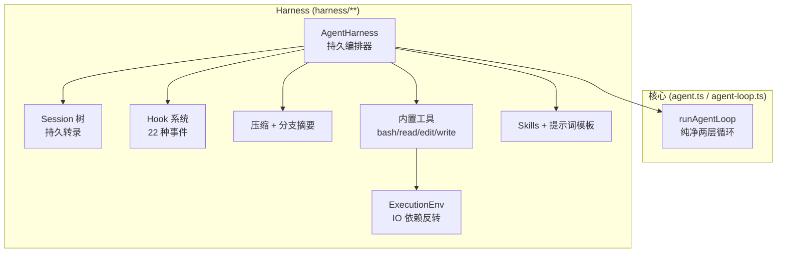
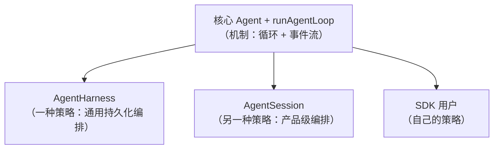

# 第 6 章：AgentHarness——可持久化的编排器

## 核心故意留下的空白

第 3 章的核心循环是纯净的：它只认识一个 `emit` 回调和一组"永不抛出"的配置槽位，不碰文件系统，不做持久化，不管压缩。这是刻意的设计——但也是不完整的。一个真实可用的 Agent 需要：把转录存到磁盘、上下文太长时压缩、在工具调用前后插入逻辑、管理 skills 和提示词模板、提供内置的文件/Shell 工具。

`pi-agent-core` 把这些"电池"装在一个独立的层里：Harness（`packages/agent/src/harness/**`）。它的核心是 `AgentHarness` 类（`packages/agent/src/harness/agent-harness.ts`，约 1,186 行），一个**可持久化、由 hook 驱动的编排器**，直接建立在 `runAgentLoop` 之上。

本章拆解这个层。但更重要的是，我们要回答一个架构问题：**为什么同一个包里既有最小核心、又有这个"电池齐全"的 Harness？** 以及一个更尖锐的问题：**为什么产品层 `pi-coding-agent` 最终没有用它，而是自建了编排器？** 这两个问题的答案，恰恰是"最小化核心"哲学最精微的体现。

---

## Harness 在核心之上加了什么

核心 `Agent` 类（第 5 章）是一个内存里的循环包装器。`AgentHarness` 在它之上增加了一整套持久化与编排能力：



逐项说：

- **持久会话树**：Harness 持有一个 `Session`（第 5 章的树），把每一轮的消息持久化进去。
- **Hook 系统**：22 种类型化的 hook 事件，让外部代码在循环的关键节点插入逻辑。
- **压缩与分支摘要**：上下文太长时自动生成摘要，分支切换时生成分支摘要。
- **内置工具**：`bash`、`read`、`edit`、`write`，建立在 `ExecutionEnv` 抽象之上。
- **Skills 与提示词模板**：加载 `SKILL.md`、格式化提示词模板。
- **phase 状态机**：跟踪 harness 当前在做什么（idle/turn/compaction/...）。

关键在于：这些能力**都不在核心循环里**。核心循环依然纯净——Harness 是通过往核心的配置槽位里塞回调、订阅核心的事件流来实现这一切的。Harness 是核心的*消费者*，不是核心的*修改者*。

---

## `ExecutionEnv`：把 IO 倒置出去

Harness 的内置工具要读写文件、执行命令。但它不直接用 `node:fs` 和 `node:child_process`——那会让它绑死在 Node 环境。它定义了一个 IO 抽象 `ExecutionEnv`（`packages/agent/src/harness/types.ts`）：

```typescript
export interface ExecutionEnv extends FileSystem, Shell {}
```

`FileSystem` 是一组文件操作，每个都返回 `Result` 而非抛出：

```typescript
export interface FileSystem {
	cwd: string;
	absolutePath(path, abortSignal?): Promise<Result<string, FileError>>;
	readTextFile(path, abortSignal?): Promise<Result<string, FileError>>;
	readTextLines(path, options?): Promise<Result<string[], FileError>>;
	readBinaryFile(path, abortSignal?): Promise<Result<Uint8Array, FileError>>;
	writeFile(path, content, abortSignal?): Promise<Result<void, FileError>>;
	appendFile(path, content, abortSignal?): Promise<Result<void, FileError>>;
	listDir(path, abortSignal?): Promise<Result<FileInfo[], FileError>>;
	canonicalPath(path, abortSignal?): Promise<Result<string, FileError>>;
	exists(path, abortSignal?): Promise<Result<boolean, FileError>>;
	createDir(path, options?): Promise<Result<void, FileError>>;
	remove(path, options?): Promise<Result<void, FileError>>;
	createTempDir(prefix?, abortSignal?): Promise<Result<string, FileError>>;
	cleanup(): Promise<void>; // 必须尽力而为，且不得抛出
}

export interface Shell {
	exec(command, options?): Promise<Result<{ stdout: string; stderr: string; exitCode: number }, ExecutionError>>;
	cleanup(): Promise<void>;
}
```

这里有两个设计决策值得注意。

**第一，`Result` 类型取代异常。** `Result<TValue, TError>` 是一个简单的可辨识联合：

```typescript
export type Result<TValue, TError> = { ok: true; value: TValue } | { ok: false; error: TError };
```

`FileSystem` 和 `Shell` 的文档明确要求：**所有失败都编码进返回的 `Result`，实现必须保持这个不变量，绝不抛出。** 这是第 3 章"失败是数据"契约在 IO 层的延续。工具的执行逻辑因此可以写成直白的 `if (result.ok) ... else ...`，而不需要 `try/catch` 包裹每个文件操作。`cleanup()` 甚至要求"必须尽力而为且不得抛出"——资源释放永远不能炸。

**第二，依赖倒置让工具跨环境。** 因为工具依赖的是 `ExecutionEnv` 接口而非具体实现，同一个 `createBashTool` 可以跑在不同的环境上。Node 环境用 `NodeExecutionEnv`（`packages/agent/src/harness/env/nodejs.ts`，基于 `node:fs`/`node:child_process`）；但理论上你可以提供一个把操作转发到远程 SSH、容器、或浏览器的实现。第 4 章提到的工具可插拔 `operations`（委托文件 IO 给远程系统）正是建立在这个抽象上。

`withFileMutationQueue`（第 4 章的文件互斥）也以 `ExecutionEnv` 为键——`WeakMap<ExecutionEnv, ...>`——所以不同执行环境有各自独立的互斥队列。IO 抽象与并发安全在这里自然地咬合。

---

## phase 状态机：harness 现在在做什么

`AgentHarness` 用一个 phase 字段跟踪自己的宏观状态：

```typescript
export type AgentHarnessPhase = "idle" | "turn" | "compaction" | "branch_summary" | "retry";
```

- `idle`：空闲，可以接受新操作
- `turn`：正在跑一轮对话
- `compaction`：正在压缩上下文
- `branch_summary`：正在生成分支摘要
- `retry`：正在重试

这个状态机的一个实际用途是**互斥保护**。比如 `navigateTree`（分支导航）开头就检查：

```typescript
async navigateTree(...): Promise<NavigateTreeResult> {
	if (this.phase !== "idle") throw new AgentHarnessError("busy", "navigateTree() requires idle harness");
	// ...
}
```

`compact()` 同样要求空闲。这避免了"一边在跑对话、一边在改会话树"这种危险的并发。phase 不是 UI 状态（那个由事件流驱动），而是 harness 自身的"我在忙什么"的内部账本。

Harness 还用一个 `activeTasks: Map<Promise, "operation" | "mutation">` 跟踪所有进行中的异步工作，区分"操作"和"变更"，以便在关闭时能等待它们完成。

---

## `createTurnState`：每轮一个快照

每一轮对话开始时，Harness 会拍一个快照 `createTurnState()`（`packages/agent/src/harness/agent-harness.ts`）：

```typescript
private async createTurnState() {
	// 从会话树构建上下文，快照：
	// messages, resources, toolContext, streamOptions, sessionId,
	// systemPrompt, model, thinkingLevel, tools, activeTools
}
```

它从 `Session` 重新构建上下文（`buildSessionContext`），把当前的模型、thinking 级别、激活工具、系统提示词、资源等全部冻结成一个不可变的轮次状态。这一轮就用这个快照。

为什么要每轮重新快照？因为运行期间状态可能被修改——用户可能在 agent 工作时切换了模型、改了激活工具。如果循环一直用启动时的旧状态，这些修改就不会生效。快照机制让"轮间变更"有了明确的生效时机。

这与第 3 章的 `prepareNextTurn` 钩子咬合。Harness 的 `createLoopConfig` 这样实现它：

```typescript
prepareNextTurn: async () => {
	await this.flushPendingSessionWrites();      // 先把待写的落盘
	const nextTurnState = await this.createTurnState(); // 重新从会话树快照
	setTurnState(nextTurnState);
	return {
		context: this.createContext(nextTurnState),
		model: nextTurnState.model,
		thinkingLevel: nextTurnState.thinkingLevel,
	};
},
```

每轮结束、下一轮开始前：先把缓冲的写操作落盘，再重新从会话树构建快照，把新的 context/model/thinkingLevel 返回给循环。于是运行中途的 `setModel()` 等修改，会在下一个轮次边界生效。这是一个干净的"变更在安全点生效"的模型。

---

## `createLoopConfig`：从核心槽位到 Harness hook

这是 Harness 最核心的适配工作。核心循环只有少数几个配置槽位（`transformContext`、`beforeToolCall`、`afterToolCall`、`prepareNextTurn`、`getSteeringMessages`、`getFollowUpMessages`），而 Harness 有一个丰富得多的 hook 系统。`createLoopConfig` 就是把前者映射到后者的适配器：

```typescript
private createLoopConfig(getTurnState, setTurnState): AgentLoopConfig {
	const turnState = getTurnState();
	return {
		model: turnState.model,
		reasoning: turnState.thinkingLevel === "off" ? undefined : turnState.thinkingLevel,
		convertToLlm,
		// 核心的 transformContext 槽位 → harness 的 "context" hook
		transformContext: async (messages) => {
			const result = await this.emitHook({ type: "context", messages: [...messages] });
			return result?.messages ?? messages;
		},
		// 核心的 beforeToolCall 槽位 → harness 的 "tool_call" hook
		beforeToolCall: async ({ toolCall, args }) => {
			const result = await this.emitHook({
				type: "tool_call",
				toolCallId: toolCall.id,
				toolName: toolCall.name,
				input: args,
			});
			return result ? { block: result.block, reason: result.reason } : undefined;
		},
		// 核心的 afterToolCall 槽位 → harness 的 "tool_result" hook
		afterToolCall: async ({ toolCall, args, result, isError }) => {
			const patch = await this.emitHook({
				type: "tool_result",
				toolCallId: toolCall.id,
				toolName: toolCall.name,
				input: args,
				content: result.content,
				details: result.details,
				isError,
				usage: result.usage,
			});
			return patch ? { content: patch.content, details: patch.details, isError: patch.isError, usage: patch.usage, terminate: patch.terminate } : undefined;
		},
		prepareNextTurn: async () => { /* 如上 */ },
		getSteeringMessages: async () => this.drainQueuedMessages(this.steerQueue, this.steeringQueueMode),
		getFollowUpMessages: async () => this.drainQueuedMessages(this.followUpQueue, this.followUpQueueMode),
	};
}
```

看这个映射：核心的 `transformContext` 槽位被接到 harness 的 `context` hook，核心的 `beforeToolCall` 接到 `tool_call` hook，核心的 `afterToolCall` 接到 `tool_result` hook。核心提供**机制**（"这里有一个可以拦截的槽位"），Harness 提供**策略**（"拦截时具体触发哪些 hook、怎么聚合结果"）。

这个适配方向很重要：是 Harness 适配核心，而不是核心迁就 Harness。核心循环对 hook 系统一无所知——它只是调用 `transformContext`，至于那个回调内部是不是触发了一个 22 种事件的 hook 系统，它不关心。这就是分层的意义：下层稳定，上层自由演进。

---

## Hook 系统：22 种类型化事件

Harness 的 hook 系统由 `AgentHarnessEventResultMap`（`packages/agent/src/harness/types.ts`）定义，列出所有 hook 事件及其返回值类型：

```typescript
export type AgentHarnessEventResultMap = {
	before_agent_start: BeforeAgentStartResult | undefined;
	context: ContextResult | undefined;
	before_provider_request: BeforeProviderRequestResult | undefined;
	before_provider_payload: BeforeProviderPayloadResult | undefined;
	after_provider_response: undefined;
	tool_call: ToolCallResult | undefined;
	tool_result: ToolResultPatch | undefined;
	session_before_compact: SessionBeforeCompactResult | undefined;
	session_compact: undefined;
	session_before_tree: SessionBeforeTreeResult | undefined;
	session_tree: undefined;
	retry_scheduled: undefined;
	retry_attempt_start: undefined;
	retry_finished: undefined;
	model_update: undefined;
	thinking_level_update: undefined;
	resources_update: undefined;
	tools_update: undefined;
	queue_update: undefined;
	save_point: undefined;
	abort: undefined;
	settled: undefined;
};
```

22 种事件，分两类：

- **可影响行为的**（返回值非 `undefined`）：`before_agent_start`、`context`、`before_provider_request`、`before_provider_payload`、`tool_call`、`tool_result`、`session_before_compact`、`session_before_tree`。这些 hook 的处理器可以返回一个结果来改变行为——比如 `tool_call` 返回 `{ block: true }` 阻止工具，`context` 返回修改后的消息列表。
- **通知性的**（返回值 `undefined`）：`after_provider_response`、`session_compact`、`retry_scheduled`、`model_update`、`tools_update`、`abort`、`settled` 等。这些只是告知"某事发生了"，供外部记录或同步状态。

`emitHook` 是触发器：

```typescript
private async emitHook<TType extends keyof AgentHarnessEventResultMap>(
	event: { type: TType } & ...,
): Promise<AgentHarnessEventResultMap[TType]> {
	// 依次调用注册的处理器，返回最后一个非 undefined 的结果
}
```

它按注册顺序调用处理器，返回**最后一个非 `undefined` 的结果**。这个"last-wins"语义让多个处理器可以叠加，后面的覆盖前面的。

注意这套 hook 系统是**强类型**的：每个事件的 payload 和返回值类型都由 `AgentHarnessEventResultMap` 精确约束。注册一个 `tool_call` 处理器时，你能在编译期得到完整的类型检查。这与"运行时钩子字符串"（`hooks.on("PreToolUse", ...)`）形成鲜明对比——后者要到运行时才知道事件名拼对了没、payload 长什么样。第 14 章会看到，产品层的扩展系统继承了这个"类型化扩展"的品味。

---

## 持久化：在安全点落盘

Harness 把消息持久化进会话树，但不是每条消息都立即写盘——它用一个写缓冲 `pendingSessionWrites`，在安全点统一刷新。

`handleAgentEvent` 是 harness 的事件处理器（对应核心 `Agent` 的 `processEvents`）。它在 `message_end` 时把消息记入缓冲，在 `turn_end`/`agent_end` 时刷新：

```typescript
private async handleAgentEvent(event: AgentEvent, signal?: AbortSignal): Promise<void> {
	// message_end → 记入 pendingSessionWrites
	// turn_end / agent_end → flushPendingSessionWrites()
}

private async flushPendingSessionWrites(): Promise<void> {
	while (this.pendingSessionWrites.length > 0) {
		const write = this.pendingSessionWrites[0]!;
		if (write.type === "message") {
			await this.session.appendMessage(write.message);
		} else if (write.type === "model_change") {
			// ...
		}
		// 出队，继续
	}
}
```

为什么缓冲而非立即写？因为运行中途可能发生变更（`setModel()`、`setThinkingLevel()`），这些变更如果立即写进会话树，可能与正在进行的消息流交错，产生不一致的中间状态。把它们缓冲到 `turn_end`/`agent_end`/`prepareNextTurn` 这些安全点统一落盘，保证了会话树的写入是有序的、原子的。

`handleAgentEvent` 也处理失败兜底——和核心 `Agent` 一样，意外错误会被转换成一个正常的失败事件序列（`message_start` → `message_end` → `turn_end` → `agent_end`），再交给 `handleRunFailure` 持久化。"失败也是正常事件序列"的契约，从核心一路贯彻到了 Harness。

---

## 压缩与分支导航

Harness 把第 5 章提到的两个会话树操作暴露为方法：`compact()` 和 `navigateTree()`。

`compact(customInstructions?)`（第 7 章详述）触发上下文压缩：生成摘要、追加一个 `CompactionEntry`、之后上下文构建用"摘要 + 尾部"。它在前后触发 `session_before_compact` 和 `session_compact` hook，并把 phase 切到 `compaction`。

`navigateTree(...)` 在会话树上导航（分支、回溯）：它可能生成一个分支摘要（`BranchSummaryEntry`），然后 `moveTo` 到目标节点。它在前后触发 `session_before_tree` 和 `session_tree` hook，phase 切到 `branch_summary`。两者都要求 harness 处于 `idle`——不能在对话进行中改树。

这两个方法是"会话树"设计的能力出口。因为转录是树而非数组，压缩可逆、分支免费——Harness 只是把这些底层能力包装成两个带 hook、带 phase 保护的高层操作。

---

## 为什么产品层没有用它

现在回答那个尖锐的问题：既然 `AgentHarness` 提供了这么完整的持久化编排，为什么 `pi-coding-agent` 不用它，反而自建了一个 3,333 行的 `AgentSession`？

答案在于**关注点的错位**。`AgentHarness` 是一个*通用的*持久化编排器——它关心会话树、压缩、hook、内置工具、skills。但产品层需要的远不止这些：

- 三种运行模式（交互 TUI / print / RPC）
- 扩展系统（约 40 种事件、注册工具/命令/快捷键/flag）
- 项目信任决策
- 斜杠命令、模型切换 UI、主题
- 设置管理、认证、OAuth
- HTML 导出、会话分享

这些产品级的关注点，与 `AgentHarness` 的通用编排关注点并不重合。如果产品层硬用 `AgentHarness`，要么把产品逻辑塞进 harness 的 hook（污染通用层），要么在 harness 外面再包一层（那 harness 就成了多余的中间层）。

于是产品层做了一个清醒的选择：**直接坐在核心 `Agent` 上，自建编排。** 回忆第 1 章的 `sdk.ts:294`：`agent = new Agent({...})`——产品层实例化的是核心 `Agent`，不是 `AgentHarness`。它复用核心的循环和事件流，但用自己的 `AgentSession` 处理产品编排，用自己的 `SessionManager`（JSONL）处理持久化。

这揭示了 `pi-agent-core` 内部两层设计的真正意图：



核心提供**机制**（循环、事件流、工具执行、消息桥）。`AgentHarness` 是官方提供的**一种策略**——"如果你想要一个开箱即用的持久化 Agent"。`AgentSession` 是产品层的**另一种策略**——"如果你要做一个完整的 CLI 产品"。SDK 用户完全可以写**自己的策略**。

核心不强迫任何人在 `AgentHarness` 和 `AgentSession` 之间二选一，因为它根本不知道这两者的存在——它只暴露机制。这才是"最小化核心"的完整含义：**核心小到可以被任何一种编排策略复用，包括官方没想到的策略。**

---

## 实践应用

`AgentHarness` 与核心的关系，为"如何设计可扩展的框架"提供了四条可迁移的模式。

**机制与策略分离，且机制不知道策略。** 核心循环提供槽位（机制），Harness 和产品各自往槽位里塞自己的逻辑（策略），核心对策略一无所知。它解决的问题是：框架把某一种使用方式焊死在核心里，导致其他使用方式被迫迁就。当核心只暴露机制，策略就能百花齐放——通用 Harness、产品 Session、自定义 SDK 各得其所。

**用依赖倒置把环境隔离出去。** 工具的 IO 依赖 `ExecutionEnv` 接口而非 `node:fs`，且所有操作返回 `Result` 不抛异常。它解决的问题是：业务逻辑绑死在某个运行环境，且 `try/catch` 散落。当 IO 是接口、失败是 `Result`，同一套工具就能跑在 Node、远程、容器里，且执行逻辑保持直白。

**用适配器连接不同抽象层次。** `createLoopConfig` 把核心的少数槽位映射到 Harness 的丰富 hook 系统，方向是"上层适配下层"。它解决的问题是：为了上层的需求改动下层接口，破坏下层的稳定。当适配方向正确，下层（核心循环）可以长期稳定，上层（hook 系统）自由演进。

**变更在安全点生效。** 运行中途的状态修改被缓冲，在轮次边界（`prepareNextTurn`）或运行结束（`turn_end`）统一落盘/生效。它解决的问题是：运行中途的修改与进行中的工作交错，产生不一致的中间状态。当变更有明确的生效时机，状态一致性就有了保障。

---

## 总结

`AgentHarness` 是 `pi-agent-core` 在最小核心之上提供的"电池齐全"层：它用 `ExecutionEnv` 倒置 IO、用 phase 状态机保护并发、用每轮快照承接运行中途的变更、用 `createLoopConfig` 把核心槽位适配到 22 种类型化 hook、用写缓冲在安全点持久化、用 `compact()`/`navigateTree()` 暴露会话树的能力。

但它最深刻的教训不在它自己，而在它*没被产品使用*这件事。核心提供机制，`AgentHarness` 是一种策略，产品的 `AgentSession` 是另一种策略——核心因为小到不偏袒任何策略，才能被所有策略复用。这是"最小化核心"哲学的完整闭环。

下一章，我们深入 Harness 的压缩与分支摘要——看 Pi Agent 如何在不删除历史的前提下，把膨胀的上下文压回模型的窗口之内。
