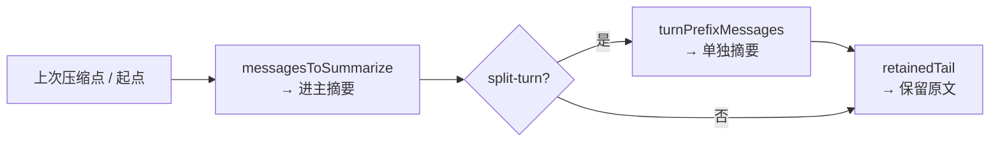
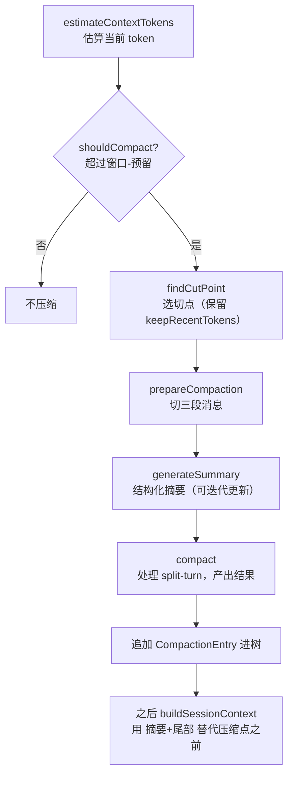

# 第 7 章：上下文压缩与分支摘要

## 有限的窗口，无限的任务

每个模型都有一个上下文窗口——一次能"看到"的 token 上限。但真实的编码任务往往很长：读几十个文件、跑几十次命令、来回讨论几十轮。转录会膨胀，迟早撞上那堵墙。撞上之后怎么办？

综合体路线的回答是"四层压缩"——snip、microcompact、collapse、autocompact，从轻到重逐级触发，外加 circuit breaker 防止无限重试。那是一个潜艇式的复杂系统。

Pi Agent 的回答简单得多，却有一个独特的 twists：**压缩不删除历史。** 回忆第 5 章：转录是一棵不可变的树。压缩不是从树里删节点，而是往树里*插入*一个摘要节点（`CompactionEntry`）。原始历史完好无损地留在树上——压缩只改变"发给模型的上下文视图"。这让压缩成为一个**可逆的视图变换**：用户可以回到压缩点之前，重新展开那段历史。

本章拆解这个机制：何时压缩、在哪里切、摘要怎么写、以及它如何与那棵树咬合。

---

## 何时压缩：阈值与估算

压缩的触发判断是一个简单的不等式。`shouldCompact`（`packages/agent/src/harness/compaction/compaction.ts`）：

```typescript
export function shouldCompact(contextTokens: number, contextWindow: number, settings: CompactionSettings): boolean {
	if (!settings.enabled) return false;
	return contextTokens > contextWindow - settings.reserveTokens;
}
```

当估算的上下文 token 数超过"窗口大小减去预留空间"时，就该压缩了。默认设置（`DEFAULT_COMPACTION_SETTINGS`）：

```typescript
export const DEFAULT_COMPACTION_SETTINGS: CompactionSettings = {
	enabled: true,
	reserveTokens: 16384,   // 为摘要提示词和输出预留
	keepRecentTokens: 20000, // 压缩后大约保留多少近期 token
};
```

- `reserveTokens`（16,384）：在窗口顶部预留的空间，给摘要生成那次模型调用用，也作为安全边际。
- `keepRecentTokens`（20,000）：压缩后希望保留的近期上下文量——切点选择围绕这个预算展开。

### token 估算：以权威用量为锚

判断"现在有多少 token"本身是个难题——你不可能每次都把整个转录发给模型去精确计数。`estimateContextTokens` 用了一个聪明的混合策略：

```typescript
export function estimateContextTokens(messages: AgentMessage[]): ContextUsageEstimate {
	const usageInfo = getLastAssistantUsageInfo(messages);
	if (!usageInfo) {
		// 没有任何权威用量：全部用启发式估算
		let estimated = 0;
		for (const message of messages) estimated += estimateTokens(message);
		return { tokens: estimated, usageTokens: 0, trailingTokens: estimated, lastUsageIndex: null };
	}
	// 有权威用量：用它做锚，只估算锚点之后的新增消息
	const usageTokens = calculateContextTokens(usageInfo.usage);
	let trailingTokens = 0;
	for (let i = usageInfo.index + 1; i < messages.length; i++) {
		trailingTokens += estimateTokens(messages[i]);
	}
	return { tokens: usageTokens + trailingTokens, usageTokens, trailingTokens, lastUsageIndex: usageInfo.index };
}
```

关键洞见：最近一次助手响应的 `usage` 字段是**权威**的——它是提供商真实报告的、包含那条消息为止整个上下文的 token 数。于是估算变成"权威锚点 + 锚点之后的启发式增量"。误差被限制在"最近一轮新增的内容"，而不是累积整个对话。这比从头估算整个转录精确得多。

锚点不存在时（比如会话刚开始），退回到纯启发式 `estimateTokens`——一个保守的"字符数 / 4"估算，图片按 `ESTIMATED_IMAGE_CHARS = 4800` 字符计：

```typescript
export function estimateTokens(message: AgentMessage): number {
	let chars = 0;
	switch (message.role) {
		case "user":
			chars = estimateTextAndImageContentChars(message.content);
			return Math.ceil(chars / 4);
		case "assistant":
			// 累加 text、thinking、toolCall（名字 + 参数 JSON）的字符
			return Math.ceil(chars / 4);
		// ... toolResult, bashExecution, branchSummary, compactionSummary
	}
	return 0;
}
```

`calculateContextTokens(usage)` 则从权威用量里取总数：`usage.totalTokens || usage.input + usage.output + usage.cacheRead + usage.cacheWrite`。

---

## 在哪里切：切点选择

决定要压缩之后，下一个问题是：从哪里切开？切点之前进摘要，切点之后保留原文。`findCutPoint` 做这个决策，目标是**保留大约 `keepRecentTokens` 的近期上下文**。

### 合法的切点

不是任何位置都能切。`findValidCutPoints` 筛选出合法的切点：

```typescript
function findValidCutPoints(entries: SessionTreeEntry[], startIndex: number, endIndex: number): number[] {
	const cutPoints: number[] = [];
	for (let i = startIndex; i < endIndex; i++) {
		const entry = entries[i];
		switch (entry.type) {
			case "message": {
				const role = entry.message.role;
				switch (role) {
					case "bashExecution":
					case "custom":
					case "branchSummary":
					case "compactionSummary":
					case "user":
					case "assistant":
						cutPoints.push(i); // 这些消息边界可以切
						break;
					case "toolResult":
						break; // 工具结果不能作为切点
				}
				break;
			}
			// 配置变更条目（model_change 等）不是切点
		}
		if (entry.type === "branch_summary" || entry.type === "custom_message") cutPoints.push(i);
	}
	return cutPoints;
}
```

注意 `toolResult` **不能**作为切点。为什么？因为协议要求每个 `tool_use` 后面必须跟着对应的 `tool_result`（第 3 章的"孤立工具结果"问题）。如果在工具调用和它的结果之间切开，保留的后半段就会以一个孤立的 `toolResult` 开头，提供商会拒绝。把切点限制在 user/assistant 等消息边界，保证了切开后的两半各自都是合法的对话片段。

### 从尾部倒推预算

`findCutPoint` 从尾部往前累积 token，直到达到 `keepRecentTokens` 预算，然后选那个位置之后最近的合法切点：

```typescript
export function findCutPoint(entries, startIndex, endIndex, keepRecentTokens): CutPointResult {
	const cutPoints = findValidCutPoints(entries, startIndex, endIndex);
	if (cutPoints.length === 0) {
		return { firstKeptEntryIndex: startIndex, turnStartIndex: -1, isSplitTurn: false };
	}
	let accumulatedTokens = 0;
	let cutIndex = cutPoints[0];

	// 从尾部往前累积，直到达到 keepRecentTokens
	for (let i = endIndex - 1; i >= startIndex; i--) {
		const entry = entries[i];
		if (entry.type !== "message") continue;
		accumulatedTokens += estimateTokens(entry.message);
		if (accumulatedTokens >= keepRecentTokens) {
			// 找到这个位置之后最近的合法切点
			for (let c = 0; c < cutPoints.length; c++) {
				if (cutPoints[c] >= i) { cutIndex = cutPoints[c]; break; }
			}
			break;
		}
	}
	// 往前微调，避免切在 compaction 或 message 之前的"空档"
	while (cutIndex > startIndex) {
		const prevEntry = entries[cutIndex - 1];
		if (prevEntry.type === "compaction" || prevEntry.type === "message") break;
		cutIndex--;
	}
	const cutEntry = entries[cutIndex];
	const isUserMessage = cutEntry.type === "message" && cutEntry.message.role === "user";
	const turnStartIndex = isUserMessage ? -1 : findTurnStartIndex(entries, cutIndex, startIndex);
	return {
		firstKeptEntryIndex: cutIndex,
		turnStartIndex,
		isSplitTurn: !isUserMessage && turnStartIndex !== -1,
	};
}
```

逻辑是：从最新的消息往前数，数到累计约 20,000 token 为止，然后对齐到最近的合法切点。这样保留的尾部大约是 `keepRecentTokens` 大小，切点之前的进摘要。

### split-turn：切在一轮中间

有一个微妙的情况：切点可能落在**一轮对话的中间**——比如一个用户请求触发了 10 次工具调用，切点恰好切在这 10 次调用的第 5 次之后。这时切点之后的"保留尾部"会以一个没有上下文的工具结果开头，模型会困惑。

`findCutPoint` 通过 `isSplitTurn` 标志检测这种情况：如果切点不是 user 消息，它会用 `findTurnStartIndex` 往前找到这一轮的起点（发起这轮的 user 消息）。`isSplitTurn: true` 意味着"切点把一轮切成了两半"。

这种情况需要特殊处理——保留的尾部（一轮的后半）需要一段"前半发生了什么"的额外说明。我们马上会看到 `compact` 如何用一个独立的"turn prefix 摘要"来解决它。

---

## 准备：`prepareCompaction`

`prepareCompaction` 把切点决策转化成一个 `CompactionPreparation`——压缩所需的一切输入：

```typescript
export function prepareCompaction(pathEntries, settings): Result<CompactionPreparation | undefined, CompactionError> {
	// 如果路径为空，或最后一个条目已经是 compaction，无需压缩
	if (pathEntries.length === 0 || pathEntries[pathEntries.length - 1].type === "compaction") {
		return ok(undefined);
	}

	// 找到上一个 compaction（用于迭代更新摘要）
	let prevCompactionIndex = -1;
	for (let i = pathEntries.length - 1; i >= 0; i--) {
		if (pathEntries[i].type === "compaction") { prevCompactionIndex = i; break; }
	}
	let previousSummary: string | undefined;
	let boundaryStart = 0;
	if (prevCompactionIndex >= 0) {
		previousSummary = (pathEntries[prevCompactionIndex] as CompactionEntry).summary;
		// 边界从上次压缩的 firstKeptEntry 开始
		// ...
	}

	const tokensBefore = estimateContextTokens(buildSessionContext(pathEntries).messages).tokens;
	const cutPoint = findCutPoint(pathEntries, boundaryStart, pathEntries.length, settings.keepRecentTokens);
	const firstKeptEntryId = pathEntries[cutPoint.firstKeptEntryIndex].id;

	// 三段消息：
	const historyEnd = cutPoint.isSplitTurn ? cutPoint.turnStartIndex : cutPoint.firstKeptEntryIndex;
	const messagesToSummarize = []; // 边界 → historyEnd：进主摘要
	const turnPrefixMessages = [];  // turnStart → 切点：split-turn 的前半，单独摘要
	const retainedTail = [];        // 切点 → 末尾：保留原文

	const fileOps = extractFileOperations(messagesToSummarize, pathEntries, prevCompactionIndex);

	return ok({ firstKeptEntryId, messagesToSummarize, turnPrefixMessages, retainedTail, isSplitTurn, tokensBefore, previousSummary, fileOps, settings });
}
```

它把路径切成三段：



- **`messagesToSummarize`**：从边界到切点（或 split-turn 的轮次起点）的消息，将被压缩进主摘要。
- **`turnPrefixMessages`**：仅 split-turn 时有——被切开的那一轮的前半段，需要单独摘要。
- **`retainedTail`**：切点之后的近期消息，保留原文，直接存在压缩条目上。

注意 `previousSummary`：如果之前已经压缩过，这次压缩不是从零开始，而是**在上次摘要的基础上增量更新**——这是一个重要的优化，我们下面会看到。

`fileOps` 则提取这段历史里读过的、改过的文件（`extractFileOperations`），存进压缩条目的 `details`。于是压缩后的上下文依然"记得"动过哪些文件——`CompactionDetails { readFiles, modifiedFiles }`。

---

## 摘要怎么写：结构化提示词

摘要的质量决定了压缩后 agent 还能不能接着干活。Pi Agent 用一个高度结构化的提示词来约束摘要格式。系统提示词（`SUMMARIZATION_SYSTEM_PROMPT`）先把模型钉死在"只输出摘要"的角色上：

> You are a context summarization assistant. Your task is to read a conversation between a user and an AI assistant, then produce a structured summary following the exact format specified.
>
> Do NOT continue the conversation. Do NOT respond to any questions in the conversation. ONLY output the structured summary.

然后用户提示词（`SUMMARIZATION_PROMPT`）规定了精确的输出格式：

```
## Goal
[What is the user trying to accomplish?]

## Constraints & Preferences
- [Any constraints, preferences, or requirements mentioned by user]

## Progress
### Done
- [x] [Completed tasks/changes]
### In Progress
- [ ] [Current work]
### Blocked
- [Issues preventing progress, if any]

## Key Decisions
- **[Decision]**: [Brief rationale]

## Next Steps
1. [Ordered list of what should happen next]

## Critical Context
- [Any data, examples, or references needed to continue]

Keep each section concise. Preserve exact file paths, function names, and error messages.
```

这个格式的设计很讲究。它不是"把对话缩写成一段话"，而是把对话**重构成一份交接文档**——目标、约束、进度（已完成/进行中/受阻）、关键决策、下一步、关键上下文。最后一句"Preserve exact file paths, function names, and error messages"尤其关键：摘要可以丢失措辞，但不能丢失精确的标识符，因为接下来的工作要靠它们。

### 迭代更新：`UPDATE_SUMMARIZATION_PROMPT`

如果已有 `previousSummary`（之前压缩过），就用 `UPDATE_SUMMARIZATION_PROMPT` 代替。它把旧摘要放在 `<previous-summary>` 标签里，要求模型**增量更新**而非重写：

> Update the existing structured summary with new information. RULES:
> - PRESERVE all existing information from the previous summary
> - ADD new progress, decisions, and context from the new messages
> - UPDATE the Progress section: move items from "In Progress" to "Done" when completed
> - PRESERVE exact file paths, function names, and error messages

这避免了"每次压缩都把整个历史重新摘要一遍"的浪费。第二次压缩时，模型只需要读"上次摘要 + 上次之后新增的消息"，而不是"全部原始历史"。压缩的成本因此不会随会话长度线性增长。

### 生成：`generateSummaryWithUsage`

实际的生成调用（`generateSummaryWithUsage`）有几个细节：

```typescript
const maxTokens = Math.min(
	Math.floor(0.8 * reserveTokens),
	model.maxTokens > 0 ? model.maxTokens : Number.POSITIVE_INFINITY,
);
// ...
const response = await completeSimpleWithRetries(models, model, {
	systemPrompt: SUMMARIZATION_SYSTEM_PROMPT,
	messages: summarizationMessages,
}, completionOptions, retry, callbacks);
```

- **输出上限**：`maxTokens` 取 `0.8 * reserveTokens` 和模型上限的较小值——摘要输出被约束在预留空间内，不会自己撑爆窗口。
- **隔离的请求**：`completeSimpleWithRetries` 给摘要调用一个全新的 `sessionId` 和 `cacheRetention: "none"`：

```typescript
export async function completeSimpleWithRetries(models, model, context, options, retry?, callbacks?) {
	// 摘要是独立请求：隔离路由，避免写入无法复用的缓存
	const requestOptions = { ...options, cacheRetention: "none", sessionId: uuidv7() };
	return retryAssistantCall(() => models.completeSimple(model, context, requestOptions), retry, requestOptions.signal, callbacks);
}
```

为什么隔离？因为摘要请求的内容（序列化的历史 + 摘要提示词）跟正常对话的 prompt 前缀完全不同，为它写 prompt cache 是浪费——那个缓存永远不会被复用。用 fresh sessionId + no cache，避免污染主对话的缓存统计。它还套了 `retryAssistantCall`（第 2 章的助手级重试），让摘要生成对临时失败有韧性。

---

## 落地：`compact` 与 split-turn

`compact` 把准备和生成串起来，产出最终的 `CompactionResult`：

```typescript
export async function compact(preparation, models, model, customInstructions?, signal?, thinkingLevel?, retry?, callbacks?): Promise<Result<CompactionResult, CompactionError>> {
	const { firstKeptEntryId, messagesToSummarize, turnPrefixMessages, retainedTail, isSplitTurn, tokensBefore, previousSummary, fileOps, settings } = preparation;

	let summary: string;
	let summaryUsage: Usage;

	if (isSplitTurn && turnPrefixMessages.length > 0) {
		// split-turn：先摘要历史，再单独摘要这一轮的前半
		let historyText = "No prior history.";
		if (messagesToSummarize.length > 0) {
			const historyResult = await generateSummaryWithUsage(messagesToSummarize, ...);
			if (!historyResult.ok) return err(historyResult.error);
			historyText = historyResult.value.text;
		}
		const turnPrefixResult = await generateTurnPrefixSummary(turnPrefixMessages, ...);
		if (!turnPrefixResult.ok) return err(turnPrefixResult.error);
		summary = `${historyText}\n\n---\n\n**Turn Context (split turn):**\n\n${turnPrefixResult.value.text}`;
		summaryUsage = combineUsage(...);
	} else {
		// 普通情况：一次摘要
		const summaryResult = await generateSummaryWithUsage(messagesToSummarize, ...);
		if (!summaryResult.ok) return err(summaryResult.error);
		summary = summaryResult.value.text;
		summaryUsage = summaryResult.value.usage;
	}
	// 返回 { summary, firstKeptEntryId, tokensBefore, usage, retainedTail, details: fileOps }
}
```

split-turn 的处理是亮点：当切点把一轮切成两半，`compact` 会做**两次**摘要——一次是常规的历史摘要（`SUMMARIZATION_PROMPT`），一次是专门的"轮次前缀摘要"（`TURN_PREFIX_SUMMARIZATION_PROMPT`），后者用另一个格式：

> This is the PREFIX of a turn that was too large to keep. The SUFFIX (recent work) is retained.
> ## Original Request / ## Early Progress / ## Context for Suffix

然后把两段拼起来。这样保留的尾部（一轮的后半）就有了一段"前半发生了什么"的说明，模型不会看到一个没头没尾的工具结果。

`CompactionResult` 携带 `summary`、`firstKeptEntryId`（保留历史从哪里开始）、`tokensBefore`、`usage`、`retainedTail`（保留的尾部消息）、`details`（文件操作）。

---

## 与树咬合：压缩如何生效

`compact` 产出的结果，最终被 `AgentHarness`（或产品层）写成一个 `CompactionEntry` 追加进会话树。回忆第 5 章的 `defaultContextEntryTransform`：之后每次构建上下文时，如果路径里有这个 `compaction` 条目，上下文就变成"`[compaction]` + 保留的尾部"。

于是整个压缩流程闭环了：



而原始历史——`messagesToSummarize` 对应的那些条目——**从未被删除**。它们还在树上。用户 `moveTo` 回压缩点之前，`defaultContextEntryTransform` 就看不到那个 `compaction` 条目（因为它在路径之外），原始历史重新展开。压缩是可逆的。

这是 Pi Agent 与"删除式压缩"的根本区别。删除式压缩（从数组里 splice 掉旧消息）简单但不可逆，且丢失了"回看历史"的能力。Pi Agent 用树结构把"存储"和"视图"分离，代价是多一层抽象，收益是压缩、分支、回溯全都自然且可逆。

---

## 分支摘要：换分支时的交接

除了压缩，还有一种摘要：分支摘要（branch summarization，`packages/agent/src/harness/compaction/branch-summarization.ts`）。

回忆第 5 章：用户可以在会话树上 `moveTo` 到另一个分支。当你从分支 A 切到分支 B 时，分支 A 上发生的事对分支 B 的后续工作可能是有用的上下文（"我刚才在另一个分支试过 X 方案，不行"）。`generateBranchSummary` 在你离开一个分支时，为它生成一段摘要（`BranchSummaryEntry`），这样切回来或切过去时，那段探索的精华不会丢失。

`collectEntriesForBranchSummary` 收集要摘要的分支条目，`generateBranchSummary` 用类似的结构化提示词生成摘要。它和压缩摘要共享"把对话重构成结构化交接文档"的理念，只是触发时机不同：压缩是"上下文太满了"，分支摘要是"我要离开这个分支了"。

`AgentHarness.navigateTree`（第 6 章）在分支导航时会触发它，phase 切到 `branch_summary`，并触发 `session_before_tree`/`session_tree` hook。

---

## 实践应用

Pi Agent 的压缩为"如何管理 Agent 的有限上下文"提供了四条可迁移的模式。

**以权威用量为锚，只估算增量。** 用最近一次提供商报告的真实 token 数做锚点，只对其后新增的消息做启发式估算。它解决的问题是：对整个转录做启发式估算会累积误差，而精确计数又太贵。锚点法把误差限制在"最近一轮"，在成本与精度之间取得平衡。

**切点对齐到协议合法的边界。** 切点不能落在工具调用和它的结果之间，否则保留的后半段会以孤立结果开头。它解决的问题是：天真的"按 token 数切"会切出协议非法的片段。把切点约束在合法边界（user/assistant），保证切开后的两半各自合法。

**把摘要写成结构化交接文档，而非缩写。** 用固定格式（目标/约束/进度/决策/下一步/关键上下文）约束摘要，并强制保留精确的标识符。它解决的问题是：自由形式的摘要会丢失继续工作所需的关键细节（文件路径、函数名、错误信息）。结构化格式让摘要成为一份可用的交接文档，而不是一段模糊的概括。

**压缩是视图变换，不是数据删除。** 把"存储完整历史"和"发给模型什么"分离——压缩插入一个摘要节点，原始历史保留，上下文构建时按需替代。它解决的问题是：删除式压缩不可逆，丢失了回看和回溯的能力。当压缩可逆，用户就能在"省 token"和"看历史"之间自由切换。代价是需要树状的存储模型——又一次，第 5 章的树结构在这里兑现了它的价值。

---

## 总结

Pi Agent 的压缩是一个围绕"树状转录"设计的机制：`shouldCompact` 用"权威锚点 + 增量估算"判断时机，`findCutPoint` 在协议合法的边界上保留约 `keepRecentTokens` 的近期上下文（并检测 split-turn），`prepareCompaction` 把路径切成三段，`generateSummary` 用结构化提示词把历史重构成一份交接文档（支持迭代更新与 split-turn 的双段摘要），最后 `compact` 产出的 `CompactionEntry` 被追加进树——原始历史永不删除，压缩只是上下文视图的可逆替换。分支摘要则在切换分支时保存探索的精华。

它比综合体路线的"四层压缩"简单一个数量级，却没有牺牲核心能力——因为复杂性被那棵树吸收了。当你理解了第 5 章的树，这里的压缩几乎是水到渠成的。这正是好的底层抽象的价值：它让上层的功能变得简单。

下一章，我们离开 `pi-agent-core`，进入产品层 `pi-coding-agent`——看 `pi` 命令如何从一行 `cli.ts` 启动，一路装配出完整的 Agent。
