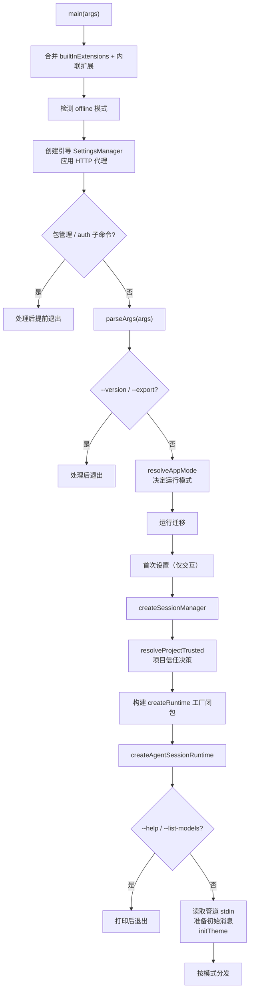

# 第 8 章：启动流水线——从 cli.ts 到模式分发

## 一个命令的诞生

前面三部分，我们自底向上走完了 `pi-ai`（模型层）、`pi-agent-core`（运行时层）。现在进入产品层 `pi-coding-agent`——`pi` 命令本身。本章追踪一个最日常的动作：你在终端敲下 `pi` 回车，到屏幕上出现那个等待输入的提示符之间，发生了什么。

启动流水线看似琐碎，实则暴露了一个产品的核心架构决策。Pi Agent 的启动要在极短时间内回答一连串问题：进哪种模式？用哪个模型？信任这个项目吗？加载哪些扩展？激活哪些工具？而这些决策必须在**不加载任何用不到的东西**的前提下完成——回忆第 2 章的惰性加载，启动速度是 Pi Agent 的执念。

我们会看到，这条流水线如何把"一个 CLI 命令"分流成三种截然不同的运行形态：交互式 TUI、headless print、以及给 IDE 用的 RPC。

---

## 入口 shim：`cli.ts`

一切从一个极简的入口文件开始（`packages/coding-agent/src/cli.ts`）：

```typescript
#!/usr/bin/env node
import { APP_NAME } from "./config.ts";
import { configureHttpDispatcher } from "./core/http-dispatcher.ts";
import { main } from "./main.ts";

process.title = APP_NAME;
process.env.PI_CODING_AGENT = "true";
process.emitWarning = (() => {}) as typeof process.emitWarning;

// 在任何提供商 SDK 发请求之前配置 undici 的全局 dispatcher
configureHttpDispatcher();

main(process.argv.slice(2));
```

这个文件只做四件事，每件都有讲究：

- **`process.title = APP_NAME`**：把进程名设成 `pi`，这样 `ps` 里看到的是 `pi` 而不是 `node`。
- **`process.env.PI_CODING_AGENT = "true"`**：打一个环境标记。子进程（比如工具启动的 shell）可以通过它知道自己跑在 pi 里。
- **`process.emitWarning = () => {}`**：静默 Node 的警告输出。一个面向用户的 CLI 不应该被 DeprecationWarning 刷屏。
- **`configureHttpDispatcher()`**：在任何提供商 SDK 发请求**之前**配置 undici（Node 的 HTTP 客户端）的全局 dispatcher——这是设置 HTTP 代理的地方。注释强调了时机：必须赶在第一个请求之前。

然后调用真正的引导函数 `main(process.argv.slice(2))`。入口 shim 与引导逻辑分离，让 `main` 可以被程序化调用（SDK 用户、测试、守护进程都可以直接调 `main` 或更底层的 `createAgentSession`），而不必经过这个 shim。

---

## `main()`：引导序列

`main()`（`packages/coding-agent/src/main.ts`，约 918 行）是真正的引导。它的签名透露了一个扩展点：

```typescript
export interface MainOptions {
	extensionFactories?: InlineExtension[];
}
export async function main(args: string[], options?: MainOptions)
```

`extensionFactories` 允许调用方注入内联扩展——内置的 llama.cpp 扩展就是通过这个机制加入的（第 14 章详述）。

引导序列大致是这样的（按顺序）：



几个关键节点值得展开。

**子命令提前退出。** `pi install/remove/update/list`（包管理）和 `pi auth print-api-key`（凭证打印）这些子命令在引导早期就被处理并退出——它们不需要完整的 Agent 会话。这避免了"只想看个版本号却要等整个会话装配"的浪费。

**`createRuntime` 工厂闭包。** `main` 不直接创建会话，而是构建一个**工厂闭包** `createRuntime`，传给 `createAgentSessionRuntime`：

```typescript
const createRuntime: CreateAgentSessionRuntimeFactory = async ({ ... }) => {
	// 在这里解析项目信任、构建 services、创建 AgentSession
	const trusted = await resolveProjectTrusted({ cwd, trustStore, trustOverride, defaultProjectTrust, extensionsResult, ... });
	// ...
};
const runtime = await createAgentSessionRuntime(createRuntime, { ... });
```

为什么是工厂而非直接创建？因为会话可能需要被**重新创建**——`/reload` 命令、切换会话、fork 都会触发重建。`AgentSessionRuntime` 这个宿主持有工厂，需要时调用它重新装配一个全新的会话。第 9 章会看到这个 runtime 宿主。

**项目信任在引导期决策。** `resolveProjectTrusted`（第 1 章提到的信任模型）在引导期被调用，决定要不要加载这个项目的扩展/skills/AGENTS.md。这个决策影响后续装配——不信任就跳过项目资源。

---

## 模式解析：`resolveAppMode`

引导的核心决策是"进哪种模式"。这个决策出奇地简单（`packages/coding-agent/src/main.ts`）：

```typescript
function resolveAppMode(parsed: Args, stdinIsTTY: boolean, stdoutIsTTY: boolean): AppMode {
	if (parsed.mode === "rpc") {
		return "rpc";
	}
	if (parsed.mode === "json") {
		return "json";
	}
	if (parsed.print || !stdinIsTTY || !stdoutIsTTY) {
		return "print";
	}
	return "interactive";
}
```

四种模式，按优先级：

| 模式 | 触发条件 | 用途 |
|------|---------|------|
| `rpc` | `--mode rpc` | JSON-RPC over stdin/stdout，给 IDE/守护进程 |
| `json` | `--mode json` | headless，把所有事件流式输出为 JSON 行 |
| `print` | `--print`/`-p`，或 stdin/stdout 不是 TTY | headless，只输出最终文本 |
| `interactive` | 默认（两个 TTY 都在） | 完整的 TUI REPL |

注意第三个分支的精妙：`!stdinIsTTY || !stdoutIsTTY`。这意味着 `echo "fix the bug" | pi` 会**自动降级**到 print 模式——因为 stdin 被管道占用，不是交互式终端。同样，`pi > out.txt` 也会降级。这是 Unix 哲学的体现：程序应该根据自己是否连接到终端来调整行为，让管道组合自然工作。`--print` 是显式强制，TTY 检测是隐式推断。

`toPrintOutputMode` 把 `json` 和 `print` 都归到 print 路径，只是输出格式不同（`json` vs `text`）：

```typescript
function toPrintOutputMode(appMode: AppMode): Exclude<Mode, "rpc"> {
	return appMode === "json" ? "json" : "text";
}
```

于是 `json` 和 `print` 共享 `runPrintMode` 实现，只是输出模式参数不同。RPC 则走完全独立的 `runRpcMode`。

---

## 参数解析：`parseArgs`

`parseArgs`（`packages/coding-agent/src/cli/args.ts`）把命令行参数解析成一个 `Args` 对象。它的字段覆盖了产品的全部可配置面：

```typescript
export interface Args {
	provider?; model?; apiKey?;           // 模型选择
	systemPrompt?; appendSystemPrompt?;    // 提示词定制
	thinking?;                             // off|minimal|low|medium|high|xhigh|max
	continue?; resume?;                    // 会话续接
	help?; version?; mode?; name?;
	noSession?; session?; sessionId?; fork?; sessionDir?; // 会话管理
	models?;                               // Ctrl+P 循环的模型集
	tools?; excludeTools?; noTools?; noBuiltinTools?; // 工具控制
	extensions?; noExtensions?;            // 扩展控制
	print?; export?; noSkills?; skills?;
	promptTemplates?; themes?; noContextFiles?;
	listModels?; offline?; alt?; verbose?;
	projectTrustOverride?;                 // --approve / --no-approve
	messages: string[];                    // 位置参数（提示词）
	fileArgs: string[];                    // @file 参数
	unknownFlags: Map<string, boolean | string>; // 未知 flag，留给扩展
	diagnostics: ...;
}
```

几个设计值得注意。

**工具与扩展的精细控制。** `--tools`/`--exclude-tools`/`--no-tools`/`--no-builtin-tools` 提供了对工具集的精确控制——这是 Pi Agent "工具允许/拒绝清单取代逐工具审批"安全模型（第 1 章）的 CLI 表面。`--extensions`/`--no-extensions` 同理控制扩展加载。

**`@file` 参数。** `fileArgs` 收集 `@path/to/file` 形式的参数，由 `file-processor.ts` 处理——把文件内容附加到提示词。这是"把文件喂给 agent"的便捷语法。

**`unknownFlags` 留给扩展。** 任何 pi 自己不认识的 `--flag` 不会被报错，而是收集进 `unknownFlags`，传给扩展系统。扩展可以注册自己的 CLI flag（第 14 章），然后通过这个机制接收参数。这是核心 CLI 对扩展开放的方式——核心不拒绝未知 flag，而是把它们转交给可能认识它们的人。

`printHelp` 生成的帮助文本会列出内置工具名（`read`、`bash`、`edit`、`write`、`grep`、`find`、`ls`）和所有 flag，并动态加入扩展注册的 flag。

---

## 分发：三条路径

引导的最后一步是按模式分发（`packages/coding-agent/src/main.ts`）：

```typescript
if (appMode === "rpc") {
	printTimings();
	await runRpcMode(runtime);
} else if (appMode === "interactive") {
	const interactiveMode = new InteractiveMode(runtime, {
		migratedProviders,
		modelFallbackMessage,
		autoTrustOnReloadCwd,
		initialMessage,
		initialImages,
		initialMessages: parsed.messages,
		verbose: parsed.verbose,
		alt: parsed.alt,
	});
	// ... startupBenchmark 特判 ...
	printTimings();
	await interactiveMode.run();
} else {
	printTimings();
	const exitCode = await runPrintMode(runtime, {
		mode: toPrintOutputMode(appMode),
		messages: parsed.messages,
		initialMessage,
		initialImages,
	});
	stopThemeWatcher();
	restoreStdout();
	if (exitCode !== 0) process.exitCode = exitCode;
	return;
}
```

三条路径共享同一个 `runtime`（`AgentSessionRuntime`），但消费方式完全不同：

- **`runRpcMode(runtime)`**：进入一个 JSON-RPC 循环，从 stdin 读命令、往 stdout 写响应/事件，直到对端关闭。它不渲染任何 UI——它是给机器（IDE、守护进程）用的。
- **`new InteractiveMode(runtime).run()`**：构建一个 `pi-tui` 的 TUI，进入交互式 REPL。这是给人用的。
- **`runPrintMode(runtime, ...)`**：跑一轮（或几轮）对话，把最终文本或 JSON 事件流写到 stdout，然后退出，返回 exit code。这是给脚本和管道用的。

注意 `printTimings()` 在每条路径前都被调用——如果设置了 `PI_STARTUP_BENCHMARK`，它会打印启动各阶段的耗时。Pi Agent 对启动速度的重视，体现在这种随时可开的性能 instrumentation 上。

还有一个 `startupBenchmark` 特判：交互模式下如果设置了启动基准测试，会 `init()` TUI、等 150ms 让 stdin 处理器消费终端查询的回复（Kitty 键盘协议、设备属性、cell size——第 13 章详述），然后立即 `stop()` 并退出。这是用来精确测量"从启动到 TUI 就绪"的耗时的。

---

## 装配的枢纽：`createAgentSession`

无论哪种模式，最终都需要一个 `AgentSession`。它的创建在 `packages/coding-agent/src/core/sdk.ts` 的 `createAgentSession`：

```typescript
export interface CreateAgentSessionOptions {
	model?; thinkingLevel?; tools?; excludeTools?; noTools?; customTools?;
	cwd?; agentDir?; resourceLoader?; settingsManager?; sessionManager?; modelRuntime?;
	// ...
}
export interface CreateAgentSessionResult {
	session: AgentSession;
	extensionsResult: LoadExtensionsResult;
	modelFallbackMessage?: string;
}
export async function createAgentSession(options: CreateAgentSessionOptions = {}): Promise<CreateAgentSessionResult>
```

这个函数是三个包相遇的枢纽。它解析 cwd/agentDir，创建 `ModelRuntime`（来自 `pi-ai`）、`SettingsManager`、`SessionManager`、`DefaultResourceLoader`，解析初始模型和 thinking 级别，计算激活工具集，然后实例化核心 `Agent`：

```typescript
agent = new Agent({
	initialState: { systemPrompt: "", model, thinkingLevel, tools: [] },
	convertToLlm: convertToLlmWithBlockImages,
	streamFn: async (model, context, options) => {
		const providerRetrySettings = settingsManager.getProviderRetrySettings();
		// ... 解析超时、重试设置 ...
		return modelRuntime.streamSimple(model, context, {
			...options,
			timeoutMs,
			maxRetries: options?.maxRetries ?? providerRetrySettings.maxRetries,
			maxRetryDelayMs: options?.maxRetryDelayMs ?? providerRetrySettings.maxRetryDelayMs,
			transformHeaders: async (requestHeaders) => {
				const headers = mergeProviderAttributionHeaders(model, settingsManager, options?.sessionId, requestHeaders);
				return headerRunner?.hasHandlers("before_provider_headers")
					? headerRunner.emitBeforeProviderHeaders(headers ?? {})
					: (headers ?? {});
			},
		});
	},
	// onPayload / onResponse / transformContext / 扩展 hook ...
});
```

看这个 `streamFn`：它是一个闭包，把核心 `Agent` 的 `StreamFn` 槽位接到 `pi-ai` 的 `modelRuntime.streamSimple`。但它不是简单转发——它在中间注入了**设置**（从 `SettingsManager` 读超时、重试策略）和**扩展 hook**（`transformHeaders` 触发扩展的 `before_provider_headers` 事件）。这就是产品层"坐在核心 Agent 上自建编排"（第 6 章）的具体体现：核心只认识一个 `streamFn`，产品层在这个槽位里塞进了设置管理和扩展系统。

`convertToLlmWithBlockImages` 则是消息桥的产品版——它在 `convertToLlm` 基础上，根据 `settingsManager.getBlockImages()` 动态决定是否把图片替换成 "Image reading is disabled." 占位文本。注意注释："Check setting dynamically so mid-session changes take effect"——设置是每次调用动态读的，所以运行中途改设置也能生效。

`Agent` 创建后，被包装进 `AgentSession`（第 9 章的主角）。`createAgentSession` 返回 `{ session, extensionsResult, modelFallbackMessage }`——`extensionsResult` 是扩展加载的结果，`modelFallbackMessage` 是"你请求的模型不可用，回退到了另一个"的提示。

---

## 实践应用

Pi Agent 的启动流水线为"如何设计一个 CLI 产品的启动"提供了四条可迁移的模式。

**入口 shim 与引导逻辑分离。** `cli.ts` 只做进程级设置（title、env、HTTP dispatcher）然后调 `main`；引导逻辑在 `main` 里，可被程序化调用。它解决的问题是：CLI 入口和可复用逻辑耦合，导致 SDK 用户和测试无法绕过 shim。分离后，同一个 `main`/`createAgentSession` 能服务 CLI、SDK、守护进程。

**用 TTY 检测让模式自动降级。** `!stdinIsTTY || !stdoutIsTTY` 自动切到 headless 模式，让管道组合自然工作。它解决的问题是：用户必须记住加 `--print` 才能在脚本里用。当程序根据自己是否连接终端自动调整，`echo ... | pi` 和 `pi | grep ...` 就"刚好能用"——这是 Unix 可组合性的精髓。

**用工厂闭包延迟并支持重建。** `main` 不直接建会话，而是传一个 `createRuntime` 工厂给 runtime 宿主，需要时重建。它解决的问题是：会话需要被重新创建（reload、切换、fork），但创建逻辑散落各处。把创建封装成工厂，重建就成了"再调一次工厂"。

**对未知输入开放，转交给能处理的人。** 核心 CLI 不拒绝未知 `--flag`，而是收集进 `unknownFlags` 传给扩展。它解决的问题是：核心 CLI 被迫认识所有扩展的参数，或扩展无法拥有自己的参数。当核心把未知输入转交出去，扩展就能拥有自己的 CLI 表面，而核心保持稳定。

---

## 总结

`pi` 命令的启动是一条精心设计的流水线：`cli.ts` 做进程级设置后调用 `main`；`main` 合并扩展、解析参数、用 `resolveAppMode`（结合显式 flag 和 TTY 检测）决定进哪种模式、在引导期做项目信任决策、构建 `createRuntime` 工厂、创建 `AgentSessionRuntime` 宿主，最后分发到 `runRpcMode`/`InteractiveMode`/`runPrintMode` 三条路径。三条路径共享同一个 runtime，但消费方式各异——给机器、给人、给脚本。而 `createAgentSession` 是三个包相遇的枢纽，它把核心 `Agent` 的 `streamFn` 槽位接到 `pi-ai`，并在中间注入设置管理与扩展 hook。

启动流水线的所有设计——子命令提前退出、惰性加载、TTY 自动降级、startup benchmark——都指向同一个执念：快，且不加载用不到的东西。

下一章，我们深入三条路径共享的那个枢纽对象 `AgentSession`——这个 3,333 行的中央编排器如何驱动一轮对话。
