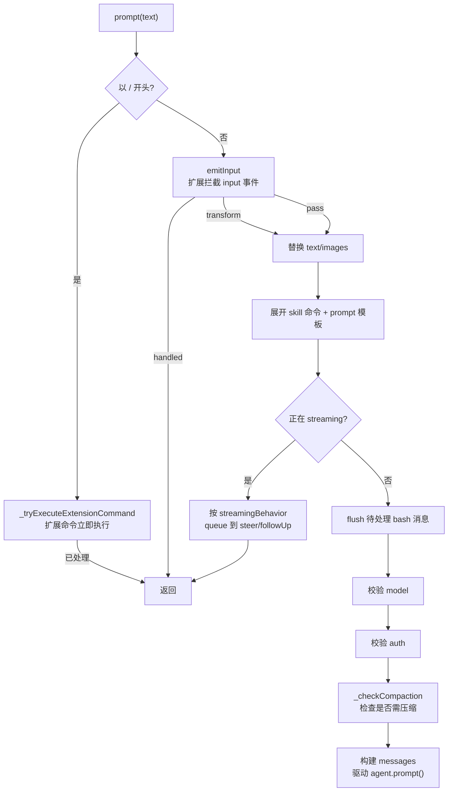

# 第 9 章：AgentSession——中央编排器

## 产品层的心脏

第 8 章我们看到，三种运行模式共享同一个 `runtime`。这个 runtime 的核心是一个对象：`AgentSession`（`packages/coding-agent/src/core/agent-session.ts`，3,333 行）。它是产品层的心脏——所有模式都通过它驱动对话，所有产品级的关注点都在它这里汇聚。

回忆第 6 章的关键结论：产品层没有用 `pi-agent-core` 的 `AgentHarness`，而是自建了编排。`AgentSession` 就是那个自建的编排器。它坐在核心 `Agent` 之上，把第 3 章那条纯净的 `AgentEvent` 流，翻译成一个丰富得多的产品级事件流；把"用户敲了一行字"这个动作，展开成一连串产品逻辑——扩展拦截、skill 展开、模板替换、模型校验、认证检查、压缩判断。

本章拆解这个编排器。读完你会理解：为什么说"最小化核心"不等于"产品也简单"——核心可以很小，但一个完整的 CLI 产品该处理的事情一件不少，只是它们都被放在了核心之外。

---

## 它包裹了什么

`AgentSession` 由一个 `AgentSessionConfig` 构建（`packages/coding-agent/src/core/agent-session.ts`）：

```typescript
export interface AgentSessionConfig {
	agent: Agent;                  // 核心 Agent（第 5 章）
	sessionManager: SessionManager; // JSONL 会话持久化（第 5 章）
	settingsManager: SettingsManager; // 设置
	cwd: string;
	scopedModels?: Array<{ model: Model<any>; thinkingLevel?: ThinkingLevel }>; // Ctrl+P 循环的模型
	resourceLoader: ResourceLoader; // 扩展/skills/模板/主题/上下文文件
	customTools?: ToolDefinition[]; // SDK 注册的自定义工具
	modelRuntime: ModelRuntime;     // pi-ai 的模型运行时
	// ...
}
```

看这个配置清单，就能看出 `AgentSession` 的"汇聚"角色：它持有核心 `Agent`、会话管理、设置、模型运行时、资源加载器、自定义工具。这些来自不同包、不同子系统的组件，在 `AgentSession` 这里被组装成一个可用的产品。

构造时，`AgentSession` 订阅核心 `Agent` 的事件流：

```typescript
this._unsubscribeAgent = this.agent.subscribe(this._handleAgentEvent);
```

这是两层事件系统的连接点。核心 `Agent` 发出 `AgentEvent`（第 3 章的 10 种），`AgentSession._handleAgentEvent` 接收它们、做产品级处理（持久化、状态更新），再翻译成 `AgentSessionEvent` 分发给模式的订阅者。

---

## `AgentSessionEvent`：更丰富的词汇

核心 `AgentEvent` 只有 10 种事件，足够描述"循环在做什么"。但产品需要更多——压缩开始了、重试调度了、会话改名了、thinking 级别变了。`AgentSessionEvent`（`packages/coding-agent/src/core/agent-session.ts`）在 `AgentEvent` 基础上扩展出这些产品级事件：

```typescript
export type AgentSessionEvent =
	// 继承核心的大部分事件
	| Exclude<AgentEvent, { type: "agent_end" }>
	// agent_end 被增强：多了 willRetry
	| { type: "agent_end"; messages: AgentMessage[]; willRetry: boolean }
	// 产品级事件：
	| { type: "agent_settled" }
	| { type: "queue_update"; steering: readonly string[]; followUp: readonly string[] }
	| { type: "compaction_start"; reason: "manual" | "threshold" | "overflow" }
	| { type: "compaction_end"; reason: ...; result: CompactionResult | undefined; aborted: boolean; willRetry: boolean; errorMessage?: string }
	| { type: "entry_appended"; entry: SessionEntry }
	| { type: "session_info_changed"; name: string | undefined }
	| { type: "thinking_level_changed"; level: ThinkingLevel }
	| { type: "auto_retry_start"; attempt: number; maxAttempts: number; delayMs: number; errorMessage: string }
	| { type: "auto_retry_end"; success: boolean; attempt: number; finalError?: string }
	| { type: "summarization_retry_scheduled"; ... }
	| { type: "bash_execution_update"; id?: string; delta: string };
```

注意几个设计。

**`agent_end` 被增强。** 核心的 `agent_end` 只带 `messages`。产品版的多了 `willRetry`——告诉 UI"这一轮结束了，但即将自动重试"。于是 UI 可以显示"出错，3 秒后重试"而不是"完成"。

**压缩有完整的事件对。** `compaction_start`/`compaction_end` 带 `reason`（`manual`/`threshold`/`overflow`——手动、达到阈值、溢出恢复），让 UI 能区分"用户主动压缩"和"系统自动压缩"，并显示进度。

**重试是可见的。** `auto_retry_start`/`auto_retry_end` 把第 2 章 `pi-ai` 的双层重试暴露给 UI。用户能看到"请求失败，正在第 2/3 次重试"。

**`queue_update` 暴露队列状态。** steering/followUp 队列的内容变化时发出，让 UI 显示"已排队 2 条消息"。

这是一个清晰的"事件翻译"模式：核心提供细粒度的循环事件，产品把它们聚合成对用户有意义的高层事件。模式（TUI/print/RPC）订阅的是 `AgentSessionEvent`，不需要关心核心 `AgentEvent` 的细节。

---

## `prompt()`：一轮对话的生命周期

`AgentSession.prompt()`（`packages/coding-agent/src/core/agent-session.ts:1114`）是产品层最核心的方法。用户敲一行字回车，最终就调到这里。它把"一行文本"展开成一连串产品逻辑：



逐步看（节选关键代码）：

**1. 扩展命令优先。** 如果文本以 `/` 开头，先尝试当作扩展命令执行：

```typescript
if (expandPromptTemplates && text.startsWith("/")) {
	const handled = await this._tryExecuteExtensionCommand(text);
	if (handled) {
		preflightResult?.(true);
		return; // 扩展命令已执行，没有提示词要发
	}
}
```

扩展命令（第 14 章）自己管理 LLM 交互，不走正常 prompt 路径。注意"即使在 streaming 期间也立即执行"——扩展命令是控制指令，不该排队。

**2. 扩展拦截 input。** 触发扩展的 `input` 事件，扩展可以"处理掉"（handled）或"变换"（transform）这条输入：

```typescript
if (this._extensionRunner.hasHandlers("input")) {
	const inputResult = await this._extensionRunner.emitInput(currentText, currentImages, options?.source ?? "interactive", ...);
	if (inputResult.action === "handled") { preflightResult?.(true); return; }
	if (inputResult.action === "transform") {
		currentText = inputResult.text;
		currentImages = inputResult.images ?? currentImages;
	}
}
```

这是扩展介入用户输入的主要钩子——比如一个扩展可以把 `!ls` 这样的输入拦截并自己处理，或者把输入文本做某种预处理。

**3. 展开 skill 与模板。** 把 `/skill:name args` 和 `/template args` 展开成实际文本：

```typescript
let expandedText = currentText;
if (expandPromptTemplates) {
	expandedText = this._expandSkillCommand(expandedText);
	expandedText = expandPromptTemplate(expandedText, [...this.promptTemplates]);
}
```

skill 和 prompt 模板（第 10 章）是"可复用的提示词片段"。用户输入 `/review` 可能被展开成一段完整的代码审查提示词。

**4. streaming 期间排队。** 如果 agent 正在工作（`isStreaming`），新消息不能直接发，要排队：

```typescript
if (this.isStreaming) {
	if (!options?.streamingBehavior) {
		throw new Error("Agent is already processing. Specify streamingBehavior ('steer' or 'followUp') to queue the message.");
	}
	if (options.streamingBehavior === "followUp") await this._queueFollowUp(expandedText, currentImages);
	else await this._queueSteer(expandedText, currentImages);
	preflightResult?.(true);
	return;
}
```

回忆第 3 章和第 5 章：steering 是"工作时插话"，followUp 是"忙完再说"。`streamingBehavior` 让调用方明确选择。如果不指定就抛错——这是一个"强制明确意图"的设计，避免用户消息被静默丢弃或误排。`_queueSteer`/`_queueFollowUp` 最终调到核心 `Agent` 的 `steer()`/`followUp()`（第 5 章的两个队列）。

**5–7. flush、校验、压缩。** 刷新待处理的 bash 消息，校验模型已选择、认证有效（OAuth 过期会提示 `/login`），然后 `_checkCompaction` 检查上一轮响应是否触发了压缩条件：

```typescript
const lastAssistant = this._findLastAssistantMessage();
if (lastAssistant) {
	await this._checkCompaction(lastAssistant, false);
}
```

`_checkCompaction`（`:1953`）用第 7 章的 `shouldCompact` 判断，必要时触发压缩。它在 prompt 前检查，是为了捕获"上一轮被中止的响应"——如果上次响应中途 abort 了，token 计数可能不准，这里重新评估。

**8. 构建消息，驱动核心。** 最后构建 `messages` 数组（用户消息 + 可选图片），调用 `this.agent.prompt(messages)`——把控制权交回核心 `Agent`，进入第 3 章的循环。

整个 `prompt()` 是一个"产品逻辑漏斗"：用户的原始输入，经过扩展拦截、skill 展开、模板替换、队列决策、模型校验、认证检查、压缩判断，最终变成一条干净的用户消息喂给核心循环。核心循环对这些产品逻辑一无所知——它只收到一条消息。

---

## 模型与 thinking 管理

`AgentSession` 还管理"用哪个模型、多深的思考"。这是产品级关注点——核心 `Agent` 只有一个 `model` 字段，但产品要支持运行时切换、循环切换、UI 选择器。

```typescript
get model();
get thinkingLevel();
async setModel(model: Model<any>): Promise<void>;       // :1578
async cycleModel(direction): Promise<void>;
setThinkingLevel(level): void;
cycleThinkingLevel(): void;
```

`scopedModels`（来自 `--models` flag）定义了一组可以循环的模型。交互模式下按 Ctrl+P 会调 `cycleModel`，在这组模型间轮换——每次切换都通过 `prepareNextTurn`（第 3 章）在轮次边界生效，并触发 `thinking_level_changed`/模型变更事件，持久化成会话树里的 `ModelChangeEntry`（第 5 章）。于是"我在第 5 轮切到了更强的模型"成为会话历史的一部分。

`setModel` 不只是改一个字段——它要更新核心 `Agent` 的状态、持久化模型变更、通知订阅者、可能重新解析认证。这些编排逻辑都在 `AgentSession` 里，核心 `Agent` 依然只知道"我的 model 变了"。

---

## 压缩与会话树操作

`AgentSession` 把第 7 章的压缩和第 5 章的会话树操作暴露为产品方法：

```typescript
async compact(customInstructions?: string): Promise<CompactionResult>; // :1783 手动压缩
get isCompacting(): boolean;
setAutoCompactionEnabled(enabled: boolean): void;
async navigateTree(...): Promise<...>;   // 分支导航
getUserMessagesForForking(): ...;
createReplacedSessionContext(): ...;
```

`compact()` 是手动压缩（`/compact` 命令），`_checkCompaction` 是自动压缩（达到阈值或溢出恢复）。两者都触发 `compaction_start`/`compaction_end` 事件，让 UI 显示进度。

`navigateTree` 在会话树上导航——`/tree`、`/fork`、`/clone` 命令的底层。它可能生成分支摘要（第 7 章），然后移动 leaf。fork 一个会话时，`getUserMessagesForForking` 提取用户消息，`createReplacedSessionContext` 构建新会话的上下文。

这些操作都建立在第 5 章的树结构上。`AgentSession` 只是把它们包装成带事件、带 UI 反馈的产品方法。

---

## bash 执行与导出

`AgentSession` 还处理一些产品特有的功能：

```typescript
async executeBash(...): Promise<...>;   // 直接执行 bash（! 命令）
recordBashResult(...): void;
abortBash(): void;
getSessionStats(): SessionStats;
getContextUsage(): ...;
async exportToHtml(): Promise<...>;     // HTML 导出
exportToJsonl(): ...;
getLastAssistantText(): string;
```

`executeBash` 支持 `!command` 语法——用户可以直接在输入框跑 shell 命令而不经过模型。`bash_execution_update` 事件流式输出命令的 stdout。

`exportToHtml`/`exportToJsonl` 把会话导出——`/export` 命令。`getSessionStats`/`getContextUsage` 给 UI 提供 token 用量、成本统计（来自第 2 章的 `Usage`）。`getLastAssistantText` 提取最后一条助手文本——print 模式用它输出最终结果。

---

## 实例演练：一次 `/model` 切换 + 提问

把 `AgentSession` 串起来。你在交互模式下按 Ctrl+P 切换模型，然后提问。

1. **Ctrl+P**：`InteractiveMode` 捕获快捷键，调 `session.cycleModel("next")`。`AgentSession` 在 `scopedModels` 里取下一个模型，调 `setModel`。`setModel` 更新核心 `Agent` 状态、`sessionManager.appendModelChange(provider, modelId)` 持久化一个 `ModelChangeEntry`、发出模型变更事件。TUI 收到事件，更新 footer 的模型显示。
2. **输入"继续修复"**：`prompt("继续修复")`。不以 `/` 开头，跳过扩展命令。`emitInput`——没有扩展拦截。展开 skill/模板——无变化。不在 streaming。flush bash。校验模型（刚切换的）和认证。`_checkCompaction`——未达阈值。构建用户消息，`agent.prompt(messages)`。
3. **核心循环**：进入第 3 章的循环。`prepareNextTurn` 在轮间从会话树重建上下文，拾取刚才的模型变更——下一轮用新模型。
4. **事件回流**：核心发出 `AgentEvent`，`_handleAgentEvent` 翻译成 `AgentSessionEvent`，TUI 增量渲染。

整个过程中，`AgentSession` 是枢纽：它接收用户动作，编排产品逻辑，驱动核心循环，翻译事件回流，持久化状态。核心 `Agent` 始终只看到干净的消息和配置。

---

## 实践应用

`AgentSession` 为"如何在最小核心之上构建产品"提供了四条可迁移的模式。

**用事件翻译隔离核心与产品。** 核心发细粒度事件，产品聚合成对用户有意义的高层事件；模式订阅产品事件，不碰核心事件。它解决的问题是：UI 被迫理解核心的内部事件，或核心被迫迁就 UI 的需求。当 `AgentSession` 做翻译，核心保持纯净，UI 拿到的是"压缩开始了"而不是几个底层事件的组合。

**把用户输入做成一个处理漏斗。** 扩展拦截 → skill 展开 → 模板替换 → 队列决策 → 校验 → 压缩 → 驱动核心，每一步都可以短路或变换。它解决的问题是：产品逻辑散落在各处，或硬塞进核心循环。当 `prompt()` 是一个清晰的漏斗，每个产品关注点都有明确的位置，核心循环只在漏斗末端收到干净输入。

**强制明确意图，而非静默猜测。** streaming 期间发消息必须指定 `streamingBehavior`，否则抛错。它解决的问题是：用户消息被静默丢弃或误排，造成"我说了但 agent 没反应"的困惑。在歧义处要求明确，比猜测用户意图更安全。

**配置变更在轮次边界生效并持久化。** `setModel` 更新状态、持久化变更条目、通过 `prepareNextTurn` 在轮间生效。它解决的问题是：运行中途的配置变更要么不生效、要么与进行中的工作冲突。当变更有明确的生效时机并被持久化，一致性和可回溯性都有了保障。

---

## 总结

`AgentSession` 是产品层的心脏，3,333 行的中央编排器。它包裹核心 `Agent`，订阅其 `AgentEvent` 并翻译成更丰富的 `AgentSessionEvent`（带 `willRetry` 的 `agent_end`、压缩事件对、重试事件、队列更新）；它的 `prompt()` 是一个产品逻辑漏斗（扩展拦截、skill/模板展开、streaming 排队、模型/认证校验、压缩检查），末端才把干净消息交给核心循环；它还管理模型切换、thinking 级别、压缩、会话树导航、bash 执行、导出。

它完美诠释了第 6 章的结论：核心提供机制（循环 + 事件流），产品自建策略（`AgentSession`）。核心因为小，才能被这样一个庞大的产品编排器干净地包裹——所有产品复杂性都在 `AgentSession` 里，核心循环依然纯净。

下一章，我们看 `prompt()` 漏斗里那个被一笔带过的关键环节：系统提示词是如何从工具、skills、模板、项目上下文文件装配出来的。
