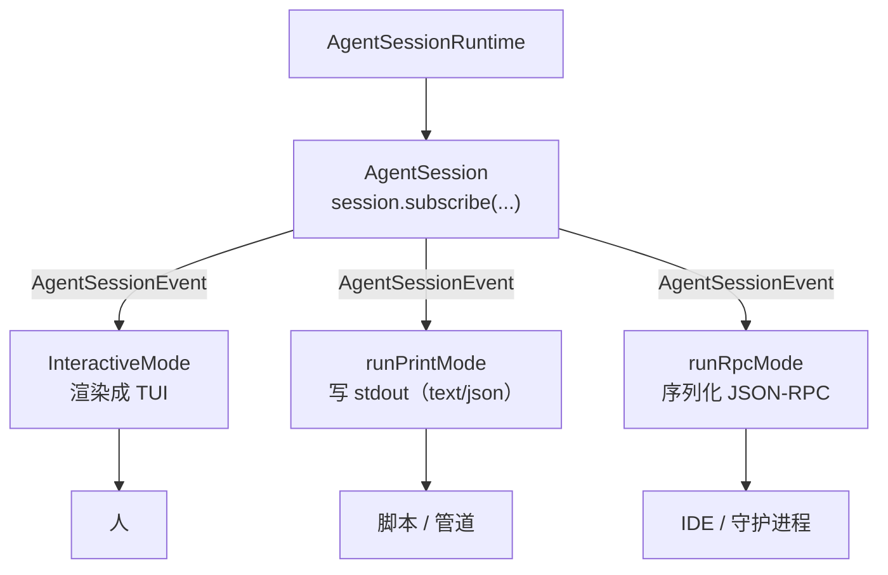

# 第 11 章：三种运行模式

## 同一条流，三种呈现

第 8 章我们看到，`resolveAppMode` 把 `pi` 命令分流成三种模式：交互式 TUI、headless print、RPC。第 9 章我们看到，三种模式共享同一个 `AgentSession`，订阅同一条 `AgentSessionEvent` 流。

本章的主题是这条分流的终点：三种模式各自如何消费那条事件流。它们的核心逻辑几乎完全相同——都是"订阅事件、驱动 `prompt()`、处理结果"——但呈现方式截然不同：一个渲染成彩色终端界面给人看，一个输出纯文本或 JSON 给脚本用，一个序列化成 JSON-RPC 给 IDE 和守护进程用。

这是"事件流即契约"设计的 payoff。因为 `AgentSession` 把所有进展都表达成事件，新增一种"消费方式"就不需要碰任何 Agent 逻辑——只需要写一个新的事件订阅者。Pi Agent 的三种模式，就是这个原则的三次实例化。

---

## 共享的底座

三种模式都从同一个起点开始：`AgentSessionRuntime`（第 8 章的 runtime 宿主）。它持有一个 `AgentSession`，并支持重建（reload、切换会话）。模式拿到 runtime，从中取出 `AgentSession`，然后：

1. 订阅 `session.subscribe(listener)`——listener 收到 `AgentSessionEvent`
2. 驱动 `session.prompt(text)`（或 steer/followUp）
3. 在 listener 里处理事件——这是三种模式唯一的分歧点



让我们逐个看。

---

## 交互式模式：`InteractiveMode`

交互式模式是给人用的完整 TUI REPL，实现在 `packages/coding-agent/src/modes/interactive/interactive-mode.ts`（约 6,100 行，是产品层最大的文件）：

```typescript
export function createInteractiveTui(options: InteractiveTuiOptions): TUI { ... } // :339

export class InteractiveMode {
	constructor(runtimeHost: AgentSessionRuntime, options: InteractiveModeOptions = {})
	async init(): Promise<void>;
	async run(): Promise<void>;          // :886 REPL 主循环
	renderInitialMessages(): void;
	async getUserInput(): Promise<string>; // :3575
	stop(): void;
	private async handleEvent(event: AgentSessionEvent): Promise<void>; // :2910
	// 大量斜杠命令处理器：handleModelCommand, handleCompactCommand, ...
}
```

`run()` 是 REPL 主循环，它的形状大致是：

```
订阅 session 事件 → handleEvent
渲染初始消息（续接的会话）
while (true) {
	const input = await getUserInput()   // 等用户输入
	if (是斜杠命令) 处理命令
	else session.prompt(input)           // 驱动对话
	await session.waitForIdle()          // 等这一轮结束
}
```

关键是 `handleEvent`（`:2910`）——它把每个 `AgentSessionEvent` 翻译成 TUI 组件。这是交互式模式的核心工作：

- `message_start`/`message_update`（助手消息）→ 增量渲染助手文本（Markdown 高亮）
- `tool_execution_start`/`update`/`end` → 渲染工具调用（用第 4 章工具的 `renderCall`/`renderResult`，比如 edit 的彩色 diff）
- `compaction_start`/`end` → 显示压缩进度
- `auto_retry_start` → 显示"重试中"
- `queue_update` → 显示排队的消息
- `thinking_level_changed`/模型变更 → 更新 footer

`createInteractiveTui` 构建底层的 `pi-tui` `TUI`（第 12 章），`InteractiveMode` 往里面添加约 45 个组件（`src/modes/interactive/components/`）：`assistant-message`、`tool-execution`、`bash-execution`、`diff`、`footer`、`model-selector`、`session-selector`、`trust-selector`、`compaction-summary-message` 等。

斜杠命令在这里处理。`getUserInput` 拿到输入后，如果是 `/model`、`/compact`、`/export` 等命令，调对应的 `handleXxxCommand`；否则交给 `session.prompt()`（第 9 章的漏斗会进一步处理扩展命令、skill、模板）。

交互式模式还管理大量交互细节：Ctrl+P 循环模型（`session.cycleModel`）、Ctrl+C 中止（`session.abort()`）、图片粘贴、外部编辑器（`external-editor.ts`）、模型搜索（`model-search.ts`）、主题（`theme/`）。这些都是"给人用"才需要的——它们构成了产品的大部分代码，但没有一行触及核心 Agent 逻辑。

---

## print 模式：`runPrintMode`

print 模式是 headless 的，给脚本和管道用。实现在 `packages/coding-agent/src/modes/print-mode.ts`：

```typescript
export interface PrintModeOptions {
	/** Output mode: "text" for final response only, "json" for all events */
	mode: "text" | "json";
	messages: string[];
	initialMessage?;
	initialImages?;
}
export async function runPrintMode(runtimeHost: AgentSessionRuntime, options: PrintModeOptions): Promise<number>
```

它返回一个 exit code（`Promise<number>`）——这是给 shell 用的，`pi -p "..." && echo success` 依赖它。

两种输出模式：

- **`text`**：跑完对话，只输出最终的助手文本（用 `session.getLastAssistantText()`）。这是 `pi -p "fix the bug"` 的默认行为——干净地输出结果，适合 `$(pi -p "...")` 这样的命令替换。
- **`json`**：把**所有** `AgentSessionEvent` 流式输出为 JSON 行（JSON Lines）。这是 `--mode json` 的行为——每个事件一行 JSON，机器可以实时解析整个对话过程。

`json` 模式特别有用：它把交互式模式里"渲染成画面"的事件流，原样序列化成结构化数据。外部程序可以实时跟踪工具调用、token 用量、压缩事件，而不需要解析终端 ANSI 序列。

print 模式的事件消费比交互式简单得多——它订阅事件，`text` 模式下只关心最终的助手消息，`json` 模式下把每个事件 `JSON.stringify` 后写到 stdout。没有 TUI，没有组件，没有快捷键。它证明了事件流的另一个好处：**消费者可以只关心自己需要的事件**，忽略其余。

---

## RPC 模式：`runRpcMode`

RPC 模式是给机器用的——IDE 集成、守护进程（第 15 章的 `pi-server` 就 spawn `pi --mode rpc` 子进程）。实现在 `packages/coding-agent/src/modes/rpc/rpc-mode.ts`：

```typescript
export async function runRpcMode(runtimeHost: AgentSessionRuntime): Promise<never>
```

注意返回类型 `Promise<never>`——它永不返回。RPC 模式进入一个无限循环，从 stdin 读命令、往 stdout 写响应和事件，直到对端关闭连接。

通信协议是 **JSON Lines over stdin/stdout**：

```typescript
const handleCommand = async (command: RpcCommand): Promise<RpcResponse | undefined> => { ... }; // :385
// 读循环：
parsed = JSON.parse(line);   // :750 每行一个 JSON 命令
const command = parsed as RpcCommand;
```

`RpcCommand`（`packages/coding-agent/src/modes/rpc/rpc-types.ts`）是命令词汇表：

```
prompt, steer, follow_up, abort,
new_session, get_state, set_model, cycle_model, set_thinking_level,
compact, bash, switch_session, fork, clone, get_tree, get_messages, set_session_name, ...
```

每个命令对应 `AgentSession` 的一个方法。`handleCommand` 是一个大分派器：收到 `prompt` 命令就调 `session.prompt()`，收到 `set_model` 就调 `session.setModel()`，收到 `compact` 就调 `session.compact()`。响应（`RpcResponse`）和事件（`AgentSessionEvent`）都以 JSON 行写回 stdout。

RPC 模式还有一个 `extension_ui_request`/`extension_ui_response` 机制——扩展可能需要在 IDE 里弹一个选择框或输入框（第 14 章）。这些 UI 请求通过 RPC 发给对端（IDE），对端渲染并把用户选择发回来。于是扩展的 UI 也能跨越进程边界。

RPC 模式是"事件流即契约"的极致体现：它把整个 `AgentSession` 的能力暴露成一组 JSON 命令，让任何能 spawn 进程、读写 stdin/stdout 的程序都能驱动一个完整的 pi Agent。第 15 章的守护进程正是这样做的。

---

## 三种模式的对照

| | 交互式 | print | RPC |
|---|--------|-------|-----|
| 入口 | `InteractiveMode.run()` | `runPrintMode()` | `runRpcMode()` |
| 服务对象 | 人 | 脚本 / 管道 | IDE / 守护进程 |
| 触发条件 | 默认（双 TTY） | `-p` 或非 TTY | `--mode rpc` |
| 输入来源 | TUI 编辑器 | CLI 参数 / stdin | stdin JSON 命令 |
| 输出去向 | 终端（TUI 渲染） | stdout（text/json） | stdout JSON 行 |
| 事件消费 | 渲染成 ~45 个组件 | text 取最终文本 / json 全量序列化 | 序列化成 RPC 事件 |
| 生命周期 | 直到 `/quit` | 跑完退出（返回 exit code） | 永不返回（`Promise<never>`） |
| 斜杠命令 | 交互式处理 | 不适用 | 通过 RPC 命令 |

三者的代码量差异巨大——交互式 6,100 行，print 几百行，RPC 一千多行。但它们的**核心逻辑**（订阅事件、驱动 prompt）几乎相同。代码量的差异全部来自"如何呈现"：交互式要渲染丰富的 UI、处理键盘交互；print 只要写文本；RPC 只要序列化 JSON。

这个分布本身就是架构健康的标志：**复杂性集中在"与人交互"，而非"与 Agent 交互"。** 因为 Agent 交互被 `AgentSession` 和事件流彻底封装了，每种模式只需要处理自己的呈现层。

---

## 为什么这很重要

让我们退一步看这个设计的价值。

假设 Pi Agent 当初把 UI 逻辑和 Agent 逻辑缠在一起——就像很多 Agent 那样，REPL 循环里直接调用模型、直接打印输出。那么：

- 想要 headless 模式？得把 UI 代码从 REPL 里剥离出来。
- 想要 IDE 集成？得重写一个不带 UI 的驱动循环。
- 想要守护进程？又得重写一遍。

每一次都要重新处理"调用模型、执行工具、管理状态"的逻辑，每一处都可能引入与主循环微妙不同的行为。

Pi Agent 的做法把这一切避免了。`AgentSession` 是唯一的 Agent 逻辑所在；它把进展表达成 `AgentSessionEvent`；模式只是事件的消费者。于是：

- 新增 headless 模式 = 写一个只输出文本的订阅者（`runPrintMode`）
- 新增 IDE 集成 = 写一个把事件序列化成 JSON-RPC 的订阅者（`runRpcMode`）
- 新增守护进程 = spawn 一个 RPC 子进程（第 15 章）

三种模式不是"三套 Agent 实现"，而是"一套 Agent 实现的三种投影"。这就是第 3 章"循环发事件、上层归约"架构在产品层的最终兑现。

---

## 实践应用

Pi Agent 的三种模式为"如何让一个系统服务多种使用方式"提供了四条可迁移的模式。

**事件流即契约，模式即投影。** 把系统的所有进展表达成一条事件流，每种使用方式只是流的一个消费者/投影。它解决的问题是：每新增一种使用方式都要重写核心逻辑，导致多套实现彼此漂移。当核心只发事件，新增模式就只是新增一个订阅者，核心逻辑永远只有一份。

**让消费者只关心自己需要的事件。** print 的 text 模式只取最终助手文本，忽略中间事件；交互式渲染所有事件。它解决的问题是：消费者被迫处理它不关心的事件。当事件流是细粒度的，消费者可以各取所需。

**用返回类型表达生命周期语义。** print 返回 `Promise<number>`（exit code），RPC 返回 `Promise<never>`（永不退出）。它解决的问题是：调用方不清楚模式的生命周期。当返回类型本身就说明"我会退出并给你 exit code"或"我永不返回"，误用就更难发生。

**把复杂性集中在真正复杂的地方。** 三种模式的代码量差异全部来自"与人交互"（UI），而非"与 Agent 交互"。它解决的问题是：核心逻辑被 UI 复杂性淹没，难以测试和复用。当 Agent 交互被彻底封装，复杂性就只集中在它该在的地方——呈现层。

---

## 总结

Pi Agent 的三种运行模式——交互式 TUI、headless print、RPC——共享同一个 `AgentSession` 和同一条 `AgentSessionEvent` 流，区别仅在于如何消费这条流。交互式模式（6,100 行）把事件渲染成约 45 个 TUI 组件给人看；print 模式把事件输出为纯文本或 JSON 行给脚本用，并返回 exit code；RPC 模式把 `AgentSession` 的能力暴露成 JSON 命令词汇，序列化事件给 IDE 和守护进程，永不返回。

三者的核心逻辑几乎相同，代码量差异全部来自呈现层。这是"事件流即契约"设计的最终兑现：三种模式不是三套 Agent 实现，而是一套实现的三种投影。新增一种使用方式，只需要新增一个事件订阅者。

到这里，第四部分结束。我们已经走完了产品层的全貌：从 `cli.ts` 启动（第 8 章），到 `AgentSession` 编排（第 9 章），到系统提示词装配（第 10 章），到三种模式消费（第 11 章）。下一部分，我们深入那个被反复提到的 `pi-tui`——完全自研的终端渲染器，看交互式模式那些组件底下，是一个怎样的渲染引擎。
