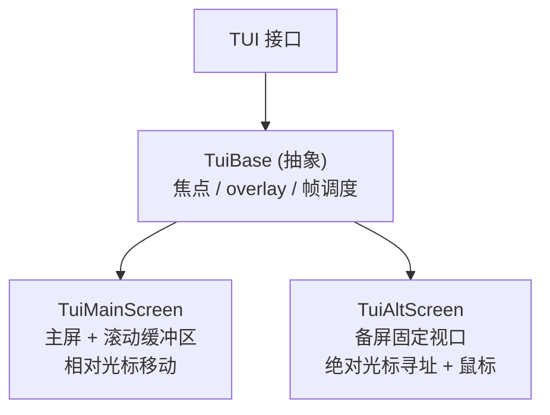

# 第 12 章：pi-tui——自研渲染器

## 一个不寻常的决定

第 11 章的交互式模式把 `AgentSessionEvent` 渲染成终端画面。这些画面底下，是 `pi-tui`（`packages/tui`）——Pi Agent 的终端 UI 库。

这里有一个不寻常的决定值得先说清楚：**`pi-tui` 不是基于 React/Ink 的。** 没有虚拟 DOM，没有 JSX，没有 reconciler。在一个"终端 UI 约等于 Ink"的时代，Pi Agent 从零写了一个渲染器。

为什么？因为 Pi Agent 的需求和 Ink 的模型有根本的张力。Ink 把终端建模成一个固定高度的视口（viewport），用虚拟 DOM 差分。但一个编码 Agent 的输出是**流式的、不断增长的文档**——助手回复一行行涌出，工具结果一段段追加，用户需要向上滚动回看。Ink 的"固定视口 + 全量重算"模型在这种场景下会闪烁、会丢滚动历史。Pi Agent 要的是"把不断增长的文档高效地写到终端的滚动缓冲区里，只重写变化的行"。

于是 `pi-tui` 的核心模型简单得近乎朴素：**组件渲染成字符串数组，渲染器逐行比较、只写变化。** 本章拆解这个模型，看它如何用极少的抽象，做到无闪烁、可滚动、支持图片和 IME 的终端渲染。

---

## 组件契约：`render(width) => string[]`

`pi-tui` 的组件不是 React 函数，而是一个接口（`packages/tui/src/tui.ts`）：

```typescript
export interface Component {
	/** 把组件渲染成给定视口宽度下的若干行 */
	render(width: number): string[];
	/** 获得焦点时的键盘输入处理（可选） */
	handleInput?(data: string): void;
	/** 是否接收按键释放事件（Kitty 协议），默认 false */
	wantsKeyRelease?: boolean;
	/** 使缓存的渲染状态失效（主题变更等） */
	invalidate(): void;
}
```

核心就是 `render(width): string[]`——给一个宽度，返回一组字符串，每个字符串是一行（可能含 ANSI 转义序列）。这是**拉取式**（pull-based）渲染：渲染器主动调组件的 `render`，组件根据自己的内容决定输出多少行。没有保留的场景图（scene graph）让渲染器去遍历布局——组件自己产出它的行。

这个契约的好处是心智模型极其贴近终端：终端就是"行 + ANSI"，组件的输出也是"行 + ANSI"。中间没有虚拟 DOM 这一层翻译。代价是每个组件要自己负责换行、截断、缓存——但这些逻辑本来就是组件特有的。

可聚焦的组件实现 `Focusable`：

```typescript
export interface Focusable {
	focused: boolean; // TUI 在焦点变化时设置
}
```

聚焦的组件在 `render` 输出里，在逻辑光标位置发出一个零宽的 `CURSOR_MARKER`：

```typescript
export const CURSOR_MARKER = "\x1b_pi:c\x07"; // 零宽 APC 序列
```

渲染器稍后会找到这个标记、计算视觉列、剥掉它、把硬件光标移到那里——这是为了 IME 候选窗口能正确定位。这个零宽标记的设计很巧妙：组件不需要知道硬件光标的存在，它只是"标记我的光标在哪"，渲染器负责把硬件光标对齐过去。

---

## 组合：`Container` 与组件目录

组件通过 `Container` 组合（`packages/tui/src/tui.ts`）：

```typescript
export class Container implements Component {
	children: Component[] = [];
	addChild(component: Component): void;
	removeChild(component: Component): void;
	clear(): void;
	invalidate(): void;
	render(width: number): string[]; // 垂直拼接所有子组件的行
}
```

`Container.render` 就是依次调每个子组件的 `render(width)`，把结果垂直拼接。这是最朴素的布局——上下堆叠。

在此之上，`pi-tui` 提供了一个组件目录（`packages/tui/src/components/`）：

| 组件 | 职责 |
|------|------|
| `Text` | 多行自动换行文本，按 `(text, width)` 缓存 |
| `TruncatedText` | 单行截断文本 |
| `Spacer` | N 个空行 |
| `Box` | 给子组件加 padding 和背景 |
| `Image` | Kitty/iTerm2 内联图片，带文本降级 |
| `Loader` / `CancellableLoader` | 旋转动画（后者支持 AbortSignal + Esc） |
| `Markdown` | 用内置 `marked` 渲染 Markdown |
| `Input` | 单行输入 |
| `Editor` | 重量级多行编辑器（约 2,352 行，第 13 章详述） |
| `SelectList` / `SettingsList` | 交互列表 |
| `VStack` / `HStack` / `ScrollView` | 布局容器 |

每个组件都是 `Component` 的实现，自己管自己的换行、截断、缓存。`Text` 用 `wrapTextWithAnsi` 做 ANSI 感知的换行（不会因为转义序列算错宽度），并按 `(text, width)` 缓存——同样的文本同样的宽度不重新计算。

---

## 渲染器：一个接口，两个实现

`TUI` 接口是消费者面对的契约（`packages/tui/src/tui.ts`）：`addChild`、`setFocus`、`showOverlay`/`hideOverlay`、`start`/`stop`、`requestRender`、`addInputListener`。它有一个抽象基类 `TuiBase`，留下一个抽象方法：

```typescript
export abstract class TuiBase extends Container implements TUI {
	protected abstract doRender(): void;
	// 焦点、overlay、输入监听、帧调度、终端查询
}
```

`doRender()` 是"把当前帧写到终端"的具体实现，由两个子类各自提供：



- **`TuiMainScreen`**（`packages/tui/src/TuiMainScreen.ts`）：写入终端的**滚动缓冲区**，输出可以不断增长、向上滚动。这是交互式模式默认用的——Agent 的流式输出就是一个不断增长的文档。它用**相对光标移动**只重写变化的行范围。
- **`TuiAltScreen`**（`packages/tui/src/TuiAltScreen.ts`）：进入终端的**备用屏幕**（alternate screen），拥有一个固定高度的视口，支持鼠标、选区、真正的 2D 布局。它用**绝对光标寻址**逐行重写。

两个渲染器共享 `TuiBase` 的焦点管理、overlay 系统、帧调度、输入处理，只在"如何把帧写到终端"上分道扬镳。这是策略模式：消费者面对同一个 `TUI` 接口，底层渲染策略可换。`ViewportTUI` 接口 + `isViewportTUI` 守卫用来识别"这是不是一个备屏渲染器"，从而门控备屏专属功能（如 `setLayoutRoot`）。

---

## 差分渲染：逐行相等扫描

现在到核心。`TuiMainScreen.doRender()`（`packages/tui/src/TuiMainScreen.ts:146`）如何只写变化的行？答案朴素得惊人——**逐行字符串相等扫描**：

```typescript
let firstChanged = -1;
let lastChanged = -1;
const maxLines = Math.max(newLines.length, this.previousLines.length);
for (let i = 0; i < maxLines; i++) {
	const oldLine = i < this.previousLines.length ? this.previousLines[i] : "";
	const newLine = i < newLines.length ? newLines[i] : "";
	if (oldLine !== newLine) {
		if (firstChanged === -1) firstChanged = i;
		lastChanged = i;
	}
}
```

它把新帧（`newLines`，整棵组件树 `render(width)` 的结果）和上一帧（`previousLines`）逐行比较，找出第一个和最后一个变化的行。没有 LCS，没有编辑距离，就是 `oldLine !== newLine`。

找到变化范围后，它**只重写这个范围**：把硬件光标移到 `firstChanged`（用相对移动 `\x1b[...A`/`\x1b[...B`），然后对每个变化行发 `\x1b[2K`（擦除整行）+ 新内容。末尾多出来的旧行单独擦除。

这就是"双缓冲"的全部含义：`previousLines` 数组在帧之间保留，作为 diff 的基准。没有离屏 canvas，没有像素缓冲——"缓冲"就是一个字符串数组。

### 何时全量重绘

并非所有情况都能增量。`doRender` 在几种情况下退回到 `fullRender`（清屏 + 全量重发）：

```typescript
// 首次渲染
if (this.previousLines.length === 0 && !widthChanged && !heightChanged) {
	fullRender(false); // 全量，但不清屏
	return;
}
// 宽度变化、或变化发生在可视视口之上、或需要清屏收缩
if (widthChanged || firstChanged < prevViewportTop || ...) {
	fullRender(true); // 清屏 + 清滚动缓冲 + 全量
	return;
}
```

`firstChanged < prevViewportTop` 这个条件值得注意：如果变化发生在用户已经滚上去看不见的区域之上，增量重写会算错光标位置，于是干脆全量重绘。这是一种务实的妥协——增量渲染在常见情况（底部追加、局部更新）下高效，在罕见情况（上方变化、尺寸变化）下退回全量。

### 同步输出：无闪烁的关键

无论增量还是全量，整个帧都被包裹在**同步输出**（synchronized output）序列里：

```typescript
let buffer = "\x1b[?2026h"; // Begin synchronized output
// ... 拼接所有变化行的擦除 + 重写 ...
buffer += "\x1b[?2026l"; // End synchronized output
this.terminal.write(buffer); // 一次性写出
```

`\x1b[?2026h`/`\x1b[?2026l` 告诉终端："接下来是一批更新，请缓冲它们，等收到结束序列再一次性显示。"支持它的终端（大多数现代终端）会把整帧作为一个原子操作渲染——用户看不到"先擦除、再逐行重写"的中间状态，因此无闪烁。整个帧拼成一个字符串、一次 `write` 调用，配合同步输出，保证了原子性。

### 防御性契约强制

`doRender` 还有一个守护：如果任何组件返回的行 `visibleWidth` 超过了终端宽度，它会抛错并写一份 `pi-crash.log`：

```
// 若某行宽度超过终端宽度 → 抛错 + 诊断日志，指向 truncateToWidth
```

这把一种静默的渲染损坏（行太长导致终端自动换行、布局错乱）变成了一个可操作的错误，直接指出"哪个组件该用 `truncateToWidth`"。这是"把契约违反变成响亮错误"的好例子——比起让用户看到一个错乱的界面然后无从查起，崩溃并留下诊断日志反而更友好。

---

## 帧调度：16ms 节流

组件不会每次状态变化都立即触发重绘。`TuiBase.requestRender`（`packages/tui/src/tui.ts:745`）做合并与节流：

```typescript
requestRender(force = false): void {
	if (force) {
		this.resetRenderState();
		// ... 立即在 nextTick 渲染 ...
		return;
	}
	if (this.renderRequested) return; // 合并：已有请求就不重复
	this.renderRequested = true;
	process.nextTick(() => this.scheduleRender());
}

private scheduleRender(): void {
	if (this.stopped || this.renderTimer || !this.renderRequested) return;
	const elapsed = performance.now() - this.lastRenderAt;
	const delay = Math.max(0, TuiBase.MIN_RENDER_INTERVAL_MS - elapsed); // 16ms
	this.renderTimer = setTimeout(() => {
		this.renderTimer = undefined;
		if (this.stopped || !this.renderRequested) return;
		this.renderRequested = false;
		this.lastRenderAt = performance.now();
		this.doRender();
		if (this.renderRequested) this.scheduleRender(); // 期间又有请求就再排一次
	}, delay);
}
```

两层机制：

- **合并**（coalescing）：`renderRequested` 标志确保多次 `requestRender` 在一帧内只触发一次渲染。流式输出时每个 token delta 都调 `requestRender`，但实际渲染被合并。
- **节流**（throttling）：`MIN_RENDER_INTERVAL_MS = 16`（约 60fps）确保两帧之间至少隔 16ms。旋转动画、流式输出不会以每秒几百次的频率冲刷终端。

`start()` 把终端接进来：`this.terminal.start((data) => this.handleTerminalInput(data), () => this.requestRender())`——输入触发渲染，窗口 resize 也触发渲染。组件自己也可以调 `tui.requestRender()`（比如 `Loader` 在定时器里、`Editor` 在编辑后）。

---

## 双布局模型

`VStack`/`HStack`/`ScrollView` 这些布局容器有一个有趣的双重人格。

在 `TuiMainScreen`（和非布局上下文）里，它们用普通的 `render(width)`——`VStack.render` 就是把子组件的行垂直拼接，产出一个**无界文档**。这正是流式 Agent 输出需要的：文档可以无限增长。

但在 `TuiAltScreen` 里，它们通过一个 symbol 协议 `LAYOUT_NODE`（`packages/tui/src/layout-node.ts`）参与一个真正的 2D flexbox 布局：

```typescript
export const LAYOUT_NODE = Symbol.for("@earendil-works/pi-tui/layout-node");
export type LayoutNode = StackLayoutNode | ScrollLayoutNode;
export function getLayoutNode(component: Component): LayoutNode | undefined
```

备屏的布局引擎（`packages/tui/src/layout.ts` 的 `renderLayoutFrame`）递归构建布局树，测量固有尺寸、按 grow/shrink 分配空间、计算裁剪、把每个盒子合成进固定高度的屏幕。这让备屏能拥有"独立滚动的受限区域"——比如一个固定高度的列表 + 一个独立滚动的详情面板。

于是同一组组件，在主屏表现为无界文档，在备屏表现为 flexbox 视口。用 symbol 而非 `instanceof` 做能力协议，让这种鸭子类型的扩展能跨包工作。这是"文档流式"与"应用视口"两种 UI 范式的干净分离，且复用了组件。

---

## 实践应用

`pi-tui` 为"如何构建终端 UI"提供了四条可迁移的模式，其中一些与主流的虚拟 DOM 路线背道而驰，却恰好适配流式 Agent 的需求。

**渲染即字符串，差分即相等扫描。** 组件输出 `string[]`，渲染器逐行 `!==` 比较、只重写变化范围。它解决的问题是：虚拟 DOM 的 reconciler 对"不断增长的流式文档"是过度设计，且固定视口模型会丢滚动历史。当输出就是终端的原生表示（行 + ANSI），渲染器可以薄到极致，而滚动、增量更新都自然成立。代价是每个组件自己管换行/截断/缓存——但对一个贴近终端的库，这份代价换来了简单和可控。

**同步输出 + 单次写入 = 无闪烁。** 把整帧拼成一个字符串、用 `\x1b[?2026h/l` 包裹、一次 `write`。它解决的问题是：逐行写入让用户看到重绘的中间状态。当终端把整帧作为原子操作显示，无论内部擦除了多少行，用户看到的都是一次干净的更新。

**合并 + 节流控制渲染频率。** `renderRequested` 合并多次请求，16ms 节流限制帧率。它解决的问题是：流式输出每个 delta、动画每个 tick 都触发重绘，冲刷终端、浪费 CPU。当渲染请求被合并和节流，无论状态变更多频繁，实际帧率都被约束在合理范围。

**用契约强制取代静默损坏。** 组件返回过宽的行就抛错并留诊断日志，而不是让界面悄悄错乱。它解决的问题是：渲染 bug 表现为难以追踪的界面错乱。当契约违反变成响亮的、指向修复方向的错误，调试成本大幅下降。

---

## 总结

`pi-tui` 是一个完全自研的终端渲染器，核心模型朴素而强大：组件实现 `render(width): string[]`，`Container` 垂直拼接，`TuiBase` 提供焦点/overlay/帧调度，两个具体渲染器（主屏 `TuiMainScreen` 写滚动缓冲、备屏 `TuiAltScreen` 写固定视口）共享一个 `TUI` 接口。差分渲染是逐行字符串相等扫描，只重写变化范围，用同步输出 + 单次写入保证无闪烁，用 16ms 节流 + 请求合并控制帧率。可聚焦组件用零宽 `CURSOR_MARKER` 标记光标以支持 IME，布局容器有"无界文档"和"flexbox 视口"双重人格。

它不基于 React/Ink，这不是为了标新立异，而是因为流式 Agent 的输出是一个不断增长的文档，需要"行 + 差分 + 滚动缓冲区"的模型，而非"固定视口 + 虚拟 DOM"的模型。理解了这一点，你就理解了为什么一个看似"重新发明轮子"的决定，其实是对需求的精准回应。

下一章，我们看用户输入如何进入这个渲染器——Kitty 键盘协议协商、转义序列重组、按键解析，以及那个 2,352 行的 `Editor` 组件。
