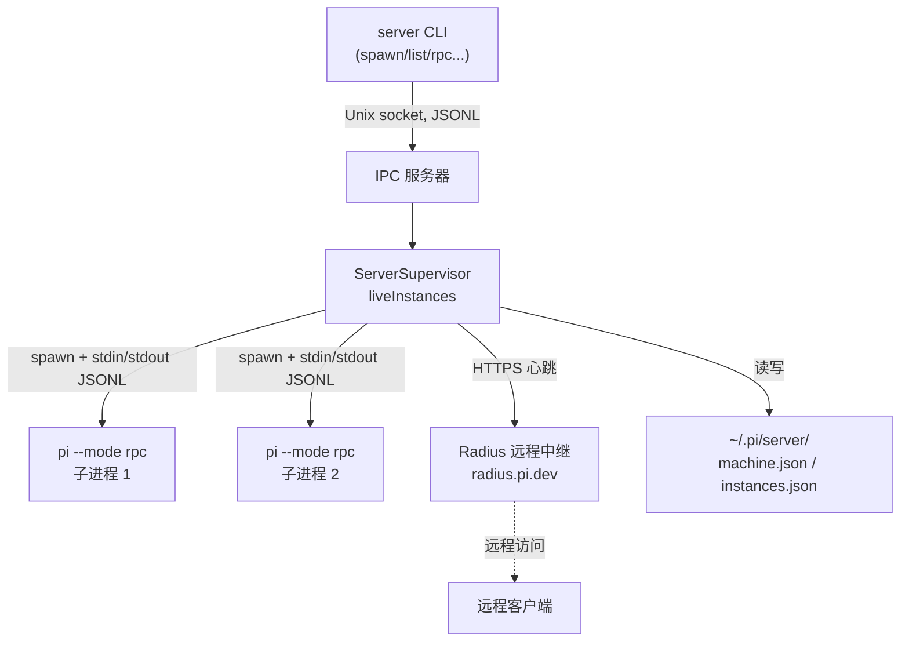

# 第 15 章：远程控制——守护进程、RPC 与协议

## 走出 localhost

到目前为止，我们看的都是"一个 pi 进程跑在一台机器的一个终端里"。但生产场景往往不止于此：你想让多个 Agent 在后台长期运行，想从 IDE 里驱动它们，想从另一台机器访问它们。

Pi Agent 的远程控制能力藏在一个关键事实里：**这个代码库里有两套截然不同的远程设计。** 这不是冗余，而是两个不同阶段、不同目标的产物——理解它们的区别，能帮你看清一个系统如何在演进中处理"远程"这个需求。

第一套是 **`pi-server`**：一个已完整实现的守护进程，监督多个无头的 `pi --mode rpc` 子进程，并把它们注册到一个叫 Radius 的远程中继。它用 newline-delimited JSON 通信。

第二套是 **`pi-protocol` + `pi-client`**：一个传输无关的、二进制的（长度前缀 CBOR）协议，配一个运行时无关的客户端 SDK。它设计精良——但在这个代码快照里，**没有任何东西在服务这个协议**。它是一个为未来的远程 UI 准备的客户端，等待它的服务端。

本章分别拆解这两套设计，然后回答：为什么会有两套？

---

## 第一套：`pi-server` 守护进程

`pi-server`（`packages/server`）的 `package.json` 诚实地标注为"experimental"。它的本质是一个**监督器**：一个长期运行的守护进程，管理多个 headless 编码 Agent 子进程。

### 命令行

`server` 二进制（`packages/server/src/cli.ts`）提供这些子命令：

```
server serve              # 启动守护进程，一直运行
server list               # 列出实例
server spawn [--cwd <path>] [--label <label>]  # 启动一个 Agent 实例
server status <id>        # 查询实例状态
server stop <id>          # 停止实例
server rpc <id> <json>    # 向实例发一个 RPC 命令
server rpc-stream <id>    # 打开持久 RPC 流
```

除了 `serve`，所有命令都是**瘦 IPC 客户端**——它们通过 Unix socket 给守护进程发一个请求、拿一个响应。真正的逻辑都在守护进程里。

### 监督器：`ServerSupervisor`

核心是 `ServerSupervisor`（`packages/server/src/supervisor.ts`），一个导出的单例 `supervisor`：

```typescript
export class ServerSupervisor {
	private readonly liveInstances = new Map<string, LiveInstance>();

	async spawnInstance(options: { cwd: string; label?: string }): Promise<InstanceRecord> { ... } // :270
	async stopInstance(instanceId: string): Promise<InstanceRecord | undefined> { ... }            // :300
	async recoverAfterRestart(): Promise<void> { ... }                                             // :244
	async shutdown(): Promise<void> { ... }
	listInstances(): InstanceRecord[];
	listLiveInstances(): InstanceRecord[] { ... }                                                  // :240
}
```

它维护一张 `liveInstances` 表，每个 `LiveInstance` 捆绑一个 `InstanceRecord`（持久化记录）和活资源（RPC 进程、Radius id、session id、事件订阅者）。

`spawnInstance` 的流程：创建一条记录（状态 `starting`）→ 持久化 → 创建一个 `RpcProcessInstance`（spawn 子进程）→ 绑定事件/退出/UI 处理器 → 同步会话元数据 → 注册到 Radius → 状态设为 `online`。失败则清理并设为 `stopped`。

`recoverAfterRestart` 处理守护进程重启：把任何 `online`/`starting` 的实例标记为 `stopped`（因为它们的子进程随上次进程死掉了），并从 Radius 断开。这是分布式系统里常见的"重启后状态 reconciliation"。

### 子进程：`RpcProcessInstance`

每个实例是一个子进程，由 `RpcProcessInstance`（`packages/server/src/rpc-process.ts`）包装。spawn 命令是 `pi --mode rpc`（或等价的 `node .../rpc-entry`）。

回忆第 11 章：`pi --mode rpc` 进入一个 JSON-RPC 循环，从 stdin 读命令、往 stdout 写响应。`RpcProcessInstance` 正是通过**子进程的 stdin/stdout 用 JSON Lines 通信**：

```typescript
send(command: RpcCommand): Promise<RpcResponse> {
	// 分配 id，写 JSON.stringify(command) + "\n"，按 id 关联响应
}
```

stdout 的每一行被分派：`type: "response"` 解决一个挂起的请求，`type: "extension_ui_request"` 调用 UI 处理器，其余的作为 `AgentSessionEvent` 广播给事件监听者。

于是链条是：守护进程通过 stdio JSONL 驱动一个 headless 的 pi，复用了第 11 章的整个 RPC 模式。`RpcCommand`/`RpcResponse`/`AgentSessionEvent` 这些类型全部来自 `@earendil-works/pi-coding-agent`——`pi-server` 依赖 `coding-agent`，把它当作一个可 spawn 的 RPC 服务。

### 本地控制面：IPC

守护进程和它的 CLI 客户端之间，是另一层协议——本地 IPC（`packages/server/src/ipc/`）。它用 newline-delimited JSON over Unix socket：

```typescript
// 请求：spawn / list / stop / status / rpc / rpc_stream
// 响应：spawn_result / list_result / stop_result / status_result / rpc_result / rpc_ready / error
encodeMessage(message): string = JSON.stringify(message) + "\n"
```

`startIpcServer` 监听 Unix socket。一次性请求拿到响应后 `socket.end()`；`rpc_stream` 请求把 socket 升级成一个持久的双向 JSONL 流。`removeStaleSocketIfNeeded` + `isSocketLive` 检测并拒绝覆盖一个正在运行的守护进程（"server is already running"）。

注意：这层 IPC 和子进程的 RPC 都是 JSON Lines，但**词汇不同**——IPC 是"管理守护进程"（spawn/stop/list），RPC 是"驱动一个 Agent"（prompt/steer/set_model）。两层各管一段。

### 持久化与 Radius

守护进程的状态存在 `~/.pi/server/`（`packages/server/src/storage.ts`）：`machine.json`（机器记录）和 `instances.json`（实例记录）。`InstanceRecord` 有 `id, status, cwd, label?, sessionId?, sessionFile?, radiusPiId?`，`InstanceStatus = starting | online | stopping | stopped | error`。

最后是 Radius（`packages/server/src/radius.ts`）——远程中继。`RadiusPresence` 把本机的 Agent 注册到一个中心服务 `https://radius.pi.dev/`，让它们能被远程访问：

```typescript
// 注册机器（machines/register）和每个 pi 实例（pis/register）
// capabilities: { rpc: true, relay: false, iroh: false }
// 心跳循环：heartbeatMachine / heartbeatPi，指数退避 + 抖动
```

它注册机器和每个实例，然后跑心跳循环（带指数退避 + 抖动），连续 404 三次后重新注册。`capabilities` 里 `rpc: true` 但 `relay: false, iroh: false`——暗示 relay 和 iroh 传输是规划中但未实现的。

### 完整架构

把第一套串起来：



这是一条完整的链：CLI/IPC 客户端 →（Unix socket JSONL）→ 守护进程监督器 →（stdio JSONL）→ headless `pi --mode rpc` 子进程 →（HTTPS 心跳）→ Radius 远程中继。它复用了第 11 章的 RPC 模式作为最内层，逐层向外延伸。

---

## 第二套：`pi-protocol` + `pi-client`

现在看第二套，一个气质完全不同的设计。

### `pi-protocol`：传输无关的 CBOR 协议

`pi-protocol`（`packages/protocol`）的自我描述是"Transport-neutral CBOR protocol for remote pi sessions"。它只有一个运行时依赖（`typebox`），零 Node 特定导入——它定义的是纯粹的协议：schema、CBOR 编码、字节流帧。

**帧格式**（`packages/protocol/src/framing.ts`）：协议版本 2，每帧是

```
[4 字节大端无符号长度][一个定长 CBOR 项]
```

```typescript
export const DEFAULT_MAX_FRAME_LENGTH = 16 * 1024 * 1024; // 16 MiB
export function encodeFrame(payload: Uint8Array): Uint8Array; // 加长度头
export class FrameDecoder {
	push(chunk: Uint8Array): Uint8Array[]; // 增量切分任意字节块
	end(): void;
}
```

`FrameDecoder.push` 增量地把任意字节流（处理分片/合并）切成完整的 payload。CBOR 用的是一个严格的 RFC 8949 子集（`cbor/`）：null/布尔、有限安全整数和 float64、UTF-8 字符串、字节串、定长数组、定长 map。默认限制：16 MiB payload、100 万元素、64 层嵌套。

**消息词汇**（`packages/protocol/src/schemas.ts`）。第一帧永远是握手：

```typescript
export const ClientHelloSchema = StrictObject({
	type: Type.Literal("hello"),
	version: Type.Integer({ minimum: 0 }),
	token: Type.String({ minLength: 1 }), // bearer token
});
```

服务器回 `hello`（带 `connectionId` 和 `snapshot`）或 `hello_error`。之后客户端发 `request` 信封，包裹一个命令。九种命令：

```typescript
export const CommandSchema = Type.Union([
	ListCommandSchema,      // list
	CreateCommandSchema,    // create
	AttachCommandSchema,    // attach
	DetachCommandSchema,    // detach
	PromptCommandSchema,    // prompt
	SteerCommandSchema,     // steer
	AbortCommandSchema,     // abort
	SetModelCommandSchema,  // set_model
	SetThinkingCommandSchema, // set_thinking
]);
```

服务器消息有 `response` 信封（按 id 关联，`ok: true` + result 或 `ok: false` + error）和 `event` 信封。事件是四种之一：

```typescript
export const ServerEventSchema = Type.Union([
	// server_snapshot, session_snapshot, session_progress, session_removed
]);
```

它还定义了一个完整的**转录域模型**：内容部分（text/thinking/image/toolCall）、`TranscriptItem`（user/assistant/tool，各带 status）、`TranscriptProgress`（item_started/assistant_delta/item_updated/item_finished）、`SessionSummary`、`SessionSnapshot`、`ServerSnapshot`、`ModelMetadata`、结构化的 `ProtocolError`。

一个细节体现了它与核心的对齐：`SessionPhase = idle | turn | compaction | branch_summary | retry`，注释明说"Matches AgentHarnessPhase so adapters do not need a second phase vocabulary"——协议的 phase 词汇直接复用第 6 章 Harness 的 phase，避免适配器要维护两套词汇。

所有 schema 用 `StrictObject`（`additionalProperties: false`）——未知属性被拒绝。这是一个为长期演进而设计的严格协议。

### `pi-client`：运行时无关的客户端

`pi-client`（`packages/client`）消费 `pi-protocol`，它的根包**没有 Node 特定导入**——Node/Bun 的 Unix socket 传输被隔离在 `./unix` 子路径导出后面。整个包建立在一个极小的传输接缝上（`packages/client/src/transport.ts`）：

```typescript
export interface ByteTransport {
	send(chunk: Uint8Array): Promise<void>; // 顺序交付，尊重背压
	close(): void;                          // 幂等
}
export interface ByteTransportHandlers {
	onData(chunk: Uint8Array): void;
	onClose(): void;
	onError(error: Error): void;
}
export type ByteTransportFactory = (handlers: ByteTransportHandlers) => ByteTransport | Promise<ByteTransport>;
```

`ByteTransport` 只有两个方法：`send` 和 `close`。任何有序字节流都行——WebSocket、Unix socket、或别的。工厂必须为每次连接尝试产生一个**全新**的传输。这个接缝让整个客户端运行时无关：换一个 `ByteTransportFactory`，它就能跑在任何传输上。

`PiClient`（`packages/client/src/client.ts`）是公共入口：

```typescript
connect(): Promise<ServerSnapshot>;
listSessions(): Promise<readonly SessionSummary[]>;
createSession(options?): Promise<PiSessionHandle>;
attachSession(sessionId): Promise<PiSessionHandle>;
subscribe(listener); onEvent(listener); onConnectionStateChange(listener);
```

它没有自动重连——调用方驱动 `connect`/`reconnect`/`disconnect`。`PiSessionHandle` 是一个会话的稳定客户端引用：`prompt(text)`、`steer(text)`、`abort()`、`setModel(model)`、`setThinking(level)`、`detach()`，每个返回 `Promise<SessionSnapshot>`。

内部的 `Connection`（`connection.ts`）是一个生命周期状态机（`disconnected | connecting | connected`）：先发自客户端 `hello`，期望服务器 `hello` 作为第一个入站消息，用 `ServerSnapshot` 解决握手，之后的消息路由给 `onMessage`。它防御"握手前就有数据"和"意外的握手消息"。

`ClientState`（`state.ts`）持有快照缓存（`ServerSnapshot` + 每会话 `SessionSnapshot`）和监听器注册表，`applyServerSnapshot` 带 revision 守卫（旧的快照不覆盖新的）。订阅者的异常被隔离并通过 `onListenerError` 上报，"不能影响客户端状态"。

### 快照权威 + 瞬时进度

这套协议有一个重要的设计哲学，README 反复强调：**快照是权威的，进度事件是瞬时的 UI 提示。**

`session_progress` 事件（带 `TranscriptProgress`：item_started/assistant_delta/item_finished）是流式的增量提示，让 UI 能实时渲染。但如果客户端错过了几个进度事件、或刚连接，它不需要重放——`session_snapshot` 提供完整的当前状态。客户端可以随时用快照重建一切，进度事件只是"让它看起来流畅"的优化。

这与第 3 章的事件流形成对比：那里事件是唯一的真相来源；这里快照是真相，事件是提示。两种模型各有适用场景——对一个可能断线重连、多客户端 attach 的远程系统，"快照权威"更健壮。

### 一个未接线的客户端

关键事实：在这个代码快照里，**没有任何东西在服务 `pi-protocol`。** `pi-server` 不 import `pi-protocol`——它用的是自己的 JSON IPC。`pi-client` 是一个设计精良的客户端 SDK，等待一个尚未在这里实现的服务端。

它读起来像是为未来的远程 UI（一个 GUI、一个 Web 界面）准备的：传输无关（可以跑在浏览器的 WebSocket 上）、运行时无关、快照权威（适合多客户端）、严格的版本化协议。它是"下一代"远程方案的设计稿。

---

## 为什么有两套

把两套放在一起对比：

| | `pi-server`（第一套） | `pi-protocol`/`pi-client`（第二套） |
|---|----------------------|-------------------------------------|
| 状态 | 已实现，自包含 | 客户端已实现，服务端未接线 |
| 传输 | Unix socket + stdio | 传输无关（任意字节流） |
| 编码 | newline-delimited JSON | 长度前缀 CBOR（二进制） |
| 运行时 | Node/Bun | 运行时无关（可浏览器） |
| 拓扑 | 守护进程监督子进程 | 客户端-服务器，多客户端 attach |
| 远程 | Radius 中继（HTTPS 心跳） | 协议本身传输无关 |
| 真相模型 | 事件流 | 快照权威 + 瞬时进度 |

这两套不是重复劳动，而是**演进的两个阶段**。`pi-server` 是"现在能用的"——它用简单的 JSON-over-socket 解决了"后台跑多个 Agent + 远程访问"的实际需求，复用了现成的 RPC 模式。`pi-protocol`/`pi-client` 是"为未来设计的"——一个更通用、更严格、传输无关的协议，为尚未到来的远程 UI 准备。

这揭示了一个务实的工程态度：**先用简单方案解决当下的问题，同时为未来设计更通用的接口，但不强行让两者统一。** `pi-server` 没有为了"优雅"而硬去用还没成熟的 CBOR 协议；`pi-protocol` 也没有为了"复用"而迁就 `pi-server` 的 JSON 设计。两者各自独立演进，等到时机成熟再收敛——或者不收敛。

这也是最小化哲学的另一种体现：远程能力本身是**可选的旁支**（第 1 章的依赖图里，`server`/`protocol`/`client` 都是产品层的下游，产品层不依赖它们）。你安装 `pi` 命令完全不需要任何远程组件。远程是"如果你需要，它在那里"，而不是"核心强制内置"。

---

## 实践应用

Pi Agent 的两套远程设计为"如何为系统添加远程能力"提供了四条可迁移的模式。

**用最小的传输接缝实现传输无关。** `ByteTransport` 只有 `send`/`close`，任何有序字节流都能适配。它解决的问题是：客户端绑死在某一种传输（WebSocket/Unix socket）上。当传输是一个两方法的接口，同一个客户端就能跑在任意传输上，包括浏览器。

**快照权威，事件瞬时。** 完整状态用快照表达（可随时重建），流式事件只是 UI 提示（丢了不影响正确性）。它解决的问题是：远程客户端断线重连、多客户端 attach 时，纯事件流需要重放、容易状态漂移。当快照是真相，重连就是"拿一个快照"，健壮性大幅提升。

**复用现成模式做内层，逐层向外延伸。** `pi-server` 的最内层直接复用第 11 章的 `pi --mode rpc`，外面包监督器、IPC、Radius。它解决的问题是：为远程从零写一套 Agent 驱动逻辑。当远程是"在现成 RPC 模式上逐层包装"，每一层都简单，且内层行为与本地完全一致。

**允许两套方案在演进中并存。** 当下的简单方案（JSON IPC）和未来的通用设计（CBOR 协议）独立演进，不强行统一。它解决的问题是：要么为了优雅让当下方案背锅，要么为了复用让未来设计妥协。当两者解耦，就能各自按自己的时间表成熟——务实往往比一致更重要。

---

## 总结

Pi Agent 的远程控制有两套设计。第一套 `pi-server` 是已实现的守护进程：`ServerSupervisor` 监督多个 `pi --mode rpc` 子进程（通过 stdio JSONL，复用第 11 章的 RPC 模式），CLI 通过 Unix socket JSON IPC 管理它，状态持久化在 `~/.pi/server/`，并通过 Radius 中继注册到 `radius.pi.dev` 实现远程访问。第二套 `pi-protocol` + `pi-client` 是传输无关、运行时无关的 CBOR 协议与客户端：长度前缀帧、hello 握手、九种命令、快照权威 + 瞬时进度、`ByteTransport` 两方法接缝——但在这个快照里没有服务端在服务它，它是为未来远程 UI 准备的设计稿。

两套并存不是冗余，而是演进的两个阶段：简单的现在，通用的未来。而远程能力整体作为可选旁支，产品核心完全不依赖它——这又一次体现了"最小化核心，把可选能力推到边缘"的哲学。

下一章，我们看一个常被忽视但对 Agent 至关重要的主题：如何用模型驱动的行为评估，验证一个 Agent 真的变好了。
