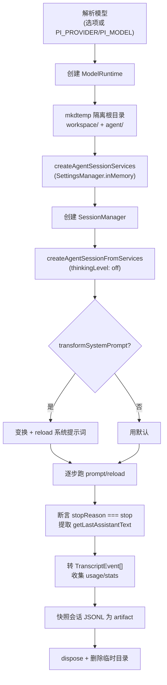

# 第 16 章：行为评估——pi-evals

## 你怎么知道它变好了

前面 15 章，我们看的是一个 Agent 如何被构建。但还有一个问题同样根本：**你怎么知道你改进了它？**

传统软件的测试是确定的：给定输入，断言输出。但 Agent 不是。你改了系统提示词的一句话，或者换了一个模型，或者加了一个工具——它的行为会如何变化？它会在某些任务上变好、某些任务上变坏吗？它会用更多 token 换来更高正确率吗？这些问题无法用单元测试回答，因为 Agent 的行为是**涌现的、非确定的**——同样的提示词跑两次，路径都可能不同。

`pi-evals`（`packages/evals`）是 Pi Agent 对这个问题的回答。它的 README 开宗明义：

> Pi evals are behavioral, model-backed checks for Pi workflows.

"行为性的、模型驱动的"——这是关键词。它不 mock 模型、不假装确定性，而是**真的跑一个 Agent**，用模型评判输出，然后在 baseline 和 candidate 之间做严格对照。本章拆解这套评估框架，看它如何把"我的 Agent 变好了吗"从一个感觉变成一个数字。

对一个以"最小化"为哲学的 Agent，这套框架尤其重要：当你不断在"核心该不该加这个功能"之间做取舍时，你需要一个客观的裁判，告诉你某个改动到底是帮助还是伤害。

---

## 核心抽象：harness

`pi-evals` 建立在第三方框架 `vitest-evals` 之上，把它适配到 pi。核心适配器是 `createPiCodingAgentHarness`（`packages/evals/src/pi-harness.ts`）：

```typescript
export function createPiCodingAgentHarness<TOutput extends JsonValue>(
	options: PiCodingAgentHarnessWithOutput<TOutput>,
): Harness<PiCodingAgentInput, TOutput>;
export function createPiCodingAgentHarness(options?: PiCodingAgentHarnessOptions): Harness<PiCodingAgentInput, string>;
```

它返回一个 `Harness`——`vitest-evals` 的概念，本质是"给定输入，产生输出"的可评估单元。选项包括：

```typescript
{
	name: string;
	model: { provider: string; id: string };
	noTools?: ...;
	transformSystemPrompt?: (defaultPrompt: string) => string; // 变换系统提示词
	output?: ({ response, session }) => TOutput;               // 自定义输出提取
}
```

输入类型（`PiCodingAgentInput`）可以是单个提示词，或一个步骤序列：

```typescript
export type PiCodingAgentInput = string | Array<{ type: "prompt"; content: string } | { type: "reload" }>;
```

`{ type: "reload" }` 步骤很有用——它让 eval 可以"先让 agent 创建一个资源，然后 reload 资源，再让 agent 使用它"。我们马上会在 extensions eval 里看到这个模式。

`transformSystemPrompt` 是对照实验的关键：它接收默认系统提示词，返回一个变换后的版本。于是你可以构造两个 harness——一个用完整提示词，一个用删掉某段的提示词——然后比较它们的表现。这正是"我的提示词改动有用吗"的严格测试方法。

---

## 跑一个真实的 Agent

`runPiCodingAgent`（`packages/evals/src/pi-harness.ts:109`）是真正的工作流。它不复用任何现有会话，而是在**完全隔离的环境**里跑一个全新的 `AgentSession`：



几个设计决策值得注意。

**完全隔离。** 每个 eval 在一个 `mkdtemp` 出来的临时目录里跑，有自己的 `workspace/`（agent 操作的项目）和 `agent/`（配置/会话）。`SettingsManager.inMemory()` 避免读写真实设置。跑完后删除临时目录。这保证了 eval 之间互不干扰，也不污染开发者的真实环境。

**`thinkingLevel: "off"`。** eval 默认关掉 thinking——为了减少非确定性、降低成本、加快评估。这是一个"评估关注行为而非推理过程"的选择。

**断言 `stopReason === "stop"`。** 每个 prompt 步骤后，断言响应正常完成（不是 error/aborted/length）。如果 agent 没能正常完成，eval 失败——这是一个基本的健全性检查。

**输出提取可定制。** 默认输出是 `getLastAssistantText()`（最后一条助手文本）。`output` 选项可以自定义——比如从会话状态里提取结构化数据。

**会话快照为 artifact。** 跑完后，整个会话的 JSONL 被快照成一个测试 artifact（`PI_SESSION_SNAPSHOT_ARTIFACT = "piSessionJsonl"`）。这意味着每个 eval 运行都留下了完整的、可回看的会话记录——你可以打开它，看 agent 到底做了什么、调了哪些工具、花了多少 token。

---

## 对照实验：`evalHarnessTable`

单个 harness 跑一次只能告诉你"它做了什么"。要回答"它比之前好吗"，需要**对照**。`evalHarnessTable`（`packages/evals/src/vitest-evals/harness-table.ts`）构造一个 baseline × candidate 的对照矩阵：

```typescript
evalHarnessTable(evalSet, {
	baseline,        // 基准 harness
	candidate | candidates, // 候选 harness（可以有多个）
	repetitions?,    // 每组重复次数
}): EvalHarnessTableRow[]
```

它把每个 harness × 每个输入 × 每次重复展开成一行，配合 Vitest 的 `describe.for(...)` 跑。每个运行被打上一个 `EVAL_HARNESS_ITERATION_ARTIFACT`（evalSet、groupKey、harness、baseline、candidates、repetition），以便后续配对。

`deriveEvalGroupKey(input, repetition)` 把观测值按"输入 id（或输入 JSON 的 SHA-256）+ 重复次数"配对——这样 baseline 和 candidate 在**完全相同的输入和重复**上被比较。`canonicalizeJson` 强制 JSON 规范化（有限数字、无环、排序键），确保同样的输入产生同样的 key。

`repetitions` 很重要：因为 Agent 行为非确定，跑一次可能是运气。重复多次，才能区分"真的变好了"和"这次恰好运气好"。

---

## 评判：score 与 judge

每个 eval 运行产生一个 score（分数）。`vitest-evals` 的约定是：**score >= 1 算通过。** 分数可以来自：

- **确定性判断**：检查输出是否满足某些硬性条件。
- **模型判断**：用另一个 LLM 评判输出质量（model-backed）。

`extensions.eval.ts` 是确定性判断的好例子。它评估"agent 能否正确编写一个 pi 扩展"，用一个确定性的 `ExtensionAuthoringJudge`（`createJudge`）打分，检查：

- 生成的扩展 import 的是 `@earendil-works/pi-coding-agent`（不是过时的 `@mariozechner/` 或 `@sinclair/typebox`）
- 扩展能无错加载
- 注册了一个 `hello` 工具
- `hello({ name: "Bob" })` 返回 `"Hello, Bob!"`

这个 eval 的输入是一个步骤序列：创建扩展 → `reload` → 使用扩展。它用 `judgeThreshold: null`——低分算"观测值"而非"失败"。这是一个微妙但重要的设计：探索性的 eval（你还在了解 baseline 表现）不应该因为分数低就让测试红掉，而应该作为数据收集。

`smoke.eval.ts` 则是最简单的端到端检查：用 `noTools: "all"` 跑一个事实性提问，断言输出是 "Paris"，并检查 usage 元数据。它验证"评估框架本身能跑通"。

---

## 指标：lift 与配对差

跑完对照实验，`summarizeHarnessComparisons`（`packages/evals/src/vitest-evals/summary.ts`）计算两类指标。

**正确性 lift**（`CorrectnessLiftSummary`）：

```typescript
export type CorrectnessLiftSummary = {
	eligiblePairs: number;
	baselinePassRate: number | null;
	candidatePassRate: number | null;
	lift: number | null; // candidatePassRate - baselinePassRate
};
```

`lift = candidatePassRate - baselinePassRate`，以百分点（pp）计。如果候选 harness 的通过率比基准高 12 个百分点，lift 就是 +12pp。这是"我的改动让正确率提升了多少"的直接答案。

**配对指标差**（`PairedMetricSummary`）：对 `totalTokens`、`totalMs`（延迟）、`estimatedCostUsd`（成本），计算 baseline 和 candidate 的配对差。这回答"正确率的提升花了多少额外 token/时间/钱"。

报告（`formatHarnessComparisonReport`）把这些渲染成彩色终端输出：

```
correctness: +12.0 pp (candidate 85%, baseline 73%)
totalTokens: +1,234 (candidate ..., baseline ...)
estimatedCostUsd: +$0.05 (...)
```

它还诊断不完整的观测：`missing-observation`、`duplicate-observation`、`harness-error`、`missing-score`、`unscorable-outcome`。这些诊断让你知道哪些对照对没能产生有效数据，避免被不完整的统计误导。

于是，"换这个模型/改这句提示词/加这个工具值不值"变成了一个多维度的客观判断：正确率 lift 是正的，但 token 和成本涨了多少？如果正确率 +5pp 但成本翻倍，可能不值；如果正确率 +5pp 且成本持平，那就是净改进。

---

## 为什么这对最小化 Agent 尤其重要

回到本书的主线。Pi Agent 的核心哲学是"最小化"——不断把功能推出核心。但每一次这样的取舍都需要回答：这个决定让 Agent 变好了还是变坏了？

比如：

- 把某条 guideline 从默认提示词里删掉（让提示词更精简），agent 表现会变差吗？`extensions.eval.ts` 正是测这个——它对照"完整提示词"和"删掉 Guidelines/文档段的提示词"。
- 默认激活 4 个工具 vs 7 个工具，哪个更好？
- 换一个更便宜的模型，正确率掉多少？成本省多少？
- 加一个 skill，它真的被有效使用了吗？

这些问题都没有先验答案。`pi-evals` 提供了一个**客观裁判**：构造 baseline 和 candidate，跑对照实验，看 lift 和成本差。于是"最小化"不再是信仰，而是可以被验证的假设——如果删掉某个东西，eval 显示 lift ≈ 0 且成本下降，那就放心删；如果 lift 是负的，那就保留。

这是"用数据驱动架构决策"的典范。很多 Agent 项目的提示词和工具集是靠直觉调的；Pi Agent 把这套调优变成了可重复、可对照、可量化的实验。`evals` 包是 `private: true`——它不发布给用户，纯粹是开发期的质量基础设施。但它的存在，是整个项目能持续做最小化取舍的底气。

---

## 实践应用

`pi-evals` 为"如何评估一个非确定性的 Agent"提供了四条可迁移的模式。

**用真实模型评估，而非 mock。** eval 真的跑一个 `AgentSession`、真的调模型、真的执行工具。它解决的问题是：mock 掉模型只能测你*以为*它会做什么，测不出它*实际*做什么。当评估是 model-backed 的，你测的是真实的涌现行为，而非你的假设。代价是 eval 慢、花钱、非确定——但对"行为是否正确"这个问题，没有更便宜的捷径。

**隔离 + 可回看 artifact。** 每个 eval 在临时目录里跑、用内存设置、跑完删除，但会话 JSONL 被快照成 artifact。它解决的问题是：eval 之间互相干扰、污染真实环境，且失败后无从查起。当每次运行既隔离又留下完整记录，eval 既可重复又可调试。

**对照 + 重复，把"感觉"变成"数字"。** baseline × candidate 矩阵，相同输入配对，多次重复，计算正确率 lift 和 token/成本配对差。它解决的问题是：单次运行的结果可能是运气，且"变好了"是个模糊感觉。当对照配对、重复多次、量化 lift，改进就成了可统计判断的事实。

**用评估驱动架构取舍。** 用 eval 验证"删掉/简化某个东西是否伤害行为"，让最小化成为可验证的假设而非信仰。它解决的问题是：架构取舍靠直觉，删错了不知道。当每个取舍都能被 eval 裁判，"保持最小"就有了客观依据——这是把工程品味和工程纪律结合起来的方法。

---

## 总结

`pi-evals` 是 Pi Agent 的行为评估框架：`createPiCodingAgentHarness` 把一个真实的 `AgentSession` 适配成 `vitest-evals` 的 harness，在完全隔离的临时环境里跑（内存设置、thinking 关闭、会话快照为 artifact）；`evalHarnessTable` 构造 baseline × candidate 对照矩阵并多次重复；评判用确定性 judge 或模型 judge，score >= 1 算通过；`summary` 计算正确率 lift（百分点）和 token/延迟/成本配对差，渲染成对照报告。

它不发布给用户（`private: true`），却是整个项目能持续做最小化取舍的底气——每一次"核心该不该加/删这个"的决策，都能被它客观裁判。这是把"最小化"从信仰变成可验证假设的基础设施。

下一章，我们合上这本书，回顾 Pi Agent 的六个架构赌注，提炼可迁移的经验，并审视最小化路线的代价与边界。
