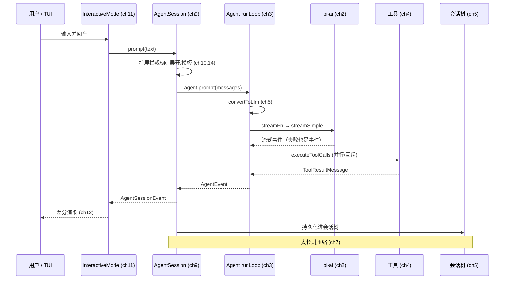

# 第 17 章：结语——最小化的赌注

## 我们走过了哪里

让我们退后一步，看看从第 1 章到现在走过的路。

我们从 `pi-ai` 的地基开始（第 2 章），看它如何用约 10 个协议适配器统一约 38 个 LLM 提供商，把失败编码进 `EventStream`。我们爬上 `pi-agent-core` 的核心循环（第 3 章），那个干净的两层嵌套状态机；拆开工具系统（第 4 章），看自描述工具如何被 prepare/execute/finalize；理解状态与会话树（第 5 章），那个把转录建模为可分支树的独特设计。我们看到 Harness 层（第 6 章）如何在核心之上提供持久化编排，以及压缩（第 7 章）如何在不删除历史的前提下控制上下文。

然后我们进入产品层：`pi` 命令的启动流水线（第 8 章）、3,333 行的中央编排器 `AgentSession`（第 9 章）、装配出来的系统提示词与两阶段 skill 加载（第 10 章）、共享一条事件流的三种运行模式（第 11 章）。我们深入完全自研的终端渲染器（第 12 章）和输入栈（第 13 章），看扩展系统如何让最小核心拥有无限能力（第 14 章），以及两套截然不同的远程控制设计（第 15 章）。最后，我们看到 pi-evals（第 16 章）如何把"变好了吗"变成一个数字。

这一切背后，是一条贯穿始终的主线。本章把它说清楚：Pi Agent 下了哪六个架构赌注，每个赌注赢在哪里、风险在哪，以及最小化路线真正的代价是什么。

---

## 复杂性守恒

先重申那个核心观察。一个生产级 Agent 必须处理的复杂性是守恒的——多提供商、流式、工具、并发、上下文膨胀、持久化、错误恢复、渲染、扩展、安全，这些难题不会因为你不写就消失。

综合体路线（以 Claude Code 为代表）把这一切吸进核心，于是核心成为近两千文件的潜艇，每个 `if` 背后都站着一个真实故障。Pi Agent 选择把复杂性**推到边缘**——推到扩展、容器、可选守护进程、调用方责任里。

这本书的每一章，都是这条原则在一个具体领域的展开。下面六个赌注，是它最集中的体现。

---

## 赌注一：分层即防火墙

**赌注**：把系统拆成严格单向依赖的包（`ai → agent → coding-agent`，`tui` 独立），每层只依赖下一层的抽象。

**赢在哪**：复杂性被层与层之间的接口挡住。`pi-tui` 连 `pi-ai` 都不依赖，所以 UI 的复杂性绝不可能泄漏进 Agent 逻辑；`pi-ai` 不依赖任何兄弟包，所以它能被任何 LLM 应用复用。每一层都可以单独拿走。

**风险**：分层有成本——接口要设计、跨层调用要绕路、有时一个功能需要在多层各改一点。过度分层会让简单的事变复杂。Pi Agent 的九个包是 carefully 划分的，不是为分而分。

**可迁移**：层的边界就是复杂性的防火墙。当你纠结"这个功能放哪"，问"它会让哪一层依赖它不该依赖的东西"。

---

## 赌注二：核心与编排分离

**赌注**：核心循环只发事件、只认识配置槽位；持久化编排（Harness）和产品编排（AgentSession）都是核心的*消费者*，核心不知道它们存在。

**赢在哪**：核心小到可以被任何编排策略复用。`AgentHarness` 是一种策略（通用持久化），`AgentSession` 是另一种（产品级），SDK 用户可以写自己的。核心因为不偏袒任何策略，才能被所有策略复用。第 6 章那个"产品没用 AgentHarness"的事实，恰恰证明了这个设计的成功——核心足够小，产品才能在它上面建一个完全不同的编排器。

**风险**：核心太小，可能把太多负担推给编排者。每个编排者都要重新处理持久化、压缩、错误恢复——这些本可以共享。Pi Agent 用 AgentHarness 提供了一份"官方编排"作为参考，但不强制。

**可迁移**：把机制（循环、事件流）和策略（如何编排、如何持久化）分开。机制要小且稳定，策略才能百花齐放。

---

## 赌注三：失败是数据，不是异常

**赌注**：`StreamFn` 永不抛出，失败编码进流的终止事件；`ExecutionEnv` 的所有 IO 返回 `Result`；连循环的协作者回调都约定"must not throw"；意外错误也被转成正常的事件序列。

**赢在哪**：循环里几乎没有 `try/catch`。错误处理退化成"检查 `stopReason`"或"检查 `result.ok`"。流式管道的消费者永远能收到 `agent_end`，永远能把状态归约到一致的点。复杂性被推到契约的实现方（`pi-ai` 的双层重试、`convertToLlm` 的安全兜底）。

**风险**：契约纪律要求每个实现者都认真遵守。一个偷偷抛异常的 `convertToLlm` 会破坏整个循环的假设。Pi Agent 用文档（每个回调的 "must not throw" 注释）和类型（`Result`）来强制，但最终依赖纪律。

**可迁移**：在异步流式系统里，让失败成为数据而非控制流。当失败是 payload，错误处理就统一成了一次字段检查，消费者也不会因为一个中途错误而陷入不一致状态。

---

## 赌注四：会话是一棵树

**赌注**：转录不是扁平数组，而是可追加、可分支的不可变条目树；leaf 指针标记当前位置；压缩是插入摘要节点而非删除历史。

**赢在哪**：回溯 = 移动指针，fork = 长新分支，压缩 = 可逆的视图变换。这些在扁平数组里极其别扭的操作，在树模型里都退化成指针操作。第 7 章的压缩之所以能"不删除历史"，第 5 章的 fork/`/tree` 之所以自然，全是因为这个底层选择。存储与上下文视图的分离（`defaultContextEntryTransform`）让"省 token"和"看历史"可以兼得。

**风险**：树比数组复杂——存储要维护 parent 边、leaf 标记、物化聚合；上下文构建要遍历路径。SQLite 后端为此引入了物化视图和 FTS 索引来保持性能。对"用户只会线性对话、从不回溯"的简单场景，这是过度设计。

**可迁移**：当你的系统里"历史"需要被回溯、分支、可逆压缩时，把它建模为不可变树 + 位置指针。交互式 Agent 正是这种系统——用户不断试错、回溯、fork。

---

## 赌注五：扩展是类型化的

**赌注**：扩展性不靠运行时钩子字符串，而靠一个强类型的 `ExtensionAPI`（约 40 种事件、工具/命令/快捷键/flag/渲染器注册）；MCP 这类可选生态能力不进核心，交给扩展。

**赢在哪**：扩展开发有编译期安全和 IDE 支持；扩展与内置在系统里平等（自定义工具走同一个 `ToolDefinition`）；核心不必内置 MCP 的 8 种传输和 OAuth。连"新增一个 LLM 提供商"（llama.cpp）都可以是扩展。核心保持最小，能力近乎无限。

**风险**：没有内置 MCP，开箱即用地接入 MCP 生态不如内置方案方便，依赖社区扩展。类型化扩展要求扩展用 TypeScript 写——纯配置型的轻量扩展被 skills/模板/主题承接，但能力受限。

**可迁移**：扩展面用类型化 API 而非字符串钩子；把可选生态能力外推为扩展。核心只保留普遍必需的，长尾交给可插拔边缘。

---

## 赌注六：安全在边界，而非每个动作前

**赌注**：不内置逐工具权限审批；隔离交给容器/沙箱；安全决策收窄为一次性的"项目信任"（是否加载项目里的扩展/skills/AGENTS.md）。

**赢在哪**：没有审批疲劳，没有七种权限模式的维护负担，核心不用"了解"每个工具的危险性。安全关注点集中在真正危险的地方——加载可能恶意的项目资源（扩展能注册工具、拦截事件，是巨大攻击面）。

**风险**：这是六个赌注里**边界条件最严格**的一个。它的前提是"你能控制执行环境"。如果 pi 裸跑在用户主机上、无法容器化，那么它确实拥有用户的全部权限——一次恶意的 bash 调用就可能造成破坏。README 明确承认这一点，并给出三种容器化模式。对无法容器化的场景，逐动作审批可能仍是必要的。

**可迁移**：把安全决策放在边界（进入项目时一次性信任），并把执行环境本身变安全（容器）。但务必诚实评估前提——如果你的环境无法隔离，这个模式不适用。最小化安全模型有其适用边界，理解边界比模仿更重要。

---

## 最小化的代价：一个诚实的审视

本书不想把最小化浪漫化。让我们诚实看看它代价几何。

**第一，核心最小 ≠ 产品最小。** 这是最容易误解的一点。`pi-agent-core` 的核心循环确实小（`agent-loop.ts` 几百行）。但产品层一点都不小：`AgentSession` 3,333 行，`InteractiveMode` 6,100 行，`pi-tui` 的 `Editor` 2,352 行。最小化的是**核心运行时**，不是整个产品。一个完整的 CLI 产品该处理的事情——三种模式、扩展系统、项目信任、斜杠命令、模型切换、TUI、输入——一件不少。Pi Agent 的成就不在于"代码少"，而在于"复杂性放对了地方"：核心干净，产品丰富，两者通过事件流和接口清晰分离。

**第二，外推的复杂性有人要承担。** 权限外推给容器——用户要自己搭容器。MCP 外推给扩展——用户要自己找/写扩展。存储外推给后端——默认 JSONL 简单但功能有限。每一次外推，都把一份责任从"框架作者"转移到了"使用者"。对有能力承担的用户（会搭容器、会写扩展），这是自由；对只想开箱即用的用户，这是门槛。最小化路线天然偏向"知道自己要什么"的高级用户。

**第三，契约纪律是隐性成本。** "失败是数据""must not throw""工具自描述"——这些契约让核心保持简洁，但它们是靠纪律维持的，不是编译器强制的（除了类型化的部分）。一个新贡献者写了一个会抛异常的回调，就可能破坏循环的假设。`AGENTS.md` 里大量的"never""always"规则，正是维护这份纪律的成本。

**第四，两套远程设计是演进的快照，不是终态。** `pi-server`（JSON）和 `pi-protocol`（CBOR）并存，说明远程方案还在演进。这种"务实的并存"在当下是合理的，但长期看需要收敛——否则维护两套协议会成为负担。最小化哲学擅长"不内置"，但"已内置的如何收敛"是另一个挑战。

这些代价不是反对最小化的理由，而是理解它的必要部分。最小化不是免费的——它用"使用者的门槛"和"纪律的维护"换取"核心的简洁"和"扩展的自由"。是否值得，取决于你的用户是谁、你的核心需要活多久。

---

## 可迁移的经验

如果你只从这本书带走十条经验，让它们是这些：

1. **复杂性守恒**：复杂性不会消失，只会转移。决定系统品质的不是复杂性多少，而是它被放在哪里。
2. **分层即防火墙**：严格单向依赖的层，让复杂性被接口挡住，每层可独立复用。
3. **机制与策略分离**：核心提供小而稳定的机制，编排策略自由演进；核心不偏袒任何策略，才能被所有策略复用。
4. **失败是数据**：在流式系统里，让失败成为事件/`Result`，而非异常；错误处理退化成字段检查。
5. **自描述组件**：工具（或任何插件）声明自己的 schema、并发、渲染、提示词；编排器无知，于是线性扩展。
6. **会话是树**：当历史需要回溯/分支/可逆压缩，把它建模为不可变树 + 位置指针。
7. **两阶段加载**：目录进提示词，内容按需读；能力数量不再受提示词大小限制。
8. **事件流即契约**：系统进展表达成事件流，每种使用方式只是它的一个投影；新增消费方式 = 新增订阅者。
9. **类型化扩展**：扩展面用强类型 API，可选生态能力外推为扩展；核心保持最小，能力近乎无限。
10. **用评估驱动取舍**：把"变好了吗"变成 baseline × candidate 的对照实验；让架构取舍成为可验证的假设，而非信仰。

这十条里，没有一条是 Pi Agent 独创的——它们都是被反复验证的工程模式。Pi Agent 的价值在于，它把这一整套模式**一以贯之**地应用到一个真实的生产级 Agent 里，并证明了"最小化核心 + 丰富边缘"是一条可行的路线。

---

## 黄金路径，再看一眼

第 1 章我们建立了黄金路径。现在你知道了它的每一段底下是什么：

这条路径上的每一段，都是一个独立可复用的层、一个被推到边缘的复杂性、一个刻意的取舍。当你理解了每一段为什么是这样，你就理解了 Pi Agent——不是记住它的 API，而是理解它的品味。

---

## Agent 的未来，与最小化的位置

最后，谈谈未来。

AI 编程 Agent 还在快速演进。模型越来越强，上下文窗口越来越大，工具生态（MCP 等）越来越丰富。在这样的趋势下，"最小化核心"会过时吗？

我认为不会，但它的形态会变。上下文窗口变大，压缩的紧迫性下降——但会话树的价值（分支、回溯、可逆）与窗口大小无关。模型变强，逐工具审批的必要性下降——这反而印证了 Pi Agent "安全在边界"的赌注。工具生态丰富，内置一切越来越不现实——这恰恰是扩展系统的用武之地。

更深的洞见是：**当模型本身承担了越来越多的"智能"，Agent 框架的核心价值就越倾向于"机制"而非"策略"。** 模型会自己决定用什么工具、怎么编排、何时停止。框架要做的，是提供干净的循环、可靠的工具执行、可持久化的状态、可插拔的扩展——也就是 Pi Agent 核心提供的那些东西。模型越强，"把策略写死在框架里"就越危险，"提供机制让模型/扩展自由发挥"就越正确。

从这个角度看，Pi Agent 的最小化不只是工程品味，更是一种对趋势的押注：**赌未来的智能在模型里，而不在框架的硬编码逻辑里。** 核心保持最小，才能跟上模型的进化；策略保持可插拔，才能容纳还没被发明的用法。

这个赌注会赢吗？没人知道。但理解它为什么是一个*连贯的、自洽的、被认真执行的*赌注，本身就是这本书想给你的东西。

---

## 最后一句话

Pi Agent 不是一个"功能更少"的 Claude Code。它是另一个问题的另一个答案。

Claude Code 回答的是："如何把尽可能多的能力，安全地内置给尽可能多的用户？"答案是综合体——庞大的单体、精密的权限、内置的一切。

Pi Agent 回答的是："如何让核心保持最小，同时让能力可以无限延伸？"答案是最小化核心 + 类型化扩展 + 容器隔离 + 可插拔存储 + 可选远程。

两条路线都通向生产级 Agent。它们之间的选择，取决于你相信复杂性该由谁承担——框架的作者，还是框架的使用者。

读完这本书，你未必会同意 Pi Agent 的每一个取舍。但你应该能看清：每一个取舍背后，都有一条连贯的逻辑，和一份对"复杂性该放在哪里"的明确回答。

而这，正是架构最本质的工作。
